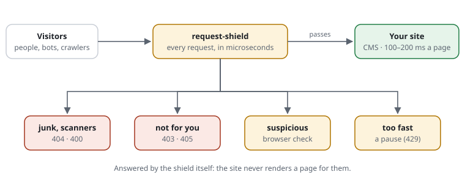

# cjw-network/request-shield

[](https://github.com/cjw-network/request-shield/actions/workflows/tests.yml)
[](https://github.com/cjw-network/request-shield/actions/workflows/static-analysis.yml)


**A mini web application firewall for PHP. Harden any PHP website in minutes —
even on simple shared hosting.**

AI crawlers, scrapers and automated attacks no longer hit only big sites. Every
such request makes your website do real work — start the software, ask the
database, build the page. Enough of them and the site slows down or goes
offline, and junk requests can fill your page cache so that real visitors wait.

request-shield is a small gatekeeper that looks at every request **before** your
website starts. Real visitors pass in a few millionths of a second. Everything
else:

- **Junk is turned away** — scanners hunting for password files, broken or
  oversized requests never reach your site.
- **Your cache stays clean** — made-up addresses and parameters are answered,
  but never stored.
- **Floods are slowed down** — whoever asks too often has to wait; suspicious
  clients prove they are a real browser with an invisible check, no puzzles to
  click ([how the browser check works, in plain words](docs/explained/browser-check.md)).
- **Doors stay shut** — an admin area only for your office, a form only where
  it belongs; your CMS can ask for the browser check when content is sent —
  or run it inside the form while the visitor types — and nobody loses what
  they typed.
- **Search engines stay welcome** — Google, Bing and others are recognised and
  let through.
- **Readable rules** — one per line, in a plain text file; every refusal names
  the line that caused it, and an optional log shows what was turned away.
- **See what it does** — a page shows the active rules in plain words, how
  often each one decided, and what happens to any address you try, step by
  step.

No extra server, no subscription, no data sent to anyone: one PHP library —
upload, include, done.



*What it is not:* protection against attacks so large that they overload the
network or the web server itself — that remains the job of your hoster or a CDN.

**See it in 30 seconds:** `php -S 127.0.0.1:8080 examples/demo/router.php`, then
open http://127.0.0.1:8080/ — a mini site with one example per feature,
including the invisible browser check ([examples/demo](examples/demo/README.md)).

## How it works

It runs **before the application** — before the framework, its autoloader and
its database — and decides in a few microseconds whether a request reaches the
application, and whether the answer may be cached.

- **Trusted proxies:** `X-Forwarded-For`, `-Proto` and `-Host` are believed only
  from your load balancer or reverse proxy, and removed from `$_SERVER`
  otherwise, so neither the shield nor the application can be told another
  client, scheme or host.
- **Hard rejects:** methods, sizes, broken or traversing paths, unknown hosts and
  the paths only scanners ask for (`/.env`, `/.git/`, backups, `phpinfo.php`, …)
  never reach the application.
- **A definition of what may be cached:** URLs outside it are answered, but
  marked uncacheable, so random paths and parameters cannot fill a page cache.
- **Budgets per client** (an IPv4 address, an IPv6 /64): requests per window,
  and budgets the application counts itself (cache misses, failed sign-ins).
  Above a threshold a client can be challenged, above the limit it gets
  `429 Too Many Requests` with `Retry-After`.
- **Access rules:** paths only for some addresses (`restrict /admin/** to …`),
  methods only on some paths (`allow POST /contact`) — matched as the
  application routes the path, so `//admin` or `/%61dmin` do not get past.
- **Rule files and a log:** the settings one rule per line, from several files
  (a CMS extension ships its own); every decision names its rule
  (`[SITE-10]`, or `site.rules:12`); an optional log of what was stopped or
  flagged. The built-in blocks are rule files too (`rules/`), versioned; a
  site that changes one is told when an update changes it underneath.
- **No dependencies, no services:** counters in APCu, or in plain files on hosting
  without APCu. PHP ≥ 8.0 (the Red Hat Enterprise Linux 9 baseline).

It turns an expensive request (framework, database, rendering: 100–200 ms) into
a cheap one (well under 0.1 ms). It does not replace protection in front of PHP
(the hoster's, a CDN's, CloudLinux, Imunify360): a flood still occupies web
server and PHP slots, just very briefly.

## Status

- **0.1.0:** the core.
- **0.2.0:** the browser challenge (proof of work), settings checked once and
  compiled for OPcache, documentation, CI.
- **Unreleased:** rule files, access rules, rule IDs, the log, the active
  rules page, the demo.
- **Next:** modes — monitor first, strict under attack
  ([proposal 0004](docs/proposals/0004-modes-monitor-and-strict.md)); earning back a spent budget with a challenge, for forms and APIs
  ([proposal 0001](docs/proposals/0001-earn-back-a-spent-budget.md)); adapters
  for Exponential, WordPress and Ibexa; exporting the rules to nginx, Apache
  and Varnish.

Documentation: [docs/](docs/README.md) — features, use cases, proposals,
architecture decisions. Changes: [CHANGELOG.md](CHANGELOG.md).

## Installation

### Without Composer (shared hosting)

Put the directory somewhere outside the document root, write the rules to
`config/request-shield.rules` (or copy `config/request-shield.dist.php` to
`config/request-shield.php`), and prepend it:

```ini
; .user.ini in the document root (PHP-FPM, LiteSpeed LSAPI)
auto_prepend_file = /home/you/request-shield/bootstrap.php
```

```apache
# .htaccess (Apache mod_php, LiteSpeed)
php_value auto_prepend_file /home/you/request-shield/bootstrap.php
```

The settings file can also be named by a constant or an environment variable,
`REQUEST_SHIELD_CONFIG` (a `.rules` or a `.php` file). Without one the shield
does nothing.

### With Composer

```bash
composer require cjw-network/request-shield
```

and call it first thing in the front controller:

```php
CjwNetwork\RequestShield\Shield::protectFile(__DIR__ . '/../config/request-shield.rules');
```

`protectFile()` checks the settings once and keeps them compiled for OPcache;
`protect($array)` checks them on every call. An adapter passes its
extensions' rule files as `sources`.

- **WordPress:** at the top of `wp-config.php`, or as `auto_prepend_file`.
- **Ibexa / Symfony:** at the top of `public/index.php`.
- **Exponential:** in `config.php`, before the HTTP cache's early exit.

## Configuration

As a rule file ([all rules](docs/features/rule-files.md)):

```text
trust        10.0.0.0/8
host         www.example.org example.org
cache-query  page
limit        requests 600/min
limit        misses 60/min on-demand
restrict     /admin/** to 192.0.2.0/24
challenge    /login
set          log /var/log/request-shield.log
```

`php bin/request-shield check|show|reload site.rules` checks it, shows the
rules in effect with their origins, or makes every server read it again;
`trace site.rules "GET https://…/wp-login.php"` shows what happens to a
request, check by check. The same as a page for the admin area:
[the active rules page](docs/features/active-rules-page.md).

Or as a PHP array — every key, with its default, is in `src/Config.php`;
`config/request-shield.dist.php` is a starting point:

```php
return [
    'trustedProxies' => ['10.0.0.0/8'],
    'hosts' => ['www.example.org', 'example.org'],
    'cacheable' => ['query' => ['page'], 'paths' => null],
    'budgets' => [
        'requests' => ['limit' => 600, 'window' => 60],
        'misses' => ['limit' => 60, 'window' => 60, 'onDemand' => true],
    ],
];
```

## Using the decision in the application

```php
$decision = CjwNetwork\RequestShield\Shield::current();   // or $_SERVER['REQUEST_SHIELD']
if ($decision && !$decision->cacheable()) {
    // answer normally, but do not store the page
}
```

A page cache that misses can count the miss against the client:

```php
// after protect()/protectFile(): the same settings and request
if (!CjwNetwork\RequestShield\Shield::active()->consume('misses')->passes()) {
    // too many renders from this client: answer 429, or a stale copy
}
```

## Cost

`php -d apc.enable_cli=1 bench/overhead.php` — a passing request with eleven
headers behind a trusted proxy, every check on:

| PHP 8.1 | per passing request |
|---|---|
| checks, APCu store | ~12 µs |
| checks, file store | ~42 µs |
| settings: rule files (compiled, APCu) / PHP file | ~5.5 / ~8 µs |
| challenge page / solution check / pass cookie (challenged clients only) | ~12 / ~9 / ~5 µs |

## Tests and checks

```bash
php tests/run.php            # no framework needed, PHP 8.0+
composer install && composer phpstan && composer taint
```

The tests include an end-to-end run through PHP's built-in server with
`auto_prepend_file`, and the challenge page's own script run in Node against
the PHP check. CI runs them on every supported PHP version, with and without
APCu, plus PHPStan (level max) and Psalm's taint analysis.

## Contributing and security

See [CONTRIBUTING.md](CONTRIBUTING.md) (and [AGENTS.md](AGENTS.md) for AI
coding agents). Security issues: [SECURITY.md](SECURITY.md).

## Copyright & license

Copyright (C) 2026 JAC Systeme GmbH, part of [CJW Network](https://cjw-network.com).
Released under the MIT license, see `LICENSE`.
