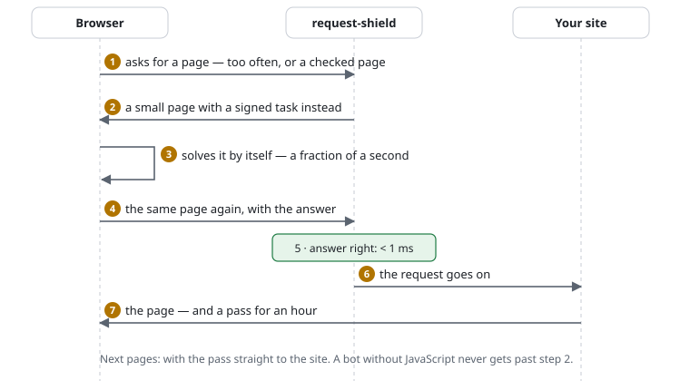

# The browser check, explained

*For site owners, editors and anyone who wants to know what happens — no
programming knowledge needed. The technical details are in
[the feature description](../features/browser-challenge.md).*

## In one sentence

Before a suspicious visitor gets the page, their browser has to solve a small
arithmetic task — a real browser does that by itself in a fraction of a
second, invisibly, and is then left alone for an hour; a program that fetches
pages by the thousand either cannot do it at all, or has to pay for every
single page with computing time.

## What a visitor sees

A plain page for a moment — *"One moment, please. Your browser is being
checked."* — with a progress bar, then the page they asked for. **Nothing to
click, no pictures of traffic lights, no puzzle.** Usually it takes 0.1 to
0.5 seconds, and it happens once: afterwards the browser holds a pass for an
hour (the site decides how long).

Without JavaScript or without cookies, the page says what is missing. The
page speaks the visitor's language — German or English built in, chosen by
their browser's setting; a site can change every text and add languages.

## When it happens

- **Someone asks too often:** past a threshold (for example more than 300
  pages a minute from one address) the next request gets the check instead of
  the page. Ordinary visitors never get near it.
- **Pages every visitor has to pass,** whatever the pace: a login, a checkout,
  an admin page — so a program cannot post to a login form it never loaded.
- **When the site asks for it:** the CMS can demand the check when content is
  sent (a comment, a registration) or when a form is opened — for example
  only when a post looks like spam. The visitor loses nothing: after the check
  the form is sent again by itself.
- **Inside a form, while typing:** a site can put a small box into its forms
  — *"✓ Browser checked"* — that does the check in the background while the
  visitor writes; sending then goes straight through.
- **Never** for search engines: Google, Bing and others are recognised — their
  address is checked with the name service, not just their claim — and let
  through.

## What it brings

| Who | What the check does to them |
|---|---|
| **Real visitors** | a moment, once an hour at most — usually never |
| **Simple bots and scrapers** (scripts, `curl`, most "AI crawlers") | they do not run JavaScript: they get the small check page again and again — **your site never renders a page for them** |
| **Bots with a real browser engine** | they can pass, but every pass costs them computing time, and the more aggressive they are, the harder the task gets — **floods become slow and expensive** |
| **Your server** | a checked request costs about **0.01 milliseconds** instead of the 100–200 ms a page from the CMS costs: a flood of 1,000 requests a second stays harmless |

And what it does **not** cost you:

- **No third party:** no Google, no Cloudflare, no script from elsewhere — the
  check comes from your own server, nothing about your visitors leaves it.
  No tracking cookie, no data protection question beyond the pass itself.
- **No account, no subscription, no service** that has to be running.

## What it does not do

- It is **not a CAPTCHA against humans.** Someone who opens the site by hand
  always gets through — which is the point.
- A determined attacker with **many real browsers** gets through too — only
  slower and at their own cost. The check makes attacks expensive, not
  impossible.
- It does not help against floods that overload the **network or the web
  server** before PHP runs; that is the hoster's or a CDN's job.

## How it works, step by step



1. **The shield decides** that this request is to be checked (too many
   requests, or a page that is always checked).
2. **Instead of the page, it sends a small page** (about 5 KB, no external
   files) with a task: *"find the number n for which sha256(code + n) gives
   this result"*. The task is **signed** by the server, so it cannot be
   forged, and it expires after a few minutes.
3. **The browser tries numbers** — 0, 1, 2, … — until it finds the right one.
   On average that is some tens of thousands of attempts: nothing for a
   computer, a noticeable cost for someone who wants a million pages.
4. **The browser puts the answer in a cookie and loads the page again.**
5. **The shield checks the answer** — one calculation, well under a
   millisecond. Every answer counts **only once**.
6. **The browser gets a pass:** a signed cookie, valid for an hour, tied to the
   visitor's address group and browser. With it, the next requests go straight
   through — the site's limits still apply.

This is the same principle as [ALTCHA](https://altcha.org/) (whose format the
shield uses) and as Imunify360's or Cloudflare's JavaScript checks — only
running on your own server, in PHP, with nothing to install.

## Compared

| | request-shield | reCAPTCHA / hCaptcha | Cloudflare challenge | Imunify360 |
|---|---|---|---|---|
| Visitors click or solve puzzles | no | often | rarely | no |
| Runs on | your server | Google's / hCaptcha's | Cloudflare's network | the hosting server (paid) |
| Visitor data goes to a third party | no | yes | yes | no |
| Protects the network too | no | no | yes | partly |
| Works on simple shared hosting | yes | yes | with a DNS change | if the hoster has it |

## Trying it

In the demo (`examples/demo`), open `/challenge`: every visitor is checked
there. The pass lasts one minute in the demo, so you can watch it expire;
`/reset` forgets it at once. The active rules page shows how often the check
was needed in the last 24 hours.

## The settings, in short

```text
limit      requests 600/min challenge-at 300    # the check past 300 a minute, a pause past 600
challenge  /login /checkout/**                  # always checked there
challenge-exempt /api/** /feed.xml              # never checked there (programs are meant to use them)
set        pass-ttl 1h                          # how long a pass lasts
```
