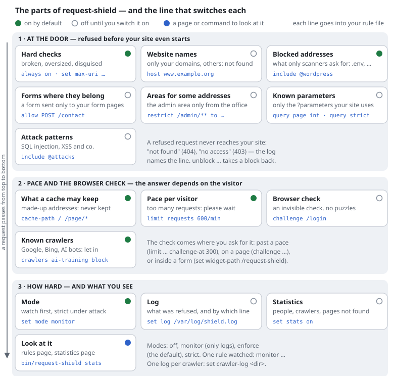

# The parts of request-shield, and their switches

request-shield is a set of small parts that look at every request, in a fixed
order, before your website starts. Each one is switched with a single line in
your rule file. Some are on from the start; the others wait until you switch
them on.

| Part | What it does | The line that switches it | From the start |
|---|---|---|---|
| **1 · At the door** — refused before your site starts | | | |
| [Hard checks](../features/hard-rejects.md) | refuses broken, oversized and disguised requests (`//admin`, `%2e%2e`, …) | always on; sizes with `set max-uri …` | on |
| [Website names](../features/hard-rejects.md) | only your domains; any other name gets "not found" | `host www.example.org example.org` | off |
| [Blocked addresses](../features/rule-files.md#the-built-in-rules) | what only scanners ask for (`.env`, backups, phpMyAdmin …), and WordPress paths on a site that is none | built in; `include @wordpress`, `unblock [SCAN-BACKUP]` | on |
| [Forms where they belong](../features/access-rules.md) | a form may be sent only to your form pages | `allow POST /contact /comment` | off |
| [Areas for some addresses](../features/access-rules.md) | the admin area only from the office | `restrict /admin/** to 192.0.2.0/24` | off |
| [Known parameters](../features/known-parameters.md) | only the `?parameters` your site uses, of their type | `query page int`, `query strict`, `include @tracking` | off |
| [Attack patterns](../features/rule-files.md#attack-patterns) | SQL injection, cross-site scripting and co. in the query and the headers | `include @attacks` | off |
| **2 · Pace and the browser check** — the answer depends on the visitor | | | |
| [What a cache may keep](../features/cacheable-definition.md) | made-up addresses and parameters are answered, but never kept | `cache-path / /page/*`, `cache-query page` | on (any) |
| [Pace per visitor](../features/budgets.md) | too many requests from one visitor: "please wait" | `limit requests 600/min` | on |
| [Browser check](../features/browser-challenge.md) | an invisible check that a real browser passes in a moment — past a pace, on a page, or [inside a form](../features/browser-check-in-the-form.md) | `limit requests 600/min challenge-at 300`, `challenge /login`, `set widget-path /request-shield` | off |
| [Known crawlers](../features/known-crawlers.md) | Google, Bing and AI crawlers are recognised by their address and let in — or checked, or refused | `crawlers ai-training block`, `set crawler-verify ranges` | on (let in) |
| **3 · How hard — and what you see** | | | |
| [Mode](../features/modes.md) | watch first (only log), enforce, or strict under attack; one rule can be watched on its own | `set mode monitor`, `monitor block /old/**` | enforce |
| [Log](../features/log-and-rule-ids.md) | what was refused or checked, with the line that decided | `set log /var/log/shield.log` | off |
| [Statistics](../features/statistics.md) | people, crawlers, bots, status codes, pages not found — per day, week, month | `set stats on`, `set crawler-log <dir>` | off |
| [Look at it](../features/active-rules-page.md) | the rules page and the statistics page; on the command line `show`, `trace`, `stats`, `crawlers` | `bin/request-shield stats site.rules` | — |

Every line goes into the site's rule file ([rule files](../features/rule-files.md));
after a change, the servers read it on their next check. Nothing is sent to
anyone else, except optional DNS lookups to verify crawlers (off with `set
crawler-verify ranges`) — see [privacy and the GDPR](../privacy.md).
