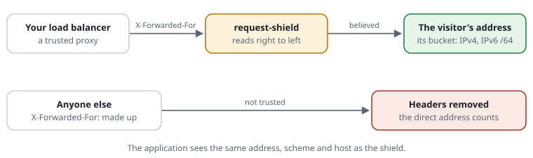

# RSF01-01 Trusted proxies and client identity

## What it does

Works out who the client is, and which scheme and host it asked for, the way
the rest of the shield (and your application) should see it:



- `X-Forwarded-For`, `X-Forwarded-Proto` and `X-Forwarded-Host` are read **only
  when the direct peer is a trusted proxy** (your load balancer, reverse proxy
  or CDN). `X-Forwarded-For` is read right to left and stops at the first
  address no trusted proxy vouches for, so a client cannot put an address in
  front of its own.
- From everyone else these headers are **removed from `$_SERVER`** before the
  application runs (`stripUntrustedForwarded`), so the application cannot be
  told another client, scheme or host either.
- The client's **bucket** — the key its budgets are counted under — is its IPv4
  address, or its IPv6 **/64** prefix (`ipv6Prefix`), since one subscriber
  usually holds a whole /64 and can rotate freely inside it.

## Use cases

- A site behind a TLS-ending load balancer: the application sees the visitor's
  address and `https`, not the balancer's.
- Cache pollution: a page cache keyed by host cannot be filled with pages for
  hosts a client invents in `X-Forwarded-Host`.
- Budgets that cannot be dodged by sending a fake `X-Forwarded-For`.

## Configuration

```php
'trustedProxies' => ['10.0.0.0/8', '2001:db8:100::/48', '192.0.2.10'],
'stripUntrustedForwarded' => true,
'ipv6Prefix' => 64,
```

## Cost

Part of building the request: about 1–2 µs.

## Limits

The shield cannot know your network: without `trustedProxies`, a site behind
a proxy sees the proxy as its only client — list it.

## Examples from the demo

What the demo's rules decide for this feature -- the same lines `request-shield test` checks and the demo's front page shows (`php -S 127.0.0.1:8080 examples/demo/router.php`).

<!-- examples: docs/tools/sync-examples.php from examples/demo/request-shield.rules -- do not edit; run the tool. -->
**RSF01-01 · A proxy in front of the site**

Behind a proxy, every request comes from the proxy's address. From a trusted proxy (trust 198.51.100.1), X-Forwarded-For names the visitor -- and only from there: anyone can send the header.

| Request | The rules decide | |
|---|---|---|
| `/admin/` | the site answers it — from 198.51.100.1, with X-Forwarded-For: 192.0.2.10 | Through the trusted proxy, a visitor from the office: the visitor's address decides |
| `/admin/` | no access (403) · rule DEMO-ADMIN — from 198.51.100.1, with X-Forwarded-For: 203.0.113.9 | the same proxy, a visitor from elsewhere |
| `/admin/` | no access (403) · rule DEMO-ADMIN — from 203.0.113.50, with X-Forwarded-For: 192.0.2.10 | The header from anyone else: not believed |
<!-- /examples -->
