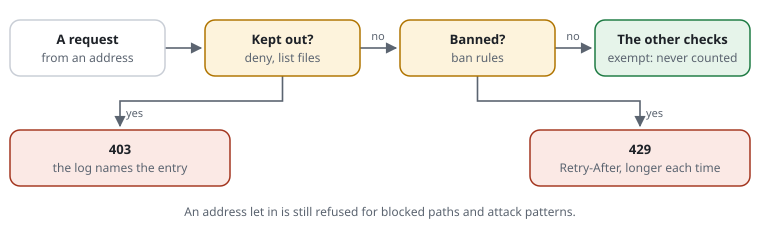

# RSF01-02 IP lists and automatic bans

From [proposal 0013](../proposals/0013-ip-lists.md).

## What it does



- **Kept out (`deny`)**: an address or a range gets **403**, checked **first**,
  before the method, the path or anything else. The answer gives no reason;
  the log names the entry that decided (`rule=LIST-D3`).
- **Let in (`exempt`)**: an address is never counted (budgets) and never
  checked, not even at the always-checked pages (`challenge`). It **is still
  refused** for blocked paths and attack patterns: a compromised office machine
  asking for `/.env` gets the same 404 as anyone else.
- **Both for a while**: `until <day>` (to the end of that day) or `until
  <day>T<hh:mm>`. An entry that has ended is left out, and the compiled
  settings are built again at the moment the next one ends (one integer
  compared per request).
- **List files**: `allow.rules` and `deny.rules` in the lists directory, kept
  with the command line (later the dashboard, [0012](../proposals/0012-dashboard.md))
  so nobody has to edit a rule file. They are read after the rule files and
  may hold **only** `deny` and `exempt` lines. Anything else is an error, so a
  directory the web server could write to can never be used to write rules.
- **Automatic bans**: a client that keeps passing its limits, keeps asking for
  what only attackers ask for, or keeps getting the check page without solving
  it gets nothing but **429 with `Retry-After`** for a while. A ban lasts
  longer each time it comes back within a day, up to `ban-max`. Bans are off
  until a `ban` rule switches them on.

## Use cases

- An attacker's address seen in the log: `request-shield deny site.rules
  203.0.113.7 --for=7d --reason="scraper"`, in force on every server within its
  recheck.
- The monitoring service or the office should never meet the browser check:
  `exempt 192.0.2.0/28` in the rule file, or `allow … --for=30d` for a while.
- A scanner tries 200 paths a minute: `ban after 20 refusals in 5m for 1h`, and
  after its twentieth refusal it gets one short answer for an hour, without the
  site doing any work.
- Brute force on a sign-in form: the site counts failures with
  `Shield::active()->consume('logins')`; `ban after 3 logins in 15m for 30m`
  bans an address that keeps exceeding that budget.
- A fail2ban-style script feeds the deny list through the command line. Many
  thousands of entries cost a lookup of about a microsecond.

## Configuration

### Rules

```text
[SITE-D1] deny 203.0.113.7 198.51.100.0/24 until 2026-10-07   # scraper
[SITE-D2] deny 2001:db8:bad::/48
exempt 192.0.2.50 until 2026-10-31T18:00                      # the agency, for the relaunch
```

`deny` may also stand in a [site block](RSF05-01-rule-files.md#site-blocks-rules-per-website) and
then keeps the address off that website only.

### The list files

```text
set lists-dir /var/lib/request-shield/lists      # default: <store-dir>/lists
```

```text
# deny.rules, as the command line writes it:
[LIST-D3] deny 203.0.113.7 until 2026-10-07T15:30   # scraper · cli 2026-09-30 15:30
```

`lists-dir` is about the server. It belongs above the site blocks and applies
to every website. Files are written whole (a temporary file, then a rename),
in `file-mode` in a `dir-mode` directory (0600, 0700 by default:
[modes](RSF05-02-settings.md#file-and-folder-modes)), outside the document root by default.

### The command line

```text
request-shield deny   site.rules 203.0.113.7      [--for=7d | --until=2026-10-07[T15:30]] [--reason="…"] [--force]
request-shield allow  site.rules 192.0.2.50       --for=30d | --until=…  [--reason="…"]
request-shield unlist site.rules 203.0.113.7
request-shield lists  site.rules
```

- `--for` takes `s`, `m`, `h`, `d` or `w`. `deny` without an end applies for good.
  `allow` always needs an end: an address let in for good belongs in the rule
  file.
- **Guards:** a range holding a trusted proxy is never denied, even with
  `--force`, because every visitor behind it would be kept out. A range wider
  than /16 (IPv4) or /32 (IPv6) needs `--force`.
- `unlist` removes every entry naming the address. With `set store file` it
  also lifts a running ban at once. With APCu the command line cannot reach the
  web server's memory, so the ban ends by itself, or `allow … --for=1h` lifts it
  (an address let in is never banned).
- After writing, the main rule file is touched, so every server reads the lists
  within its `recheck`.

### Bans

```text
[SITE-BAN]   ban after 5 limits in 10m     for 15m     # past a limit again and again: a pause, a spent check
[SITE-SCAN]  ban after 20 refusals in 5m   for 1h      # blocked paths, attack patterns
[SITE-POW]   ban after 10 checks in 10m    for 15m     # the check page, never solved
[SITE-LOGIN] ban after 3 logins in 15m     for 30m     # a budget the site counts, past its limit
set ban-growth 2      # each ban within a day lasts twice as long (default 2; 1 = always the same)
set ban-max 1d        # at most (default 1d)
```

| Signal | Counted when |
|---|---|
| `limits` | a request is past a limit: throttled (429), or the check that frees a spent budget |
| `refusals` | a refusal for a blocked path or an attack pattern |
| `checks` | the check page is shown (a visitor who solves it is not shown it again) |
| `<budget>` | a budget the site counts on demand (`consume('<budget>')`) is past its limit; a budget defined above the site blocks |

- Counted per client as for the budgets: IPv4 by address, IPv6 by its /64.
  Only when the signal happens; a passing request counts nothing.
- **Never banned:** addresses let in (`exempt`), trusted proxies (`trust`),
  and verified crawlers ([known crawlers](RSF01-04-known-crawlers.md)), which keep getting
  the pause they understand. A client that only borrows a crawler's name is
  banned like anyone else.
- **One ban for every website:** `ban` belongs above the site blocks (an error
  inside one). A client banned for scanning one website is banned on all of
  them.
- **Watch first:** `[SITE-SCAN] monitor ban after …` bans nobody and writes the
  line it would have written (`monitor-throttle 429 "banned"`). In `set mode
  monitor` no ban is enforced at all.
- The log line of a ban:
  `2026-10-01T10:19:11+02:00 203.0.113.0/24 throttle 429 "banned" rule=SITE-SCAN "GET http://example.org/.env" "curl"`.
  Requests during the ban are logged as `banned` like any other refusal.

## How it shows

- The [active rules page](RSF06-01-active-rules-page.md) lists "Kept out and let in"
  (with each entry's end) and "Banned for a while" with their IDs and lines.
  The setup view shows both as the first two steps of the way of a request.
- `request-shield trace site.rules 203.0.113.7 /` names the entry that decides
  (`Decided by LIST-D1`).
- The statistics count them like other refusals and pauses, by action and by the rule that decided.

## Cost

Measured with `decide()` + `settle()` + the ban signals on a passing request,
PHP 8.4 with OPcache, 3 rounds, `µs` per request:

| | APCu store | file store |
|---|---|---|
| no lists, no bans | 17–19 | 53–58 |
| 5,000 deny ranges | +0.3–2 | +0–5 |
| 2 bans on (one `marked()` lookup per request) | +0.5–1 | +3–6 |
| both | +1.5–4 | +4–7 |

A denied client is refused before any other check; a banned one costs that
lookup and a short answer, and nothing else runs. Counting happens only on
a request that was refused, throttled or checked anyway.

### Big lists

A list fed by a script can hold hundreds of thousands of addresses. The deny
entries are compiled into **one sorted table** (per family a string of
fixed-width records, plus one string of their IDs), not into an array with an
element per entry. OPcache keeps the strings once for every worker; loading
the settings copies nothing, and a lookup is a binary search, for IPv4 from a
directory by the first two bytes. `bench/big-lists.php`, PHP 8.4 with OPcache,
single addresses spread over the internet:

| Entries | Build (once) | Compiled | Loading the settings, per request | Lookup |
|---|---|---|---|---|
| 0 | 39 ms | 0.4 MB | 14 µs | — |
| 10,000 | 0.2 s | 1.2 MB | 16 µs | 2–3 µs |
| 200,000 | 2.1 s | 7.8 MB | 16 µs | 2–3 µs |
| 1,000,000 | 11 s | 36 MB | 10–15 µs | 2–3 µs |

- **Building** happens once after a list or rule file changed, or when an
  entry ends. While one request builds, the others **keep the last compiled
  settings** (a lock taken without waiting), so a big list never makes every
  request under load build at once. Deny lines as the command line writes them
  are read on a fast path; the list files are read once per build, not once
  per website.
- The settings keep the first 100 entries as written (`Settings::DENY_SHOWN`),
  for the pages; the rules page counts the rest, `request-shield lists` shows
  them all.
- Overlapping ranges are merged; the merged range answers with the ID of the
  one that starts first.

## Limits

- Many people can share one address (an office, a school, a mobile carrier).
  Hence bans are off by default, count only clear signals, are short, grow only for
  repeat offenders, answer 429 with the time to wait, and can be watched first.
- With APCu a ban holds per server (each has its own memory); with the file
  store on a shared disk, for all of them. For the firewall level, feed the log
  line to fail2ban: cheaper still, and a good second line.
- Behind a load balancer the client address must be right
  ([trusted proxies](RSF01-01-trusted-proxies.md)), or the balancer would be counted,
  which the shield refuses for trusted proxies anyway.
- **OPcache's memory:** the table is compiled into the settings file, which
  OPcache keeps in its shared memory, and its strings may go into the interned
  strings buffer (PHP's default is 8 MB, shared by every script on the
  server). From about 100,000 entries, give OPcache room:
  `opcache.memory_consumption` above the settings file's size plus what the
  sites need, `opcache.interned_strings_buffer=16` or more. Without OPcache a
  big list is read on every request: tens of milliseconds at 100,000 entries.
- Lists and bans hold addresses: see [privacy](../privacy.md). Entries without an
  end should be reviewed; a ban ends by itself, at most after `ban-max`.
- In the dashboard: [the live view and the lists](RSF06-02-live-and-lists.md): add an
  entry with a comment, extend, remove, the active bans with "lift", "keep out
  for good?" after the third ban in a day. `set ban-keep file` lets bans
  survive a restart of APCu.

## Examples from the demo

What the demo's rules decide for this feature -- the same lines `request-shield test` checks and the demo's front page shows (`php -S 127.0.0.1:8080 examples/demo/router.php`).

<!-- examples: docs/tools/sync-examples.php from examples/demo/request-shield.rules -- do not edit; run the tool. -->
**RSF01-02 · Addresses kept out, and bans**

An address on the deny list is refused before anything else. A scanner that piles up refusals is banned for a while -- in the demo the ban is only watched (monitor), so the log says what would happen; test decides it on.

| Request | The rules decide | |
|---|---|---|
| `/` | no access (403) · rule DEMO-DENY — from 203.0.113.66 | An address on the deny list |
| `/` | the site answers it — from 203.0.113.67 | its neighbour |
| `/.env` | wait (429) · rule DEMO-SCAN — from 203.0.113.70, 6 times in a row | A scanner, the sixth refusal in five minutes: banned |
| `/.env` | "not found" (404) — the site never sees it · rule SCAN-HIDDEN — from 203.0.113.71, 5 times in a row | the fifth: still only refused |
| `/rs/waf/lists` | look at it | The lists: keep an address out or let it in, with a comment of your own |
<!-- /examples -->
