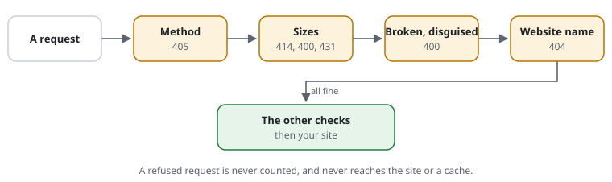

# RSF02-01 Hard rejects

## What it does

Refuses requests no browser sends before the application starts, cheapest
check first, stopping at the first that fails:



| Check | Answer | Setting |
|---|---|---|
| method not allowed | 405 | `methods` |
| URI too long / too many query parameters / headers too large | 414 / 400 / 431 | `limits` |
| NUL byte, broken `%`-escape, not UTF-8, `..` segment (also `%2e%2e`, `%252e%252e`, `\`) | 400 | always |
| host not the site's | 404 | `hosts` (`"*.example.org"` for subdomains) |
| paths only scanners ask for (`/.env`, `/.git/`, backups, `phpinfo.php`, phpMyAdmin, …) | 404 | `blockedPaths` |

A rejected request is never counted against a budget and never reaches the
application or a cache.

## Use cases

- Scanners and exploit kits probing for `/.env`, `/wp-login.php` on a site that
  is not WordPress (`Config::wordpressPaths()`), or path traversal.
- Oversized requests meant to tie up the application.

## Configuration

```php
'methods' => ['GET', 'HEAD', 'POST', 'OPTIONS'],
'hosts' => ['www.example.org', 'example.org'],
'limits' => ['uri' => 4096, 'queryParameters' => 64, 'headerBytes' => 16384],
'blockedPaths' => array_merge(\CjwNetwork\RequestShield\Config::scannerPaths(), \CjwNetwork\RequestShield\Config::wordpressPaths()),
```

## Cost

Well under 1 µs each (measured: method 0.1, limits 0.1, path sanity 1.0,
host 0.1, blocked paths 0.8 µs).

## Limits

The answers are generic on purpose (no rule name), so they do not help a
scanner tune its requests. Use `debugHeader` while testing.

## Examples from the demo

What the demo's rules decide for this feature -- the same lines `request-shield test` checks and the demo's front page shows (`php -S 127.0.0.1:8080 examples/demo/router.php`).

<!-- examples: docs/tools/sync-examples.php from examples/demo/request-shield.rules -- do not edit; run the tool. -->
**RSF02-01 · Broken requests**

A path that leaves the site's folder, however it is encoded, never reaches the site.

| Request | The rules decide | |
|---|---|---|
| `/files/%2e%2e/secret` | a broken request (400) · rule built-in — from another address (198.51.100.7) | Leaving the site's folder |
| `/files/secret` | the site answers it — from 127.0.0.1 | the same folder, a plain name |
<!-- /examples -->
