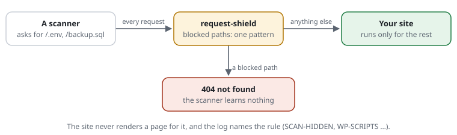

# RSF02-02 Blocked paths

## What it does



Some addresses are asked for only by scanners: `/.env`, `/.git/config`,
`/backup.sql`, `/phpinfo.php`, `/phpmyadmin/`. The shield refuses them with
"not found" (404) before the site runs -- the scanner learns nothing, the site
spends nothing, and the log names the rule.

Every site has the shipped set `@scanners` (`rules/scanners.rules`), read
before its own rules. A site that is **not** WordPress adds `include
@wordpress`: WordPress's folders and scripts are the most scanned paths there
are. Both are rule files like a site's own -- with IDs, descriptions,
revisions and examples (`expect`) that `request-shield test` checks.

## Use cases

- **Every site:** hidden files, backups, test scripts, database tools and
  project or key files (composer.json, id_rsa) are never part of a public
  site; scanners try them all day.
- **A site that is not WordPress:** `include @wordpress` turns away the
  requests for `/wp-login.php` and `/wp-admin/` that make up a large share of
  all attack traffic.
- **A path of the site's own that only attackers ask for:** an old installer,
  a forgotten admin tool -- `block /install/**`.

## Configuration

```text
include @wordpress                                 # this is not WordPress
[SITE-OLD] block /install/** /phpmyadmin/**        # paths of your own

replace [SCAN-BACKUP@1] block *.sql *.bak          # one rule written differently, its ID kept
unblock [SCAN-CGI@1]                               # one shipped rule taken back
[SITE-DL] unblock [SCAN-BACKUP@1] at /downloads/**  # open at some paths only
[SITE-FILES] unblock [SCAN-HIDDEN@1] at /admin/files/** for 192.0.2.0/24   # … and only for some addresses
```

The order matters: an `unblock … at` opens the rule as it stands at that line.
A `replace` written after it puts a new rule in its place, and the opening no
longer applies -- write `replace` first.

Paths are globs (`/news/**`, `*.sql`, `**/admin/**`) or, with `regex`, regular
expressions ([rule files](RSF05-01-rule-files.md#paths)). The `@1` is the
revision a site reviewed -- when an update changes the rule, `check` says so.
A path that leaves the site's folder (`/files/%2e%2e/secret`) is refused
before any of these, as a broken request (400, [hard rejects](RSF02-01-hard-rejects.md)).

The shipped rules:

| Rule | Set | Refuses |
|---|---|---|
| `SCAN-HIDDEN` | `@scanners` | hidden files and folders: .env, .git, .htpasswd, editor settings |
| `SCAN-BACKUP` | `@scanners` | backups, dumps and archives: .bak, .old, .sql, .zip, .tar.gz, .log … |
| `SCAN-TEST` | `@scanners` | test and info scripts: phpinfo.php, info.php, test.php |
| `SCAN-DBTOOL` | `@scanners` | database and test tools: phpMyAdmin, Adminer, PHPUnit |
| `SCAN-CGI` | `@scanners` | cgi-bin, and .well-known except certificates, security.txt and password change |
| `SCAN-CONFIG` | `@scanners` | project and key files: composer.json, composer.lock, web.config, docker-compose.yml, .npmrc, id_rsa (also id_dsa, id_ecdsa, id_ed25519 and their .pub) -- a scanner asks for them to learn what the site runs on; the web server sends a file that exists without PHP, so the rule spares the site's front controller the ones that do not |
| `WP-FOLDERS` | `@wordpress` | WordPress folders: /wp-admin, /wp-includes, /wp-content |
| `WP-SCRIPTS` | `@wordpress` | WordPress scripts: wp-login.php, xmlrpc.php, wp-config.php |

## Cost

All blocked paths together are one regular expression, built when the rules
are compiled: one match per request, part of the 2--3 µs a passing request's
decision takes ([cost](../../README.md#cost)). More patterns make that
expression longer, not the number of matches.

## Limits

- **The shield sees what reaches PHP.** On a site without a front controller
  the web server answers a path that is no PHP file -- `/.env` -- itself; the
  shield never sees it (found when the install guide was followed,
  [dry run](../llm/install-dryrun.md)). Sites that send every request to one
  `index.php` (WordPress and most CMS) get the full effect; elsewhere the web
  server's own rules (`location ~ /\.` in nginx, `RedirectMatch 404 /\.` in
  Apache) cover the files that are not PHP.
- **404, not 403**, on purpose: a scanner cannot tell a refused path from one
  that is not there.

## Examples from the demo

What the demo's rules decide for this feature -- the same lines `request-shield test` checks and the demo's front page shows (`php -S 127.0.0.1:8080 examples/demo/router.php`).

<!-- examples: docs/tools/sync-examples.php from examples/demo/request-shield.rules -- do not edit; run the tool. -->
**RSF02-02 · Paths only attackers ask for**

Hidden files, backups, database tools: refused before the site runs, with "not found" -- the scanner learns nothing.

| Request | The rules decide | |
|---|---|---|
| `/.env` | "not found" (404) — the site never sees it · rule SCAN-HIDDEN — from another address (198.51.100.7) | What a scanner looks for |
| `/backup.sql` | "not found" (404) — the site never sees it · rule SCAN-BACKUP — from another address (198.51.100.7) | A backup |
| `/files/.env` | the site answers it — from 127.0.0.1 | The admin's file reader: hidden files open at /files/ only, from this machine |
| `/files/.env` | "not found" (404) — the site never sees it · rule SCAN-HIDDEN — from another address (198.51.100.7) | the same address from anywhere else |
<!-- /examples -->
