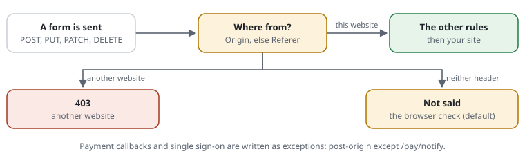

# RSF02-04 Forms only from the website itself: `post-origin`

## What it does



```text
[F-ORIGIN]   post-origin same                                   # forms only from this website's pages
[F-ORIGIN-X] post-origin except /pay/notify /sso/**             # payment callbacks and single sign-on post from elsewhere
```

A form sent to the website (POST, PUT, PATCH, DELETE) must come from a page of
one of the website's own names. The browser says where a form comes from:

- the **`Origin`** header, which modern browsers send with every form;
- else the **`Referer`** (the page before).

| The form comes from | Answer |
|---|---|
| one of the website's names | on to the other rules (`allow POST`, the check, the pace …) |
| another website | **403**, reason "a form sent from another website" |
| neither header says (privacy settings, some proxies; `Origin: null`) | `missing check` (default): **the browser check**, then through; `missing allow`: through; `missing refuse`: 403 |

Proposal [0028](../proposals/0028-forms.md), phase 1.

## What it is for, honestly

It stops **a foreign page from sending a form in a visitor's name**: a page on
another site with a hidden form that posts to your contact form, your
newsletter sign-up or, worse, an admin action, using the visitor's cookies
(cross-site request forgery, CSRF). Checking `Origin` and `Referer` is a
defence OWASP recommends ("verifying origin with standard headers"). It is
most valuable for applications and plugins without form tokens of their own.

It is **not a bot defence**: a script sets `Origin` and `Referer` to whatever
it likes. Against bots, the browser check inside the form
([the widget](RSF03-03-browser-check-in-the-form.md)) and the pace do the work.

## The website's own names

- **The `host` rule's names**, `*.domain` included (one label:
  `*.shop.example` is `a.shop.example`, not `a.b.shop.example`).
- **In a `site` block**, that block's names as well.
- **Without either**, the name the request was sent to: a form from
  `https://www.example.org` to `www.example.org` passes, one from `example.org`
  does not (name it in `host` if both are yours).
- The port and the case do not matter (`https://WWW.Example.org:8443`).

So a backend on `admin.example.org` saving to `www.example.org` is fine when both
are in the `host` rule (or in the same `site` block).

## Never for

- **`except <paths>`**: a payment provider's callback (`/paypal/notify_url/…`),
  single sign-on answers posted from the identity provider (SAML, OAuth
  `form_post`), webhooks. Several `post-origin except` lines add up; they
  switch nothing on by themselves.
- **The API** (`api-path`): programs authenticate otherwise.
- **Addresses let in** (`exempt`, the allow list).

## Trying it first

```text
[F-ORIGIN] monitor post-origin same
```

logs what it would refuse or check, and lets everything through. The live view
and the log show "a form sent from another website" with the rule's ID; after
a few days of editors and visitors, take `monitor` away.

## Examples

```text
[F-ORIGIN] post-origin same
expect POST /contact header Origin:https://www.example.org   answered
expect POST /contact header Origin:https://evil.example      403
expect POST /contact                                         check   # neither header
```

`header <Name>:<value>` sends a header with the example
([examples](RSF05-04-rule-examples.md)); `request-shield test` decides them.

## Where it runs

After "where forms may be sent" (`allow POST …`: 405 first), before the
restricted areas. `bin/request-shield trace` shows it as the step "Where forms
come from"; the rules page lists it. A check from it goes through the gate like
an always-checked page: a visitor with a valid pass gets through, and a form
sent without one comes back after the check by itself.

## PHP settings

```php
'postOrigin' => ['missing' => 'check', 'except' => ['#^/pay/notify$#']],   // null: off (the default)
```

## Cost

Measured on PHP 8.4 with OPcache: **about 0.1 µs for GET and HEAD** (the
method is all it looks at), **about 2–3 µs for a form** (reading the `Origin`,
the exception and API patterns, one host comparison), a little more when it
refuses (the exempt addresses are looked up only then). A form request renders
a whole page anyway.

## Examples from the demo

What the demo's rules decide for this feature -- the same lines `request-shield test` checks and the demo's front page shows (`php -S 127.0.0.1:8080 examples/demo/router.php`).

<!-- examples: docs/tools/sync-examples.php from examples/demo/request-shield.rules -- do not edit; run the tool. -->
**RSF02-04 · Forms only from the website itself**

A browser says where a form was sent from (Origin, else Referer). A form sent from another website -- a page that makes the visitor's browser post here -- is refused; one from the site's own pages passes.

| Request | The rules decide | |
|---|---|---|
| `POST https://www.example.org/edit` | no access (403) · rule DEMO-ORIGIN — from another address (198.51.100.7), with Origin: https://elsewhere.example | A form sent from another website |
| `POST https://www.example.org/edit` | the site answers it — from another address (198.51.100.7), with Origin: https://www.example.org | from the site's own page |
| `POST https://www.example.org/edit` | the site answers it — from another address (198.51.100.7) | without Origin and Referer (missing allow): a tool, an old browser |
<!-- /examples -->
