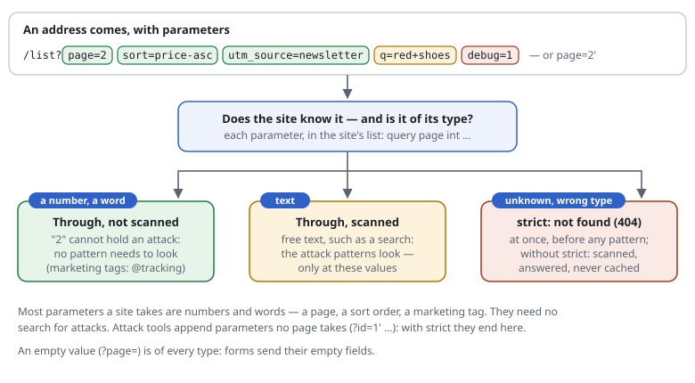

# RSF02-05 Known query parameters

## What it does

A site says which query parameters it takes, and of which type:

```text
include @tracking                                   # utm_*, fbclid, gclid, … (shipped)
query  page int   sort word   q text                # everywhere
query  SearchText text at /content/search           # one page only
match /news/** {
  query  year int   month int                       # one area (a match block)
}
query  strict                                       # anything else: 404
```

With that list the shield

- **refuses what the site does not take**, with `query strict`: an unknown
  parameter, or a value not of its type, is answered "not found" (404) at once,
  before a single attack pattern runs;
- **scans only what could hold an attack**: the [attack
  patterns](RSF05-01-rule-files.md#attack-patterns) see the free-text values (`text`),
  the unknown parameters and the values not of their type — name and value, as
  they stand in the query. A number or a word is not scanned: it cannot hold an
  attack.



Without `strict` nothing is refused for being unknown: the request is answered
as before, and a cache must not keep it (that is `cache-query`, see
[the cacheable definition](RSF04-01-cacheable-definition.md)).

## Use cases

- A site with few parameters (a CMS whose views are in the path, a shop's
  search and paging): `query strict` turns away every `?id=1…` an attack tool
  appends to an arbitrary address, cheaply, and the log shows the rule.
- A site that keeps the attack rules but wants them cheaper and fewer false
  alarms: the typed values (`page=2`, `sort=price-asc`) are no longer scanned.
- Documentation: the rule file says what the site takes.

## Types

The value after decoding. An **empty value** (`?page=`) is of every type:
forms send their empty fields, and an empty value holds nothing.

| Type | Allows | Scanned by the attack patterns |
|---|---|---|
| `int` | digits, an optional minus (up to 18 digits) | no |
| `number` | `int` with a decimal point | no |
| `word` | letters (any language), digits, `-`, `_`, `.` — up to 64 | no |
| `id` | ASCII letters, digits, `-`, `_` — up to 128 (a slug, a key) | no |
| `list` | `word`s separated by `,` | no |
| `text` | anything | **yes** |
| `any` | anything | no (for tags such as `utm_*`) |
| `/regex/` | what the expression allows, the whole value (`code /[a-z]{2}-[0-9]{3}/`) | no |

**Names:** `name[]` and `name[key]` count as `name`, an encoded name as the
decoded one — as PHP reads them. `*` stands for any characters (`utm_*`).
Every occurrence of a parameter is checked (`?page=1&page=x` is not of its type),
not only the last one PHP keeps.

**Which declaration counts:** a path's own (`at …` or a `match` block) before
the ones for every path; among those an exact name before one with `*`; for the
same name the first line.

## The marketing tags: `@tracking`

`rules/tracking.rules` (IDs `TRACK-…`, versioned like the other shipped rules)
declares the tags newsletters, ads and social networks append, all as `any`:
`utm_*`; Google `gclid`, `gbraid`, `wbraid`, `dclid`, `_ga`, `_gl`; Microsoft
`msclkid`; Meta `fbclid`, `igshid`; TikTok, X and LinkedIn `ttclid`, `twclid`,
`li_fat_id`; Mailchimp, HubSpot and Marketo `mc_cid`, `mc_eid`, `_hsenc`,
`_hsmi`, `mkt_tok`; Yandex `yclid`, Adobe `s_kwcid`. With `strict`, marketing
links keep working. They stay uncacheable unless `cache-query` names them.

## Configuration

Rule file: as above. The line `query strict` has an ID like any rule
(`[SITE-Q] query strict`); a refusal names it (`X-RS: reject
unknown parameter; rule=SITE-Q`, the log, the [rules page](RSF06-01-active-rules-page.md)).
`strict` is for the whole site: not inside a `match` block.

PHP array:

```php
'queryParams' => [
    ['paths' => null, 'exact' => ['page' => 'int', 'q' => 'text'], 'globs' => ['#^utm_.*$#' => 'any']],
    ['paths' => ['#^/content/search$#'], 'exact' => ['SearchText' => 'text'], 'globs' => []],
],
'queryStrict' => true,
```

A regex type is written as a PHP pattern that matches the whole value
(`'#^(?:[a-z]{2}-[0-9]{3})$#'`).

## Order

method → sizes → path check → host → blocked paths → forms → restricted areas →
**known parameters** → attack patterns → cache → budgets. The query string is
parsed once, for all of them.

## Cost

Measured on PHP 8.1 with OPcache (`bench`-style loop, one request after the
other, µs per request; the shipped `@attacks` included where it says so):

| | attacks only | attacks + known parameters | + `strict` | known parameters + `strict`, no attacks | neither |
|---|---|---|---|---|---|
| `?page=2&sort=price-asc&utm_source=newsletter` | 20.6 | 19.6 | 20.9 | 12.7 | 11.1 |
| … `&q=red+running+shoes` | 22.2 | 23.1 | 23.0 | 13.5 | 10.5 |
| `?page=2&debug=1` (unknown) | 17.7 | 20.0 | **6.7 (404)** | **6.5 (404)** | 9.7 |
| no query string | 12.4 | 13.0 | 11.9 | 7.6 | 7.4 |

- Next to the attack rules the check pays for itself on typed queries: the
  values it takes out of the scan cost what the lookup costs.
- The gain is in the refusals: an unknown parameter under `strict` costs 6.7
  instead of 17.7 µs, and never reaches the attack rules or the site.
- On its own, about 1.5 µs for three parameters. No query string: nothing.

The rules are merged into one lookup when the settings are read (compiled with
them): a name is one hash lookup, plus one short expression per name with `*`
until one matches.

## Limits

- `strict` refuses links other tools create. Include `@tracking`, and try
  `strict` with the log first (`set log-level flag`): it shows what would be
  refused. (A `monitor` mode that does exactly this is planned, proposal 0004.)
- Only the query string. Form fields (POST) are not checked; Exponential's view
  parameters in the path (`/(offset)/12`) are a matter for the Exponential
  adapter.
- PHP turns `.` and spaces in parameter names into `_` (`a.b` → `a_b`); the
  shield compares the name as sent. A name declared as `a_b` does not cover
  `a.b` — which is then unknown: refused with `strict`, scanned without.

## Examples from the demo

What the demo's rules decide for this feature -- the same lines `request-shield test` checks and the demo's front page shows (`php -S 127.0.0.1:8080 examples/demo/router.php`).

<!-- examples: docs/tools/sync-examples.php from examples/demo/request-shield.rules -- do not edit; run the tool. -->
**RSF02-05 · Known query parameters**

The site's parameters and their types: anything else is "not found" before a single attack pattern runs.

| Request | The rules decide | |
|---|---|---|
| `/?page=2` | the site answers it — from another address (198.51.100.7) | A number where a number belongs |
| `/?page=2%27` | "not found" (404) — the site never sees it · rule DEMO-STRICT — from another address (198.51.100.7) | A parameter not of its type |
| `/?debug=1` | "not found" (404) — the site never sees it · rule DEMO-STRICT — from another address (198.51.100.7) | A parameter the site does not know |
| `/?page=2&fbclid=x&gclid=y` | the site answers it — from another address (198.51.100.7) | Marketing tags (the built-in tracking list) |
<!-- /examples -->
