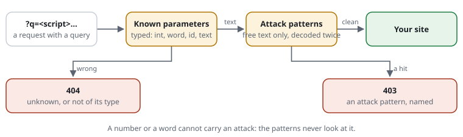
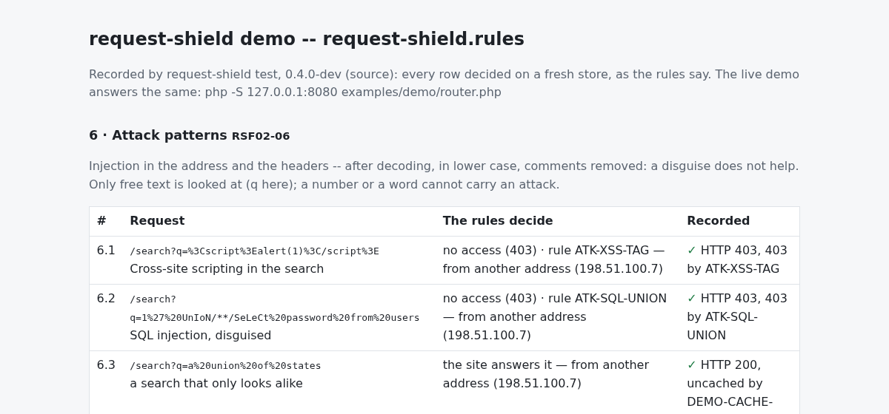

# RSF02-06 Attack patterns

## What it does



Attack patterns look **inside** a request -- its query string and its headers
-- for what automated attacks send: SQL injection, cross-site scripting, PHP
and shell code, file inclusion, Log4Shell, attack tools, known exploit paths.
A hit is refused with 403 before the site runs; the log and `trace` name the
rule.

The shipped set is `include @attacks` (`rules/attacks.rules`): 15 rules after
the OWASP Core Rule Set's first level (paranoia level 1) -- only patterns that
practically never appear in a real visitor's request, written for this
library, each with examples (`expect`) that `request-shield test` checks.

Before matching, the shield normalises the value: decoded twice, lower case,
SQL comments and runs of white space as one space -- `%2527`,
`UnIoN/**/SeLeCt` and `%3Cscript%3E` do not get past. MySQL's versioned
comments (`/*!50000UNION*/`, MariaDB's `/*M!100100…*/`) are code to MySQL:
their body stays, only the comment marks go -- a plain comment inside one
(`/*!/**/UNION*/`) goes first.

## Use cases

- **Every site that does not filter its own input perfectly** -- which is every
  site with old code, plugins or third-party modules: the shield turns away
  the scanners' payloads before the code sees them.
- **Together with [known parameters](RSF02-05-known-parameters.md)**: a
  parameter typed `int`, `word` or `id` cannot carry an attack at all, so the
  patterns only look at free text (`text`) and at what is not typed. A
  parameter typed `any` is **not** looked at: give it to a value that holds
  such strings by design -- a tester that takes addresses to check, as the
  rules page has -- on a page only its admins reach. With `query strict`
  an unknown parameter is refused (404) before a single pattern runs -- the
  cheapest order, and the one the shield checks in.
- **A site of your own patterns**: `block query|header <Name>|headers|anywhere
  <regex>` adds one (see below).

## Configuration

```text
include @attacks                                   # the shipped set

block query \bunion\s+select\b                     # a pattern of your own: the query string
block header User-Agent \b(sqlmap|nikto)\b         # one header
block headers \$\{jndi:                            # every header (not Cookie: name it)
block anywhere \$\{env:                            # path, query and every header

unblock [ATK-XSS-URL@1]                            # one shipped rule taken back
unblock [ATK-XSS-TAG@1] at /admin/editor/** for 192.0.2.0/24   # opened where it is needed, for whom
```

The patterns are regular expressions, case does not matter. `unblock`,
`unblock … at` and `replace` work for them as for [blocked
paths](RSF02-02-blocked-paths.md); the `@1` is the revision a site reviewed
-- when an update changes a rule, `check` says so. Test new patterns first:
`monitor block query …` logs what it would refuse, nobody is refused
([modes](RSF05-03-modes.md)).

The shipped rules:

| Rule | Against |
|---|---|
| `ATK-SQL-UNION` | SQL injection: UNION SELECT |
| `ATK-SQL-TIME` | SQL injection that makes the database wait: sleep(5), benchmark(), waitfor delay |
| `ATK-SQL-TAUT` | SQL injection: ' or '1'='1, " or 1=1 -- |
| `ATK-SQL-SCHEMA` | SQL injection reading the database's own tables |
| `ATK-SQL-STACK` | SQL injection: a second statement -- ; drop table |
| `ATK-SQL-FUNC` | SQL injection through the database's own functions: extractvalue(), load_file(), into outfile '…', @@version |
| `ATK-XSS-TAG` | cross-site scripting: &lt;script&gt;, &lt;iframe&gt; in the address |
| `ATK-XSS-EVENT` | cross-site scripting: an event handler in a tag, &lt;img onerror=...&gt; |
| `ATK-XSS-URL` | cross-site scripting: a parameter that is a javascript: address |
| `ATK-PHP` | PHP code in the address: &lt;?php, eval(base64_decode(...)) |
| `ATK-SHELL` | shell commands in the address: ; cat /etc/passwd, \| wget http://…, $(id) |
| `ATK-LFI` | reading the server's files: ../../, /etc/passwd |
| `ATK-WRAPPER` | PHP stream wrappers in the address: php://filter, phar://, data:// |
| `ATK-JNDI` | Log4Shell: ${jndi:ldap://…}, also nested (${${lower:j}ndi:…}), anywhere in the request -- a `${` before the first one closes is refused (`${a}${b}` passes, `${a ${b}` does not); where such text belongs, `unblock [ATK-JNDI] at <paths>` |
| `ATK-UA-TOOLS` | attack tools by their name: sqlmap, nikto, nuclei, wpscan … |
| `ATK-EXPLOIT` | paths of well-known exploits: PHPUnit eval-stdin, routers, Laravel Ignition, stored keys |

## Cost

Measured on PHP 8.3 with OPcache, a passing request, the decision alone:

| | per request |
|---|---|
| without `@attacks` | about 2.3 µs |
| with `@attacks`, no free-text parameter (the header patterns) | about 3.7 µs |
| with `@attacks`, one free-text parameter | about 5.8 µs |

The patterns are compiled with the rules; nothing is read per request.

## Limits

- **Form contents (POST bodies) are not looked at.** A site must handle its
  forms itself; the shield sees the address and the headers.
- **Not a full WAF ruleset.** The set is deliberately small: patterns that
  refuse real visitors are worse than none. Higher paranoia levels belong to
  a dedicated WAF in front of the server.
- **A pattern can still hit a real page** -- an editor's preview with
  `<iframe>` in the address, a search for "union select" on a database
  tutorial. The log names the rule; `unblock [ID@1] at <paths>` opens it there.

## Examples from the demo

What the demo's rules decide for this feature -- the same lines `request-shield test` checks and the demo's front page shows (`php -S 127.0.0.1:8080 examples/demo/router.php`).



<!-- examples: docs/tools/sync-examples.php from examples/demo/request-shield.rules -- do not edit; run the tool. -->
**RSF02-06 · Attack patterns**

Injection in the address and the headers -- after decoding, in lower case, comments removed: a disguise does not help. Only free text is looked at (q here); a number or a word cannot carry an attack.

| Request | The rules decide | |
|---|---|---|
| `/search?q=%3Cscript%3Ealert(1)%3C/script%3E` | no access (403) · rule ATK-XSS-TAG — from another address (198.51.100.7) | Cross-site scripting in the search |
| `/search?q=1%27%20UnIoN/**/SeLeCt%20password%20from%20users` | no access (403) · rule ATK-SQL-UNION — from another address (198.51.100.7) | SQL injection, disguised |
| `/search?q=a%20union%20of%20states` | the site answers it — from another address (198.51.100.7) | a search that only looks alike |
| `/` | no access (403) · rule ATK-UA-TOOLS — from another address (198.51.100.7), as "sqlmap/1.7 (https://sqlmap.org)" | An attack tool by its name |
<!-- /examples -->
