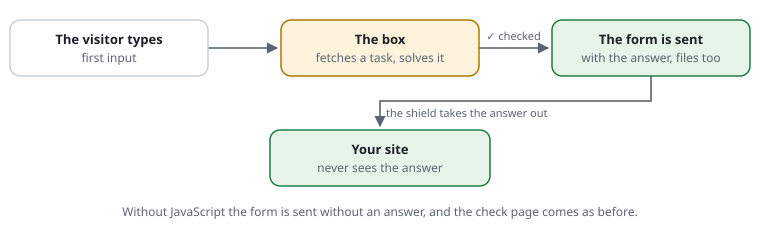

# RSF03-03 The browser check inside the form

## What it does

A placeholder in a form becomes a small box that checks the visitor's browser
**while they type** — *"Checking your browser … ✓ Browser checked"* — and puts
the answer into the form. When the form is sent, the shield finds the answer
there and lets the form through: no check page, nothing sent twice, **files
included**. Off unless switched on.



```text
set widget-path /request-shield          # the endpoint: /request-shield/challenge, /request-shield/widget.js
```

```php
<form method="post" action="/contact" enctype="multipart/form-data">
  …
  <?= CjwNetwork\RequestShield\Shield::active()?->widget() ?>
  <button>Send</button>
</form>
```

and where the form arrives, as for any form the site wants checked
([the site asks for the check](RSF03-04-app-challenges.md)):

```php
Shield::active()?->requirePass();        // the answer from the form counts
```

A page where every visitor is checked (`challenge /login`) takes the answer
from the form too.

`widget()` writes the placeholder `<div data-request-shield></div>` and, once
per page, `<script src="/request-shield/widget.js" defer>`; both can also be
written by hand. `widget('load')` checks at once instead of on the first input;
`data-start="submit"` on the placeholder only when the form is sent.

## How it works

1. The page carries **no task**, so it stays cacheable (an HTTP cache,
   Varnish). On the first input into the form, the script asks the shield for
   one: `GET /request-shield/challenge` — answered by the shield, before the
   application, as JSON in ALTCHA's format, with the texts in the visitor's
   language. A visitor holding a pass gets `{"passed": true, "until": <Unix time>}` and the ✓ at
   once; sent after `until` (less 20 seconds), the box fetches a task first. A pass with
   less than 30 seconds left gets a task anyway.
2. The browser solves the task (the check page's own solver; the widget's
   difficulty is lower, `set widget-difficulty 25000`: the visitor is typing)
   and puts the answer into a hidden field, `rss`.
3. When the form is sent, the shield checks the answer — signed, for this
   visitor, a few minutes valid, **once** — sets the pass cookie and takes the
   field out of `$_POST`: the application never sees it.
4. Sent before the check is done: the script waits for it, then sends.
   Without JavaScript, or when the endpoint cannot be reached: the form is sent
   without an answer, and the shield checks as before (the check page; a form
   without files is sent again by itself afterwards).

The box has the classes `rs-widget`, `rs-icon`, `rs-text` and a `data-state`
(`idle`, `checking`, `done`, `failed`) for the site's own styles, `role="status"`
and `aria-live="polite"` for screen readers. Next to it, not inside it, a
small `?` link (class `rs-about`) opens [the browser check in plain
words](../explained/browser-check.md) for the visitor; its title is the text
`about`, and `set docs-url off` leaves it out. `widget.js` is served with a day's
cache and an ETag; for a strict Content-Security-Policy it is a file, not an
inline script.

Because the endpoint speaks ALTCHA's format, ALTCHA's own widget should work
against it instead (its `challengeurl` pointing at the endpoint, `name="rss"`):
the shield accepts answers in ALTCHA's encoding (tested); the widget itself has
not been tried with it yet.

## Cost

Pages without the placeholder: nothing — with `widget-path` unset, not even
the path comparison. With it: one request to the endpoint per form view (the
task, ~12 µs on the server), the script once per browser, and a fraction of a
second in the browser while the visitor types. The endpoint counts against the
visitor's budgets like any request.

Proposal: [0010](../proposals/0010-browser-check-in-the-form.md). Demo:
`/contact` in `examples/demo`.

## Examples from the demo

What the demo's rules decide for this feature -- the same lines `request-shield test` checks and the demo's front page shows (`php -S 127.0.0.1:8080 examples/demo/router.php`).

<!-- examples: docs/tools/sync-examples.php from examples/demo/request-shield.rules -- do not edit; run the tool. -->
**RSF03-03 · The check inside the form**

A box in the form checks while the visitor types; the form goes straight through, a file too.

| Request | The rules decide | |
|---|---|---|
| `/contact` | look at it | The contact form with the box |
<!-- /examples -->
