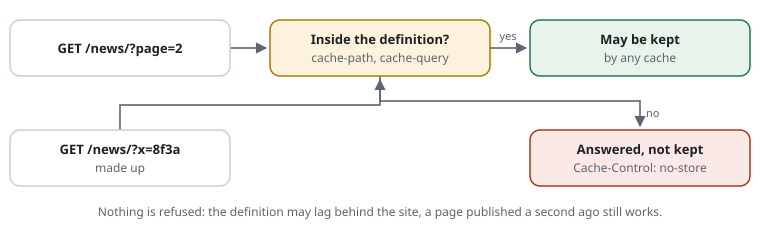

# RSF04-01 The cacheable definition

`Request::cacheKey()` (0031 C.4) names the answer for an HTTP cache: scheme and host in lower case, the path as the application routes it, the parameters sorted -- nothing of the client; whether the answer may be kept is the decision's (`cacheable()`). A cache is a plugin with the `Handler` capability ([plugins](RSF06-04-plugins.md#capabilities-what-a-plugin-can-do-for-the-pages)).

## What it does

Says which answers a page cache may keep. A request outside the definition is
**not refused** — the definition can lag behind the site, a page published a
second ago — but answered as `allow-uncached`: the application renders it, and
no cache stores it. So random paths and parameters can never fill a cache.



- `cacheable.query`: the query parameter names a cacheable URL may carry
  (`null`: any, `[]`: none).
- `cacheable.paths`: regular expressions a cacheable path matches (`null`: any).
- An adapter's URL index (the `$known` callback): `true` = cacheable,
  `false` = not, `null` = no opinion (the patterns decide).
- Anything but GET and HEAD is never cacheable.

## Use cases

- `?utm_source=…`, `?x=<random>` or invented paths on a site with a page cache
  (Varnish, LSCache, Exponential's HTTP cache): answered, never stored.
- The same campaign link with every `utm_` value a new one: with
  `cache-ignore`, one kept page answers them all.
- An application reads the decision and skips its own cache write.

## Configuration

```php
'cacheable' => ['query' => ['page'], 'paths' => ['#^/[a-z0-9_/-]*$#']],
```

In the application:

```php
if (!\CjwNetwork\RequestShield\Shield::current()?->cacheable()) {
    // answer, but do not store
}
```

or `$_SERVER['REQUEST_SHIELD'] === 'allow-uncached'`.

## Query parameters: in the key, ignored, unknown

[Proposal 0048](../proposals/0048-query-parameters-and-php-caches.md): fewer
keys, more hits -- for the shield's HTTP cache and every cache that runs in
PHP after it (Exponential's `exphttpcache`, Symfony's `HttpCache`, a
WordPress page cache).

```text
cache-query page sort                 # in the key
cache-ignore @tracking                # ignored: utm_*, gclid, fbclid … (the shipped set's names); or name them: cache-ignore utm_* ref
set cache-unknown-query hit-only      # unknown: answered from the page without it, never kept (default: uncached)
```

| Kind | In the key | The application sees it | A hit | Kept |
|---|---|---|---|---|
| in `cache-query` | yes | yes | yes | yes |
| `cache-ignore` | no | no -- taken out before | yes: the page without it | yes, as the page without it |
| unknown, `hit-only` | no | yes | yes, when the page without it is kept | no |
| unknown, `uncached` (default) | -- | yes | no | no |

- **In this order:** the rules decide on the whole query (an attack in
  `utm_source` is still refused), the log and the statistics see it; then
  the ignored parameters leave `$_GET`, `$_REQUEST`, `QUERY_STRING` and
  `REQUEST_URI` -- a copy goes to `$_SERVER['REQUEST_SHIELD_IGNORED']` (JSON,
  name => value) for tracking on the server. A page made for a campaign link
  therefore never carries `utm_source` in its links. The check page's resend
  keeps the whole address.
- **Names as PHP names them:** `utm.source` and `%75tm_source` are
  `utm_source`, `utm[x` is `utm_x`. `$_REQUEST` is rebuilt as PHP would
  have made it without them (`request_order`: a cookie of the same name only
  where it counts).
- **`cache-query` wins:** a name it names stays in the key, whatever a
  `cache-ignore` glob matches (`cache-ignore p*` never takes `page` out);
  `check` names the overlap.
- **Unknown, `hit-only`:** `$_SERVER['REQUEST_SHIELD']` stays
  `allow-uncached` (keep nothing), and
  `$_SERVER['REQUEST_SHIELD_CACHE_LOOKUP']` names the address a cache may
  answer from (the path and the `cache-query` parameters, sorted). **The
  caveat:** a parameter that does change the page (`?lang=en`) gets the plain
  page on a hit -- a wrong answer for that visitor, never a poisoned cache.
  Name such parameters in `cache-query`. `check` warns about `hit-only`
  without `cache-query`.
- `include @tracking` alone ignores nothing: `query strict` lets its
  parameters through, `cache-ignore @tracking` leaves them out of the keys
  (some carry a visitor's identity for the application -- `mkt_tok`,
  `_hsenc`: name only what the site does not read).
- **Only PHP caches:** a Varnish or CDN in front sees the request before the
  shield runs.

## Cost

About 0.5 µs. With `cache-ignore` or `hit-only`: the query's pairs compared
once more, and `$_SERVER` rewritten only for a request that has an ignored
parameter.

## Limits

The shield only marks; the cache has to honour the mark. Adapters for
Exponential, WordPress and Ibexa (planned) do that for their caches.

## Examples from the demo

What the demo's rules decide for this feature -- the same lines `request-shield test` checks and the demo's front page shows (`php -S 127.0.0.1:8080 examples/demo/router.php`).

<!-- examples: docs/tools/sync-examples.php from examples/demo/request-shield.rules -- do not edit; run the tool. -->
**RSF04-01 · What a cache may keep**

Every page passes; only some may be kept by a cache. Unknown paths and parameters reach the site, but marked so a cache does not keep them -- made-up URLs cannot fill it.

| Request | The rules decide | |
|---|---|---|
| `/` | passes; a cache may keep it — from another address (198.51.100.7) | A normal page |
| `/page/about` | passes; a cache may keep it — from another address (198.51.100.7) | A known page |
| `/?utm_source=newsletter` | passes, but a cache must not keep it — from another address (198.51.100.7) | A link from a newsletter: a known marketing tag, not for a cache |
| `/random/abc` | passes, but a cache must not keep it — from another address (198.51.100.7) | An unknown path: the site answers it (200 or 404), a cache must not keep it |
<!-- /examples -->
