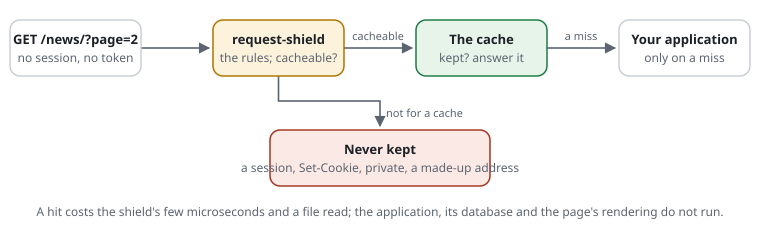
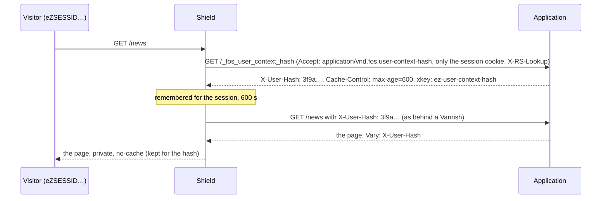

# RSF04-03 The HTTP cache

## What it does



A plugin (`plugins/cache`, the edition `request-shield-cache.php`) that keeps
the application's public answers and gives them out again before the
application starts: no framework, no database, no rendering for a page that
was built a minute ago. It keeps only the addresses
[a cache may keep](RSF04-01-cacheable-definition.md) -- made-up paths and
parameters never fill it -- and never a page that may be someone's own.

- **A hit:** the kept answer, with `Age` and `X-RS-Cache: hit`; `If-None-Match`
  with its ETag gets `304`.
- **A miss:** the application runs as always (`X-RS-Cache: miss`); its answer
  is kept when it may be kept by anyone.
- **Kept:** status 200, 301 or 308; no `Set-Cookie`; no `private`, `no-store`
  or `no-cache` (nor `Pragma: no-cache`, nor an `Expires` gone by); not
  encoded by the application (`Content-Encoding`); no `Vary` but on the
  encoding -- every line of a header counts; at most `http-cache-max-object`
  (a larger answer is not held in memory either). For the answer's own
  `s-maxage` or `max-age`, else `http-cache-ttl`.
- **Only whole answers:** what the application throws away with `ob_clean()`,
  an answer it ends before the script does (`ob_end_flush()` of every buffer,
  `fastcgi_finish_request()`), or a fatal error -- not kept.
- **Only the site's names:** the host as the visitor sent it, port and all,
  must be on `http-cache-hosts`. An application that builds links or a
  redirect from the `Host` header would otherwise keep a page made for
  `www.example.org:1337` for everyone, and made-up names would fill the
  cache.
- **One key, one answer:** an address with a parameter twice (`?a=1&a=2`) or
  an encoded `/`, `?`, `#` in its path is not kept.
- **Never asked:** a request with a cookie that is not named harmless (a
  session, a cart, a login), with `Authorization`, a POST, or an address the
  rules found not cacheable.
- **Off by default.** Off, the plugin is not even loaded: a request pays nothing.

### Tags and purges: what the CMS already sends

The cache understands the headers and requests a CMS sends to the caches
it knows ([proposal 0039](../proposals/0039-cache-compatible.md)), so its
cache plugin works unchanged -- and a site that grows puts a Varnish in
front and switches this cache off, with nothing to change in the
application.

- **Tags in the answer:** `xkey` (Varnish: Ibexa, Exponential Platform),
  `X-Cache-Tags` (FOSHttpCache), `X-LiteSpeed-Tag`, `Surrogate-Key`,
  `Cache-Tag`, `Edge-Cache-Tag`, `X-Magento-Tags`, Exponential's older
  `X-Location-Id` (as `location-<id>`), and one of your own with
  `http-cache-tag-headers`. Split at spaces and commas, kept with the answer
  and **taken out of what the visitor gets** -- they name content ids. A
  LiteSpeed tag `private:…` means the answer is not kept; `public:` is
  dropped. More than 500 tags: not kept.
- **Every answer also has the tag of its address** (path and query, any
  host), so `PURGE /news/?page=2` purges it.
- **Purge requests** -- answered before the rules, `200 Purged`:

  | Request | Purges | Sent by |
  |---|---|---|
  | `PURGE <address>` | that address | any purge client |
  | `PURGE /` with `key: a b` (`key: ez-all`: everything) | tags | Exponential Platform |
  | `PURGE /` with `X-Cache-Tags: a,b` | tags | FOSHttpCache, Ibexa "local" |
  | `PURGE /` with `X-Location-Id: *`, `12` or `(1\|2\|3)` | everything, or `location-12` … | Exponential's older calls |
  | `PURGEKEYS /` with `xkey-purge: a b` or `xkey-softpurge: a b` | tags (a soft purge purges, for now) | Ibexa with Varnish |

  Only from `http-cache-purgers` or with `X-Invalidate-Token` equal to
  `http-cache-purge-token`; **by default nobody**. A CMS on the same machine
  needs `set http-cache-purgers 127.0.0.1 ::1` -- but only where no proxy
  runs on the machine: behind a local nginx or Varnish that adds no
  forwarding header (`proxy_pass` does not by default), every visitor comes
  from `127.0.0.1`. There, use the token.
  A request from such an address that came through a proxy the shield does
  not trust (it carries `X-Forwarded-For`, `Forwarded`, `X-Real-IP` or
  `Via`) does not count. Anyone else meets the rules: `405`, as for any
  method the site does not take -- no hint that a cache is there.
- **Purges in the answer** (LiteSpeed's way, any method, a POST's too):
  `X-LiteSpeed-Purge: tag=c52, /news/, *` purges tags, addresses or
  everything before the answer leaves, and is taken out.
- **Purges from the application itself** (an adapter, in the same PHP
  process): `Shield::active()?->purge(['content-12', 'list'])` -- tags, `*`
  for everything; no `PURGE` request. A plugin with the `Purger` capability
  (the cache) makes the answers with those tags out of date; without one
  the call does nothing. `Shield::active()?->hasWidget()` tells an adapter
  whether the check in forms is on, without sending its script (as
  `widget()` does, once per page).
- **How a purge works:** no list of pages is searched. Each tag remembers
  when it was purged last; a kept answer remembers when its request began.
  A hit whose tag -- or everything -- was purged since is a miss, and the
  page is made and kept anew. A purge is one small file written (and its
  copy in APCu), whatever the number of pages; a hit asks first when
  anything was purged at all, so a page made after the last purge costs one
  read more, not one per tag.

### One page per role: signed-in visitors too

Without more, a session cookie means the site answers. With a page per
role, editors get the editors' page from the cache, members the members'
-- the application says who the visitor is, in the same PHP process
(proposal 0039), and the shield never trusts the browser with it:

```php
// in the CMS's adapter, while the application runs (a WordPress plugin, an Exponential extension):
\CjwNetwork\RequestShield\Shield::active()?->cacheContext('editor', shared: true);
// in its logout hook:
\CjwNetwork\RequestShield\Shield::active()?->forgetContext();
```

- **What is kept:** `MAC(secret, the session cookie) -> role` in APCu, for
  `http-cache-context-ttl` (`10m`) after the application last named it. The
  next request with that cookie finds the role before the application
  starts. The key is the session cookie itself: whoever has it *is* that
  user; an unknown or forged cookie finds nothing, and the application
  runs. A role cookie the browser could set was rejected for that reason.
- **Which pages:** only those the application names the role for **in
  that request** (a role remembered from earlier is no proof: the session
  may have ended) and calls the same for everyone with the role --
  `cacheContext(..., shared: true)` (it also stands for the
  page's `Cache-Control`; kept for `http-cache-ttl` when the page says
  `no-cache`), or `Vary: X-User-Hash` / `X-User-Context-Hash`, as
  FOSHttpCache applications send it. Any other answer to a signed-in
  visitor is not kept. A page that holds one user's data -- a nonce, a
  name, a cart -- must not be called shared.
- **How it leaves:** `Cache-Control: private, no-cache` -- no cache behind
  the shield and no browser keeps one role's page for another. The `Vary`
  on the hash stays, for a cache in front. An anonymous page with that
  `Vary` is kept as before; a request that sends `X-User-Hash` or
  `X-User-Context-Hash` itself is never answered from the cache nor kept
  (an application that believes the header would make a role's page).
  On a miss it carries `X-RS-Cache: miss; role`: the statistics then know
  that `private` is the cache's own, not the site's.
- **Which cookies:** `http-cache-session-cookie` names the session cookies
  (`wordpress_logged_in_* eZSESSID* PHPSESSID`). A request with any other
  cookie besides those and the harmless ones (a cart) is the visitor's own,
  as before.
- **Roles changed:** a purge of the tag `rs-context` forgets every
  remembered role and every role's page; `forgetContext()` in the logout
  hook forgets one session. Without either, a visitor whose roles changed
  gets the old role's page from the cache until the application runs for
  them again -- at most `http-cache-context-ttl`. A role's page is purged
  by its address like any page.
- **Needs APCu:** without it a session cookie means the site answers, as
  before.

### Exponential 6: its own HTTP cache

Exponential 6 has its own role-aware page cache since 6.0.15
(`exphttpcache`: pages before the kernel starts, anonymous, role and private
contexts, purge on publish). Two caches in a row are worse than one, so
there the shield's cache stays off (proposal 0048, 0031 step G.6):

- **The shield keeps no page that carries `X-Exp-Cache`** (`appcache` in the
  statistics), and PHP's error log says once a minute that `http-cache` should
  be off for that site.
- **The statistics read `X-Exp-Cache`** as they read `X-RS-Cache`: the
  response times by hit and miss for Exponential's cache
  ([statistics](RSF06-03-statistics.md#how-fast-the-site-answered)).
- **Fewer keys for it too:** with `cache-ignore` the shield takes tracking
  parameters out before Exponential's early exit looks up the page
  ([the cacheable definition](RSF04-01-cacheable-definition.md#query-parameters-in-the-key-ignored-unknown)).

### The role from FOSHttpCache's user hash: Ibexa, Exponential Platform

An application built on FOSHttpCache computes the role itself -- the
*user context hash* a Varnish asks for. With `set http-cache-user-context
on` the shield asks it the same way, and no adapter is needed:



- **Asked once per session** for the hash answer's `max-age` (at most an
  hour; without one `http-cache-context-ttl`), with only the session
  cookies; kept in APCu with the hash answer's tags -- the CMS's purge of
  `ez-user-context-hash` (roles changed) asks again. Every session of a
  role shares the role's pages.
- **Where it asks:** `on` -- the site itself, at the address the visitor
  used (scheme, host and port); or the address given (`set
  http-cache-user-context http://127.0.0.1:8080`, the visitor's host sent as
  `Host`; the address's path is kept as written). 2 seconds at most; a
  redirect is not followed (it is no hash). **Prefer an address of the
  application server itself:** behind a CDN or a proxy, `on` goes out and
  back in through it.
- **The answering server** is the shield in front of the application, with
  the **same secret and the same `http-cache-session-cookie`**: it knows the
  question by its `X-RS-Lookup` (a MAC of the session cookie), only as
  `GET /_fos_user_context_hash` without a hash header. Several servers:
  share the secret (`set secret …` or the same store).
- **The header:** `X-User-Context-Hash` (Ibexa, the default) or
  `set http-cache-user-hash-header X-User-Hash` (Exponential Platform). The
  application gets it in the request, as from a Varnish, and its pages
  vary by it.
- **The shield's own question** carries `X-RS-Lookup`, a MAC of the session
  cookie: the shield lets it through to the application. A visitor that
  asks for a hash (that `Accept`) or sends one gets `400`, as the Varnish
  configurations answer.
- **Fail safe:** no hash -- the cache is skipped for this request, the
  application answers. The application not answering (no answer, a
  timeout, 502, 503, 504): nobody is asked for 60 seconds. Any other answer
  without a hash (a 500, a 4xx, a redirect, no header): that session is not
  asked for 60 seconds.
- **Never a cost a visitor can multiply:** a session cookie a browser could
  not send (a space, a quote, a comma, over 512 bytes) is not asked with;
  new sessions from one address get at most 30 questions a minute; at most
  2 questions wait at a time (each holds a PHP worker while it waits for
  another) -- past either, the cache is skipped, the application answers.
- **The question is a request to the site:** rules that refuse or check a
  request from the server's own address to `/_fos_user_context_hash`
  switch the roles off; let that address in (`exempt 127.0.0.1 ::1` when
  the shield asks there).
- **A remembered hash counts as the application's own** for its `max-age`:
  a role changed in the CMS without purging `ez-user-context-hash` keeps
  the old role's pages until then (as behind a Varnish).
- **Needs APCu and an HTTP client** (`allow_url_fopen` or curl); `check`
  says when one is missing, and when no `http-cache-session-cookie` is set.

### Memory first, the disk when needed

With APCu, small answers stay in memory: a hit is one `apcu_fetch`, no
file (a 20 KB page: about 9 µs instead of 16 µs from the disk, measured
with the plugin alone).

- **In memory:** answers up to `http-cache-memory-object` (default `256K`),
  for at most an hour; one that lives longer is on the disk too and comes
  back into memory on its next hit. Larger answers, and everything without
  APCu, go to the disk (`http-cache-dir`).
- **Its share of APCu:** at most `http-cache-memory` (default `32M`) --
  counted per hour of storing, so the count is an upper bound (a purged
  answer counts until its hour has passed). Above it, or when APCu would
  keep less than a quarter free, an answer goes to the disk: a full APCu
  (with `apc.ttl` 0) is emptied whole, and the shield's budgets and roles
  with it.
- **Purges** reach memory as the disk: by tag and address at once. The
  command line's `cache purge` (everything or below a path) empties the
  disk and makes every answer in memory out of date -- the web server's
  APCu sees it within 10 seconds (the command line's APCu is its own); the
  API's purge and a `PURGE` request at once.
- **The disk's cap:** `http-cache-disk` (default `256M`, `0`: none). Each of
  the cache's 256 folders holds a 256th of it; past it, the expired and then
  the oldest answers go until the folder holds nine tenths. With APCu the
  folders' bytes are counted as answers are written (exact per folder);
  without APCu the sweep (one store in a hundred) trims the folder it
  sweeps -- on average within the cap, not every folder at every moment.
  `request-shield cache … expired` trims every folder (cron).

## Use cases

- **A CMS without a page cache of its own** on simple hosting: the news, the
  product pages and the start page come from files, not from PHP and the
  database.
- **A flood of real addresses** (a newsletter, a link on a big site): the
  first visitor builds the page, everyone else gets it from the cache.
- **Together with the shield's definition:** a bot that asks for
  `/?x=1`, `/?x=2` … gets answers, but none of them is kept -- the cache only
  holds the site's real pages.

## Configuration

```text
set http-cache on
set http-cache-hosts www.example.org example.org   # the site's names (required: nothing is kept without)
set http-cache-ttl 5m                       # when the answer says nothing (its s-maxage or max-age wins)
set http-cache-cookies _ga* _pk_* rsp       # cookies that do not make a page someone's own (default: analytics, the pass)
set http-cache-max-object 1M                # the largest answer kept
set http-cache-memory-object 256K           # with APCu: the largest kept in memory (0: none in memory)
set http-cache-memory 32M                   # the most of APCu the answers may take
set http-cache-disk 256M                    # the most the folder holds -- the oldest go first (1M or more; 0: no cap)
set http-cache-dir /var/cache/request-shield   # default: <store-dir>/http-cache
set http-cache-purgers 127.0.0.1 ::1        # who may send PURGE / PURGEKEYS (default: nobody; not behind a local proxy)
set http-cache-purge-token …                # or anyone with this X-Invalidate-Token (16 characters or more)
set http-cache-tag-headers X-My-Tags        # a tag header besides the known ones
set http-cache-session-cookie wordpress_logged_in_*   # a page per role for these sessions (needs APCu)
set http-cache-context-ttl 10m              # how long a session's role is remembered
set http-cache-user-context on              # the role from FOSHttpCache's user hash (or the address to ask)
set http-cache-user-hash-header X-User-Hash # its header: X-User-Context-Hash (default) or X-User-Hash
cache-query page sort                       # the parameters a page may have (RSF04-01)
```

Emptying it -- after a deploy, or a CMS after it published a page:

```bash
php bin/request-shield cache site.rules                    # how many answers, how many bytes
php bin/request-shield cache site.rules purge --path=/news/
php bin/request-shield cache site.rules purge --tag=c52,l2   # the answers with one of the tags
php bin/request-shield cache site.rules expired            # cron: remove what has run out, keep the folder within http-cache-disk
```

**In the dashboard:** the tab *HTTP cache* (`/rs/cache`, below
`dashboard-path`; the administrator only, while `http-cache` is on) shows
what the cache holds against its caps -- memory (an upper bound, APCu's free
memory beside it) and disk -- a bar per day for the last two weeks (from the
cache, asked the site and kept, not to be kept, past the cache; the share of
hits above each bar, the numbers as a table; with the statistics' part
`times`), leads to the response times by hit and miss in the statistics,
and purges by tag, below a path or everything (forms with
the page's token, an HMAC of the viewer's address and the hour, as the lists'
page has).

The same in the [API](RSF06-05-api.md): `GET /rs/api/v1/cache`, `POST
/rs/api/v1/cache/purge` with `path` or `tags` (a write: `set api-write on`).
A purge by tag from the command line reaches the web server's copy in APCu
within 10 seconds (the command line's APCu is its own; the files are what
counts). `request-shield check`
warns when `http-cache` is on without `http-cache-hosts`, and when every query
parameter is cacheable (no `cache-query`). A purge below a path compares
literally: `--path=/news` takes `/newsletter` too.

## Cost

| | |
|---|---|
| off | nothing: the plugin is not loaded |
| on, a hit | the shield's decision, one APCu read (memory) or one file read (the disk; then one APCu write: it comes into memory), and the time of the last purge (one APCu read, or one small file) -- instead of the application; the tags' times only when something was purged since the page was made |
| on, a miss | one output buffer, a callback before the headers go out (tags and purges taken out), and, when kept, after the answer: two APCu reads, APCu's free memory and one APCu write (memory), or one file written and one APCu count (the disk; past a folder's share the folder is measured and trimmed) |
| a purge | one small file per tag and one for "anything", with APCu their copies |
| a signed-in visitor, roles on | one MAC and one APCu read before the cache is asked; `cacheContext()` one APCu write |
| the user hash (`http-cache-user-context`) | one request to the application per session and `max-age` (a lookup is a small answer; 2 s at most) |

## Limits

- **One server's files:** several servers keep their own unless
  `http-cache-dir` is shared.
- **The cap is the folder's, not the store's:** `http-cache-disk` holds for
  the answers; the purge times (`tags/`) are small files kept 30 days.
- **Memory is per server:** each PHP pool has its own APCu, and the command
  line reaches it only through the purge times (10 seconds).
- **One key per spelling of a path:** the key holds the path as it was
  sent (as Varnish's `req.url` does for the path): `/news//item`,
  `/n%65ws/item` and `/news/item` are three keys. The parameters are
  decoded and sorted; an address with a name PHP reads twice or folds
  (`page=1&page=2`, ` page`) is not kept, nor one sent with a `#` or a
  whole URL as its target, nor a request with `X-Original-URL` or
  `X-Rewrite-URL` (some frameworks route by them). A redirect to another
  spelling of its own address (`/news/?` to `/news/`, `//` to `/`) is never
  kept: it would be a loop for everyone. A purge by address reaches every
  spelling (it names the decoded path); so does a purge by tag.
- **Every spelling is its own entry:** made-up spellings of a page fill
  the cache like made-up addresses do -- `http-cache-disk` caps them.
- **Redirects are kept for everyone:** a 301 or 308 that sends visitors to
  different places by language or device without saying `Vary` is kept as
  the first visitor got it -- send such redirects with `Cache-Control:
  private`.
- **Concurrent misses** each run the application; the last one written is
  kept.
- **The user hash costs a second request** for a new session (and after its
  `max-age`): with `on` and one small PHP-FPM pool, the question waits for a
  free worker of the same pool -- under load it times out after 2 seconds
  and roles pause for a minute. Ask another pool or the application server
  directly (`set http-cache-user-context http://127.0.0.1:8080`).
- **One header callback:** PHP allows one `header_register_callback()` per
  request. An application that registers its own replaces the cache's: its
  tag headers then reach the visitor and its `X-LiteSpeed-Purge` is not
  followed (the tags are still kept with the answer; purges by request
  work).
- **Not yet:** `BAN` with patterns, a soft purge that serves the stale page
  while one request renews it -- the
  further parts of [proposal 0039](../proposals/0039-cache-compatible.md).
- **Pages that differ by language or device** (`Vary: Accept-Language`,
  `Vary: Cookie`) are not kept: one address, one answer.
- **Signed-in visitors only per role,** and only when the application names
  the role (`cacheContext()`) or gives its user hash
  (`http-cache-user-context`); without either a session cookie means the
  site answers.
