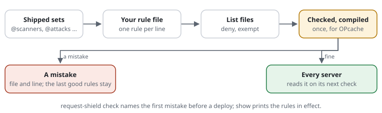

# RSF05-01 Rule files

## What it does

The settings written one rule per line, for people rather than PHP — readable
and editable without knowing PHP arrays, loadable from a main file plus any
number of further files (one per CMS extension, say), and compiled once into
the same OPcache-served PHP file the settings use. A rule file is an
alternative to the PHP settings array, not a second system: it is turned into
that array, and every value is checked the same way.



```text
# site.rules

host        www.example.org example.org
trust       10.0.0.0/8                       # the load balancer

block       /wp-admin/**  /xmlrpc.php        # this site is not WordPress
block regex ^/(phpmyadmin|adminer)

cache-query page
cache-path  /  /news/**  /page/*

limit       requests 600/min challenge-at 300
limit       misses   60/min  on-demand
challenge   /login  /admin/**                # always check the browser
challenge   POST **                          # every form sent: the check first (not the pages)
restrict    /admin/**  to 192.0.2.0/24       # the office only
allow       POST  /contact  /edit/**         # a POST only where the forms are
exempt      192.0.2.50                       # monitoring

set         secret ${SHIELD_SECRET}
set         log /var/log/request-shield.log
include     rules.d/*.rules
```

```php
CjwNetwork\RequestShield\Shield::protectFile('/path/to/site.rules');
// or: REQUEST_SHIELD_CONFIG=/path/to/site.rules with bootstrap.php
```

The demo (`examples/demo/request-shield.rules`) is a complete example.

## The format

One rule per line: a keyword, then values separated by spaces. `#` starts a
comment at the start of a line or after a space; `\#` is a literal `#`.

<!-- reference rules: docs/tools/gen-reference.php -->
| Rule | Setting | |
|---|---|---|
| `host <names>` | `hosts` | the site's hosts; others 404 |
| `trust <addresses or ranges>` | `trustedProxies` | who may send `X-Forwarded-*` |
| `method <METHODS>` | `methods` | methods allowed at all |
| `allow <METHODS> <paths>` | `methodPaths` | those methods only there, else 405 ([access rules](RSF02-03-access-rules.md)) |
| `restrict <paths> to <addresses or ranges>` | `restricted` | only those addresses, else 403 ([access rules](RSF02-03-access-rules.md)) |
| `block <paths>` / `unblock <paths>` | `blockedPaths` | 404 before the site sees it / take a block back |
| `block query\|header <Name>\|headers\|anywhere <regex>` | `contentRules` | attack patterns in the query or the headers, 403 |
| `unblock [<what>] at <paths> [for <addresses>]` | `blockExceptions` | blocked paths let through at some paths only (an admin's file reader) ([access rules](RSF02-03-access-rules.md#exceptions-an-admins-file-reader)) |
| `query <name> <type> … [at <paths>]` / `query strict` | `queryParams`, `queryStrict` | the query parameters the site takes and their types (`int`, `number`, `word`, `id`, `list`, `text`, `any`, `/regex/`); only `text` and the unknown ones go to the attack patterns; `strict`: anything else 404 ([known parameters](RSF02-05-known-parameters.md)) |
| `cache-path <paths>` | `cacheable.paths` | what a cache may keep; `any`: every path (default) |
| `cache-query <names>` | `cacheable.query` | parameters a cached URL may have; `any` (default), `none` |
| `limit <name> <n>/<unit> [challenge-at <n>] [on-demand] [on-exceeded challenge] [at <paths>]` | `budgets` | units `s`, `sec`, `min`, `hour`, `day`, also `20/10s`; `on-exceeded challenge`: past the limit the check that frees the counter instead of a pause ([budgets](RSF03-01-budgets.md#past-the-limit-a-pause-or-earn-it-back)); `at <paths>` (or inside a `match` block): only requests there count ([an area's budget](RSF03-01-budgets.md#a-budget-for-one-area)) |
| `post-origin same [missing check\|allow\|refuse] [except <paths>]` / `post-origin except <paths>` | `postOrigin` | forms (POST, PUT, PATCH, DELETE) only from the website's own pages: `Origin`, else `Referer`; another website 403, neither the browser check ([forms from the website](RSF02-04-forms-from-the-website.md)) |
| `backend <paths>` | `backend` | the editors' area: its forms counted apart in the statistics, one entry per area ([forms in the statistics](RSF06-03-statistics.md#forms-sent-from-where-how-they-ended)); inside a `match` block without paths |
| `api-path <paths>` | `challenge.apiPaths` | the site's API: a check there is JSON with a header, not a page |
| `no-limit <name>` | `budgets` | switch a budget off, the default one too |
| `challenge [<METHODS>] <paths> [max-age <duration>]` | `challenge.alwaysPaths`, `challenge.alwaysMaxAge`, `challenge.alwaysMethods` | always check the browser there; `max-age 5m`: a pass from the last five minutes there ([modes](RSF05-03-modes.md)); with methods first only those: `challenge POST **` checks every form sent and every endpoint posted to, not the pages ([every form](RSF03-02-browser-challenge.md#every-form-and-every-endpoint-challenge-post)) |
| `monitor <rule>` | `monitorRules` | before `block`, `restrict`, `allow`, `limit`, `challenge`, `ban`, `feed`, `query strict`: logged as it would decide, not enforced ([modes](RSF05-03-modes.md)) |
| `stats-group "<name>" <websites>` | `ext.stats.groups` | websites of one customer, read together and each on its own; counted apart without naming them in `stats-hosts`; above the site blocks ([groups](RSF06-03-statistics.md#groups-websites-per-customer)) |
| `dashboard-access "<principal>"\|* sha256:<hash> [until <day>]` | `dashboardAccess` | who may open the dashboard: the admin (`*`) or a principal (a customer's group in the statistics); only the token's hash (`bin/request-shield access-token`); above the site blocks ([who sees what](RSF06-03-statistics.md#who-sees-what-tokens-a-login-signed-links)) |
| `stats-skip <paths>` | `ext.stats.skip` | not in the statistics when they pass (a map proxy's tiles); refused or checked they are counted; protected all the same ([statistics](RSF06-03-statistics.md#paths-that-are-not-counted-stats-skip)) |
| `challenge-exempt <paths>` | `challenge.exemptPaths` | never challenge there (APIs, feeds) |
| `exempt <addresses or ranges> [until <day>[T<hh:mm>]]` | `exempt.ips` | never counted and never checked, still refused for blocked paths and attack patterns ([IP lists](RSF01-02-ip-lists.md)) |
| `deny <addresses or ranges> [until <day>[T<hh:mm>]]` | `deny` | kept out: 403 before every other check ([IP lists](RSF01-02-ip-lists.md)) |
| `feed <name> [<https-url> \| from <file>] deny\|check\|count\|ban-signal <n> [at <paths>] [format <f>] [wide-ok]` | `feeds` | a public blocklist, fetched by `request-shield feeds … update`; above the site blocks ([feeds](RSF01-03-blocklist-feeds.md)) |
| `ban after <n> <signal> in <time> for <time>` | `bans` | a client past `<n>` signals (`limits`, `refusals`, `checks`, a budget's name) is answered only 429 for a while; above the site blocks ([IP lists](RSF01-02-ip-lists.md#bans)) |
| `crawlers <kind> allow\|check\|block` / `crawler <ID> allow\|check\|block` | `crawlerPolicy` | what the site does with verified crawlers, by kind (`search`, `ai-search`, `ai-user`, `ai-training`) or one by one ([known crawlers](RSF01-04-known-crawlers.md)) |
| `crawler <kind> ua /<pattern>/ [dns <suffixes>] [ranges <lists>]` | `crawlers` | a crawler of the site's own, verified by DNS or an address list (`ranges ./ours.json`) |
| `expect <METHOD> <address> <outcome> [by <ID>] [from <address>] [with pass] [times <n>]` | — | an example of what the rules decide, below the rule it is about; decided by `request-shield test`, never by a request ([examples](RSF05-04-rule-examples.md)) |
| `match <paths> { … }` | — | the rules of an area in one place: the lines inside apply to its paths only ([match blocks](#match-blocks-the-rules-of-an-area-in-one-place)) |
| `site <names> { … }` | `sites` | rules for some websites, added to the base ([site blocks](#site-blocks-rules-per-website)) |
| `ids <PREFIX> [required]` | — | the namespace of this file's IDs; `required`: every rule needs one ([IDs](#ids-namespaces-and-descriptions)) |
| `version <version>` | — | this file's own version, shown by `check` and on the rules page ([versions](#versions-revisions-and-replacing-a-rule)) |
| `replace [<ID>] <rule>` | — | a rule swapped in one line, keeping its ID -- and its count in the log ([replacing](#versions-revisions-and-replacing-a-rule)) |
| `plugin <class> [from <file>]` | `plugins`, `pluginFiles` | a [plugin](RSF06-04-plugins.md), told what was decided and how a request ended; `from` names the file that holds the class, relative to the rule file, for a site without Composer (loaded when the rules are compiled and when the shield makes its plugins); the statistics need none (`set stats on`); a class that is an [extension](RSF06-04-plugins.md#extensions-words-and-settings-of-their-own) brings words and `set` keys of its own, known from its `plugin` line on |
| `set <key> <value>` | any other setting | see below |
| `include <path or glob>` | — | further rule files, relative to this one |
<!-- /reference -->

`none` as the first value empties a list first — the defaults too
(`exempt none 192.0.2.1`, `block none`).

### Paths

Simple patterns by default, matched against the path (not the query):

| Pattern | Matches | Not |
|---|---|---|
| `/wp-admin/**` | `/wp-admin`, `/wp-admin/x/y.php` | `/wp-adminx` |
| `/page/*` | `/page/about` | `/page/a/b` (`*` stays in one segment) |
| `*.sql` | `/dump.sql`, `/a/b/dump.sql` (no leading `/`: anywhere) | `/dump.sqlx` |
| `**/admin/**` | `/admin`, `/shop/admin/x` (in any directory) | `/administrator` |
| `/file?.txt` | `/file1.txt` (`?` is one character) | `/file12.txt` |

`regex` switches the rest of the line to regular expressions, written without
delimiters: `block regex ^/(phpmyadmin|adminer)`. Every pattern is compiled
when the files are read — a broken one is an error then, never a silent miss.

`unblock <pattern>` takes back exactly that pattern from an earlier line or
file; `unblock [SCAN-BACKUP]` a rule by its ID.

### Attack patterns

`block` with a target instead of a path pattern looks inside the request —
the patterns are always regular expressions and case does not matter:

```text
block query \bunion\s+select\b          # the query string
block header User-Agent \b(sqlmap|nikto)\b   # one header
block headers \$\{jndi:                 # every header and the Content-Type (not Cookie: name it)
block anywhere \$\{env:                 # path, query and every header
```

Matched after the value is normalised — decoded twice, lower case, SQL
comments and runs of white space as one space (the body of MySQL's versioned
`/*!50000UNION*/` stays: MySQL runs it) — so `%2527`, `UnIoN/**/SeLeCt` or
`/*!50000UNION*/SELECT` do not get past. `headers` normalises each value on
its own and joins them with `\x1e` (no white space: `^` and `\x1e` mark where
a value starts, `\s` does not reach into the next one); the answer is 403 and the log and trace name the rule. Form
contents (POST bodies) are not looked at. `unblock`, `unblock at` and `replace`
work for these rules exactly as for path blocks; `rules/attacks.rules`
(`include @attacks`) is a reviewed set, after the OWASP Core Rule Set's first
level -- [attack patterns](RSF02-06-attack-patterns.md) has the rules, what
they cost and where they stop.

## match blocks: the rules of an area in one place

```text
match /admin/** {
  [SITE-ADM]    restrict to 192.0.2.0/24          # the admin area: office only
  [SITE-ADM-F]  allow POST                        # forms only here
                challenge                         # always the browser check
                unblock [SCAN-HIDDEN@1] for 192.0.2.0/24   # the file manager opens .env
}

match /shop {
  match /checkout/** {
    [SHOP-PAY]  challenge                         # /shop/checkout/**
  }
}

match regex ^/api/ {
                challenge-exempt
}
```

- Inside a block, a rule that takes paths **leaves them out** — they are the
  block's: `restrict to …`, `allow <METHODS>`, `challenge`, `challenge-exempt`,
  `cache-path`, `block` (the whole area), `unblock [<ID>] [for <addresses>]`
  (an exception there), `query <name> <type> …`, `limit <name> <rate> …`
  (a budget that counts this area only, [budgets](RSF03-01-budgets.md#a-budget-for-one-area)),
  and `replace [ID] <one of these>`.
- A block is exactly the rules written out with the path — the same settings,
  the same cost per request; the rules page shows each rule's area.
- An inner block adds its path to the outer one; `**` only at the end of the
  innermost; a block by `regex` holds no blocks.
- Rules without paths (`host`, `trust`, `method`, `exempt`, `block query …`)
  and `set`, `include`, `ids`, `version` do not go inside; `cache-query` per
  area is planned ([proposal 0008](../proposals/0008-match-blocks.md)).
- IDs go on the rules inside, not on the block. `}` stands on a line of its
  own; a block not closed by the end of its file is an error naming the line
  of its `match`.

## site blocks: rules per website

One rule file for a server with many websites ([proposal 0024](../proposals/0024-rules-per-website.md)):
rules outside any block are the **base**, for every website; a `site` block
**adds** rules for some websites and may set their own values.

```text
[BASE-PACE] limit requests 300/min          # the base: every website (counted across all)
[BASE-OLD]  block **/old/**

site shop.a.de a.de {                       # the shop
  match /admin/** {
    [SHOP-ADM] restrict to 192.0.2.0/24     # the office only
  }
  query strict
  no-limit requests                         # not the base's pace …
  [SHOP-PACE] limit shop 120/min            # … its own
}

site *.b.de {                               # every subdomain of b.de: news.b.de, not b.de, not x.news.b.de
  include b.rules
}

site default {                              # any name no block lists
  set mode strict
}
```

- **Which block:** the website's name in lower case, without port and trailing
  dot — the exact name, then `*.` and the name without its first label, then
  `default`; without a `default` block, the base alone.
- **Which name decides:** `set site-from server-name` (the default) takes
  `SERVER_NAME` — with nginx the name of the `server` block that answers, from
  its configuration, not from the visitor (Apache: `UseCanonicalName On`). So a
  visitor cannot pick another website's rules with a `Host` header. `set
  site-from host` takes the `Host` header (from a trusted proxy:
  `X-Forwarded-Host`) — for setups that route by it; `check` warns when there is
  then no `host` rule listing the names.
- **Inside a block:** every rule, `match` blocks, `include` (read only for that
  website), `set` of a website's values (`mode`, `pass-ttl`, `log`, `stats …`),
  and the words that drop a base rule for this website (`no-limit`, `unblock`,
  `challenge-exempt`, `replace`). Not inside — they are about the server:
  `trust`, `set store`, `store-dir`, `secret`, `recheck`, `dns-lookups`,
  `ipv6-prefix`, `site-from`, `lists-dir`, `ban-growth`, `ban-max`, `ban-keep`, `live`, `live-keep`, `feeds-max-age`, `stats-hosts`, `ban`, `feed` (a client
  banned on one website is banned on all); and no `site` inside a `site` or a `match`.
  `deny` may stand inside: it then keeps the address off that website only.
- **Order:** the base first; after the first `site` block only further `site`
  blocks, `include`, `ids` and `version` — an `include sites/*.rules` with a
  `site` block in each file is the same thing as one file.
- **Errors** name their line: a name in two blocks (both lines), a block not
  closed, a name that is no website's (`a.de`, `shop.a.de`, `*.a.de`,
  `default`).
- **Compiled per website:** the base and each website become settings of their
  own (one PHP file each, kept by OPcache), all checked together when a file
  changed — a mistake in any block is an error at once, not at that website's
  first visitor. A request reads the compiled base, looks its website up (two
  `isset()`, ~1 µs) and builds only that website's settings, without a second
  check of the files: measured **about 5 µs more** per request than without
  site blocks (13–20 µs against 9–13 µs for loading the settings), nothing more
  for a website without a block of its own.
- **Budgets:** a budget of the base counts **across all websites** — one address
  flooding many websites is one flood. A `limit` written in a `site` block
  counts on that website only, under its own counter (`a.de@search`), so equal
  names in two blocks never mix — for an application's own limits (an API, a
  shop's searches), not for the defence. Logs per website are the next step
  (0024 phase 2).
- `bin/request-shield check` reads every block and lists them (`sites:
  shop.a.de (a.de) · *.b.de · default; picked by server-name`); `trace` takes the
  website from the address it tests.

## IDs, namespaces and descriptions

```text
ids SITE                                                  # this file's IDs start with SITE-

[SITE-10]    restrict /admin/** to 192.0.2.0/24           # the admin area: office only
[SITE-FILES] unblock [SCAN-HIDDEN] at /admin/files/** for 192.0.2.0/24   # the admin's file reader
             block /old-api/**                            # no ID: named site.rules:5
```

- **`[ID]` before a rule** gives it a name that stays when lines move:
  letters, digits, `-`, `_`, `.` — names or numbers (`[SITE-10]`,
  `[SHOP-CHECKOUT]`). Decisions, the log, the rules page and `trace` use it
  (`rule=SITE-10`); where it is written is shown next to it. A rule without an
  ID is named by file and line, as before.
- **`ids <NAMESPACE>`** at the top of a file: every ID in that file starts with
  `<NAMESPACE>-` — a number block per file, so the site (`SITE`), an extension
  (`SHOP`) and the built-ins (`SCAN`, `WP`) never collide. `ids SHOP required`:
  every rule in the file needs an ID (not `set` and `include`). A namespace
  binds only its own file.
- **An ID used twice** — in any file — is an error naming both places.
- **The comment after a rule is its description**: the rules page shows it
  instead of the pattern, for people who do not read patterns
  (the pattern stays underneath).

## Versions, revisions and replacing a rule

```text
ids SITE
version 2026-09-29.2                                            # this rule set's version

[SITE-DL]  unblock [SCAN-BACKUP@1] at /downloads/**             # downloads are archives
replace    [SCAN-TEST@1] block /phpinfo.php /info.php            # test.php is a real page here
```

- **`version <word>`**, one per file: shown by `check`, `show` and the rules
  page — which rule set is live on which server.
- **`[ID@n]`** before a rule is its revision; the built-in rules raise it when a
  rule changes what it matches ([`rules/CHANGELOG.md`](../../rules/CHANGELOG.md)).
- **`[ID@n]` as a reference** names the revision you reviewed. After a library
  update that changes the rule, `check` (exit 3) and the rules page warn:
  *"SITE-DL (site.rules:4) was written for SCAN-BACKUP revision 1; SCAN-BACKUP
  is now revision 2 … please check what changed"*. The changed rule applies at
  once; only your deviation needs a look.
- **`replace [ID@n] <rule>`** swaps a rule in one line: what the old rule set
  is taken back, the new one takes its ID — the log and the rules page go on
  counting it. For any rule: a built-in one, an extension's, your own.

### Changing a built-in rule — the ways

| You want | Write |
|---|---|
| one rule differently | `replace [SCAN-BACKUP@1] block *.sql *.bak` |
| one rule open at some paths only | `[SITE-DL] unblock [SCAN-BACKUP@1] at /downloads/**` (`for <addresses>`) |
| one rule gone | `unblock [SCAN-CGI@1]` |
| all of a file gone, your own instead | `unblock @scanners`, then `include rules.d/our-scanners.rules` |

Never edit `rules/*.rules` in the library's directory: an update overwrites it,
and the change is gone without a word. The ways above live in your own files
and survive updates — and with `@n` you learn when the rule underneath changed.

## The built-in rules

What they refuse, and why: [blocked paths](RSF02-02-blocked-paths.md) and [attack patterns](RSF02-06-attack-patterns.md).

The blocks every site has are rule files shipped with the library, read
before the site's own rules — the same format, with IDs and descriptions:

| File | IDs | Use |
|---|---|---|
| `rules/scanners.rules` | `SCAN-HIDDEN`, `SCAN-BACKUP`, `SCAN-TEST`, `SCAN-DBTOOL`, `SCAN-CGI`, `SCAN-CONFIG` | always read |
| `rules/wordpress.rules` | `WP-FOLDERS`, `WP-SCRIPTS` | `include @wordpress` (or `block @wordpress`), for sites that are not WordPress |
| `rules/crawlers.rules` | `CRAWL-GOOGLE`, `CRAWL-GPTBOT`, … (19) | always read: the [known crawlers](RSF01-04-known-crawlers.md), with their address lists in `rules/crawlers/` |
| `rules/tracking.rules` | `TRACK-UTM`, `TRACK-GOOGLE`, `TRACK-MICROSOFT`, `TRACK-META`, `TRACK-SOCIAL`, `TRACK-MAIL`, `TRACK-OTHER` | `include @tracking`: the marketing tags as known parameters ([known parameters](RSF02-05-known-parameters.md#the-marketing-tags-tracking)) |

`unblock @scanners` takes back all of a shipped file's blocks, `unblock
[SCAN-CGI]` one. PHP array settings get the same blocks from `Config`; a test
keeps both the same.

### `set`

<!-- reference settings: docs/tools/gen-reference.php -->
| Key | Value |
|---|---|
| `secret` | at least 32 characters; better `${SHIELD_SECRET}` than in the file |
| `store` | `auto`, `apcu`, `file`, `memory` |
| `store-dir` | where file counters, a generated secret, the lists, the feeds and the statistics live; default `.request-shield/store` next to the main rule file (never the system's temp dir, which a shared host shares between customers) |
| `pass-ttl`, `solution-ttl` | `3600`, `30m`, `1h`, `1d` |
| `difficulty-min`, `difficulty-max` | numbers |
| `cookie`, `solution-cookie` | cookie names |
| `bind-user-agent`, `search-engines`, `debug-header`, `strip-untrusted-forwarded` | `on` / `off` (`search-engines off`: no crawler is recognised) |
| `dns-lookups` | new DNS lookups a minute to verify search engines, for all requests together (default 30; `0`: none — a DMZ without DNS) |
| `app-challenge` | `on`: the site may ask for the check with the header `X-RS-Check: 1` ([docs](RSF03-04-app-challenges.md)) |
| `ipv6-prefix`, `max-uri`, `max-query-parameters`, `max-header-bytes` | numbers |
| `challenge-logo` | an SVG file (relative to the rule file) for the middle of the check page's ring, checked strictly ([how it looks](RSF03-02-browser-challenge.md#how-it-looks)) |
| `widget-path`, `widget-difficulty` | the browser check inside a form: its endpoint (`/request-shield`; unset: off) and difficulty ([docs](RSF03-03-browser-check-in-the-form.md)) |
| `home` | a path (`/`) or an address: the shield's own pages (404, a pause, the check page) link to it, "To the home page" |
| `language` | `auto` (default: the visitor's browser language among those there are texts for, else English) or a code: `de`, `en` |
| `text.<key>`, `text.<lang>.<key>` | what visitors read (the rest of the line): for every language, or for one — `set text.de.title Einen Moment, bitte`. Keys: `title`, `text`, `noscript`, `nocookies`, `failed`, `about` (the check page's link for visitors, with `docs-url`); the error pages' titles `bad-request`, `no-access`, `not-found`, `not-allowed`, `too-long`, `too-many`, `too-large`, `error` and their sentences, the same with `-text` (`too-many-text`: `%s` = seconds to wait), and `reference` ([error pages](RSF05-06-error-pages.md)). English and German are built in; another language comes with its texts (`text.fr.title …`) |
| `mode` | `off`, `monitor`, `enforce` (default), `strict` ([modes](RSF05-03-modes.md)) |
| `crawler-verify` | `both` (default), `ranges` (the published address lists only: no DNS, for a DMZ), `dns` ([known crawlers](RSF01-04-known-crawlers.md)) |
| `log`, `log-level`, `log-ip`, `log-max-size` | [the log](RSF05-05-log-and-rule-ids.md) |
| `error-page` | a page of the site's own for a status the shield refuses with: `set error-page 404 errors/404.html`, `4xx` for all of them, `{lang}` in the name for one per language (`errors/pause.{lang}.html`); relative to the rule file, HTML up to 64 KB, read when the rules are compiled; placeholders `{status}` `{title}` `{text}` `{wait}` `{home}` `{lang}` `{reference}`; also in a site block -- without one, the shield's own page ([error pages](RSF05-06-error-pages.md)) |
| `docs-url` | where the pages' `?` links and the command line's hints point: the docs' folder, the repository's by default; a copy of your own (`https://docs.example.org/request-shield`, `/docs`), or `off` for no links -- the one-sentence explanations stay ([rules and setup](RSF06-01-active-rules-page.md)) |
| `api`, `api-write`, `api-origins` | the API below `<dashboard-path>/api/v1`: `api` on (default) or off; `api-write` on for the endpoints that change something (off by default); `api-origins` the websites whose pages may call it from a browser (CORS) ([the API](RSF06-05-api.md)) |
| `http-cache`, `http-cache-hosts`, `http-cache-ttl`, `http-cache-cookies`, `http-cache-max-object`, `http-cache-dir` | the HTTP cache: `http-cache` on or off (default); how long an answer is kept when it says nothing (`5m`); the cookies that do not make a page someone's own (default: analytics, the pass); the largest answer kept (`1M`); where (default `<store-dir>/http-cache`) ([the HTTP cache](RSF04-03-http-cache.md)) |
| `file-mode`, `dir-mode` | the modes of the files and folders the shield makes -- store-dir and what is in it, the log, the statistics, the lists, the feeds, the HTTP cache: `0600` and `0700` by default (only the user PHP runs as); a server's own rules exactly (`0640`/`0750` for a group, `02770` so the group is inherited) -- set with chmod after making, before any data, the umask takes nothing away; never writable for everyone; above the site blocks. What exists keeps its mode; the secret and the compiled settings stay `0600` ([settings](RSF05-02-settings.md#file-and-folder-modes)) |
| `stats` | `off` (default), `on`, or the parts: `requests`, `crawlers`, `not-found`, `bots`, `pages`, `forms` (what `on` counts), and `times` -- how long the site took, only when named ([statistics](RSF06-03-statistics.md)) |
| `stats-slow` | with `stats … times`: a request slower than this goes to the slow log (`2s` by default, `0` none) -- a line each, page and time, no address ([how fast the site answered](RSF06-03-statistics.md#how-fast-the-site-answered)) |
| `dashboard-path` | where the statistics pages live: `/rs` (default) gives the statistics under `/rs/stats/` (`overview`, `visitors`, `protection`, `sites`) and `/rs/waf/rules`, `/rs/waf/live`, `/rs/waf/lists`; something in front is fine (`/admin/rs`); the shield serves these pages itself -- a `restrict` rule (`restrict **/rs/** to <addresses>`) or a login must cover them, `check` warns otherwise ([statistics](RSF06-03-statistics.md#the-statistics-page)) |
| `stats-hours`, `stats-days`, `stats-months`, `stats-flush` | days the hours are kept (7), days the day totals are kept (400, then summed into months), months kept (0: for good), seconds between writes to disk with APCu (60) |
| `site-from` | which name picks a site block: `server-name` (the default, the web server's) or `host` (the Host header) — [site blocks](#site-blocks-rules-per-website) |
| `dashboard-session` | how long a login to the dashboard lasts (`8h`; 1 minute to 30 days) |
| `stats-path` | where the statistics plugin's pages live (default `<dashboard-path>/stats`): `…/sites`, `/overview`, `/visitors`, `/protection` below it; the core's stay at `<dashboard-path>/waf/` |
| `stats-hosts` | the websites with statistics of their own: names, `*.domain`, `host` (the host rule's), `sites` (the site blocks'); any other name counts as "other hosts" ([statistics per website](RSF06-03-statistics.md#statistics-per-website)) |
| `stats-depth` | folder levels a section's views are counted for exactly, 1 to 4 (2: `/news/`, `/news/2026/`; 3 where a language takes the first level: `/de/news/2026/`) |
| `crawler-log`, `crawler-log-kinds`, `crawler-log-days`, `crawler-log-query` | one log per known crawler and day: its directory, the kinds logged, days kept (30), whether the query is kept ([statistics](RSF06-03-statistics.md#one-log-per-crawler-optional)) |
| `lists-dir` | where the list files `allow.rules` and `deny.rules` live (default `<store-dir>/lists`); they hold only `deny` and `exempt` lines ([IP lists](RSF01-02-ip-lists.md#the-list-files)) |
| `feeds-max-age` | a fetched list older than this is not used (`3d`; at least `1h`) ([feeds](RSF01-03-blocklist-feeds.md)) |
| `ban-keep` | `memory` (default) or `file`: a ban also as a file in store-dir, so it survives a restart of APCu ([live and lists](RSF06-02-live-and-lists.md#bans-that-survive-a-restart-set-ban-keep-file)) |
| `live`, `live-keep` | `on`: the live view from memory, with full addresses (APCu); how long an entry stays (1h; 1m to 1d) ([live and lists](RSF06-02-live-and-lists.md)) |
| `ban-growth`, `ban-max` | each ban within a day this many times as long (2), at most (`1d`) ([IP lists](RSF01-02-ip-lists.md#bans)) |
| `recheck` | how often the files are checked for changes, see below |
<!-- /reference -->

`${NAME}` is an environment variable, `${NAME:-default}` one that may be unset.
The values used are recorded: the compiled settings are rebuilt when one
changes.

## Several sources

- **`include rules.d/*.rules`** — the files in alphabetical order, as Debian's
  `conf.d`: `10-base.rules`, `50-shop.rules`, `90-local.rules` layer
  predictably. An include stays below the including file's directory (`..` is
  refused) unless its path is absolute; a file including itself is an error.
- **From code:** `Shield::protectFile('site.rules', sources: [...])` or
  `Settings::load($file, null, $sources)` — further rule files or globs read
  **before** the main file. An adapter fills them from its extensions, for
  Exponential `extension/*/settings/request-shield.rules`.
- **Merging:** lists are combined, single values follow "the later wins", and
  `unblock`, `no-limit`, `none` let a later file take back what an earlier one
  (or a default) set. The main file comes last, so the site has the last word.

Every rule remembers its ID and where it was written (`SITE-10` in
`site.rules:12`, `ext/shop/settings/request-shield.rules:2`, `SCAN-BACKUP` in
`built-in scanners.rules:11`), and every
decision names it ([rule IDs](RSF05-05-log-and-rule-ids.md)).

## Cost and changes

Nothing per request beyond loading the compiled settings: the files are read
once and kept as a PHP file that OPcache serves. What costs is noticing a
change:

| | checked | cost (PHP 8.1) |
|---|---|---|
| with APCu | all files and include directories, at most every `recheck` seconds (default **10**) | ~5.5 µs setup, no `stat()` in between |
| without APCu | the main file on every request; the others when it changes | as a PHP settings file (one `stat()`, ~2.6 µs of it) |
| `set recheck 0` | every file on every request | one `stat()` each (~2.6 µs) |
| PHP settings file, for comparison | the file on every request | ~8 µs on a quiet machine |

So with APCu an edit takes up to `recheck` seconds to apply. Without APCu, a
changed or added extension file is picked up when the main file changes:
`php bin/request-shield reload site.rules` checks everything and marks it
changed (run it on deploy or after installing an extension).

A file added to an included directory is noticed through the directory's
mtime. mtime has whole seconds: a change of the **same size within the same
second** it was read is not seen (the same holds for PHP settings files).

A broken edit is an error on the next check — with file and line — not the
old settings quietly kept: `bin/request-shield check` first.

## The command line

```bash
php bin/request-shield check  site.rules [--source=<glob>]...   # errors with file:line; warns about world-writable files
php bin/request-shield show   site.rules [--source=<glob>]...   # the rules in effect, each with its origin
php bin/request-shield reload site.rules [--source=<glob>]...   # check, then mark changed for every server
php bin/request-shield test   site.rules [--only=<ID>] [--as-written] [--junit=<file>]   # decide the examples (expect lines)
php bin/request-shield deny   site.rules 203.0.113.7 --for=7d --reason="scraper"   # the list files (IP lists)
php bin/request-shield allow  site.rules 192.0.2.50 --for=30d
php bin/request-shield unlist site.rules 203.0.113.7
php bin/request-shield lists  site.rules
```

`show` prints every rule as the regular expression it became, with the line it
comes from — the answer to "why was this request refused?". It never prints a
secret.

## Security

- Rule files are read, never executed; there is no expression language.
- They must not be writable by the web server's user or by anyone else on the
  machine; `check` warns about files anyone can change. Keep them outside the
  document root, like the PHP settings.
- `include` stays below the including file unless an absolute path is given.
- Access rules match the path as the application routes it (decoded, `//` and
  `/./` collapsed, any case), so `//admin` or `/%61dmin` do not slip past
  `restrict /admin/**` ([access rules](RSF02-03-access-rules.md)).

## Compatibility

PHP array settings keep working unchanged; `protectFile()` takes a `.rules`
file or a `.php` settings file. Proposal:
[0003](../proposals/0003-human-readable-rule-files.md).

## Examples from the demo

What the demo's rules decide for this feature -- the same lines `request-shield test` checks and the demo's front page shows (`php -S 127.0.0.1:8080 examples/demo/router.php`).

<!-- examples: docs/tools/sync-examples.php from examples/demo/request-shield.rules -- do not edit; run the tool. -->
**RSF05-01 · One rule file, several websites**

A site block holds the rules of one website, added to the rules for all of them: a rule of its own, a setting of its own. strict.example runs in strict mode -- the setting for a site under attack: an address a cache must not keep counts twice against the pace.

| Request | The rules decide | |
|---|---|---|
| `/cart/debug/x` | "not found" (404) — the site never sees it · rule DEMO-SITE-DEBUG — on the website strict.example, from another address (198.51.100.7) | A rule of one website |
| `/random/a` | the invisible browser check · rule DEMO-PACE — on the website strict.example, from another address (198.51.100.7), 11 times in a row | strict there: eleven made-up addresses count as 22, past 20 the check |
| `https://www.example.org/cart/debug/x` | the site answers it — from another address (198.51.100.7) | the same path on the other website |
| `https://www.example.org/random/a` | passes, but a cache must not keep it — from another address (198.51.100.7), 11 times in a row | eleven made-up addresses there: eleven, no check |
<!-- /examples -->
