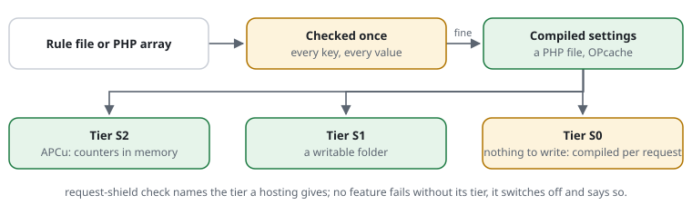

# RSF05-02 Settings, checked once

## What it does

The configuration is one PHP array (`src/Config.php` has every key with its
default). It is **checked** into typed values — a wrong type is an error that
names the key — and, with `Shield::protectFile()` or `bootstrap.php`,
**compiled**: the checked values are written once as a PHP file (0600) that
OPcache serves from memory, and rebuilt when the settings file's mtime or size
changes.



## Use cases

- Every request on a busy site: settings cost about 8 µs instead of 10–11 µs,
  most of it one `stat()` of the settings file to notice changes.
- A hoster's rule "new folders 02770, files 0660": `set dir-mode 02770`,
  `set file-mode 0660` -- every folder and file the shield makes has exactly
  that mode ([file and folder modes](#file-and-folder-modes)).
- Deploying a wrong setting: the error names it at once
  (`request-shield: 'budgets.requests.limit' must be an integer`).

## Configuration

```php
\CjwNetwork\RequestShield\Shield::protectFile('/path/to/request-shield.php');   // compiled
\CjwNetwork\RequestShield\Shield::protect($configArray);                       // checked every time
```

The compiled file goes to `.request-shield/` next to the settings file unless
`protectFile()` is given another directory; the store's default is
`.request-shield/store` there too. Both belong outside the document root, as
the settings file does. The system's temp dir is not used: on a shared host
it is shared between customers, and the store holds the secret.

## What this installation can do: the tiers

PHP ≥ 8.0 is the only requirement ([ADR 0013](../adr/0013-hosting-tiers.md));
a writable directory and APCu are tiers the shield detects. `request-shield
check site.rules` and `version site.rules` print the tier and what is not
active in it:

| Tier | Environment | What runs |
|---|---|---|
| **S0** | no writable directory, no APCu | the stateless rules (hard rejects, blocked paths, access rules, host, forms from the website, parameters, attack patterns, the cacheable definition); the settings are compiled on every request; budgets, bans and the pass cookie's secret have nowhere to live, lists, feeds and statistics neither |
| **S1** | a writable `store-dir`, no APCu — the shared-hosting norm | everything, in files (~25 µs a request) |
| **S2** | APCu | counters in shared memory (~9 µs a request) |

A feature that lacks its tier switches off and `check` says so; nothing fails.

## When the rules cannot be compiled

A rule file with a mistake in it — a typo after a deploy, a file the server
cannot read — never takes the site down
([ADR 0007](../adr/0007-fail-safe-pass-through.md)):

- **After a good compile:** the last good compiled settings stay in force; the
  requests are decided as before the change. PHP's error log gets one line a
  minute naming the file, the line and the mistake; a marker next to the
  compiled settings keeps the servers from compiling again on every request
  until the file changes.
- **At the first install**, with nothing compiled yet: the shield runs
  switched off (every request passes, nothing is counted or logged) and the
  error log says so once a minute, with the mistake.
- **A compiled settings file cut short** (a full disk) is noticed, deleted
  and compiled anew on the next request.
- `request-shield check site.rules` is where a mistake is an error, with file
  and line — run it before a deploy; a passing `check` means nothing above
  will happen.

The fix is picked up as any change is: the next request compiles the file.

## File and folder modes

What the shield writes holds addresses: the log, the lists, the statistics'
hour files, a ban kept in store-dir, a learning run. By default only the user
PHP runs as may read it: files `0600`, folders `0700`. A server with its own
rules for new folders and files sets them:

```
set file-mode 0640     # the group reads (a log reader, the deploy user)
set dir-mode 02770     # the group writes too; setgid: new files keep the folder's group
```

- **Exactly what is set:** a new folder (each missing parent too) and a new
  file get their mode with `chmod()` right after they are made -- the umask
  takes nothing away (`02770` keeps its setgid bit) and adds nothing. No
  data is ever in a file of another mode: a file written whole is a
  temporary file, made in file-mode (the umask set to match), then filled
  and renamed; a
  line appended to a file that is not there yet makes it in file-mode at
  once (the umask set to match for that one call; with a threaded PHP,
  where the umask is the whole process's: made, then file-mode while it is
  still empty, then the line). A file system
  without modes (some mounts) refuses the `chmod()`: written all the same.
- **About the server:** `set file-mode` and `set dir-mode` go above the site
  blocks, as `store-dir` does -- the folders are shared.
- **Never allowed:** writable for everyone (`0666`, `0777`), a file with an
  x bit or setuid, a mode that keeps PHP from writing (the owner needs `rw`,
  for a folder `rwx`). `check` names the line; the settings array
  (`fileMode`, `dirMode`, ints or octal strings) throws.
- **What exists keeps its mode:** a folder that is there, a file appended
  to, a file named by the user (`feeds export
  --write`). A file written whole anew (a list, a feed) is a new file in
  file-mode. `check` names files and folders in store-dir, lists-dir and the
  log that everyone may read (made by an older version or by an umask; it
  looks two levels down and more, up to 20,000 entries) -- `chmod -R o-rwx`
  them once.
- **The command line and the web server:** `deny`, `learn` and `advise` write
  into store-dir as the user they run as. With `0600` the web server's PHP
  cannot read what another user wrote; `check` warns when store-dir belongs
  to another user. Run the command as that user (`sudo -u www-data
  request-shield deny …`), or share a group: `set file-mode 0640`,
  `set dir-mode 02750`.
- **Not set by these:** the secret is always `0600`, from its first byte (in
  store-dir, which gets dir-mode), the compiled settings `0600` in a `0700` folder -- they
  hold the key. The counters in store-dir hold only newlines (their size
  counts) and keep the umask's mode, in folders of dir-mode: a `chmod()` for
  each would cost on the passing path. `check` passes them over.

Cost: a line in the log and, without APCu, the statistics' line set the
umask around their write -- two `umask()` calls, about 0.6 µs on the test
machine (the append itself 11 µs). A passing request that is not logged
and not counted in files pays nothing.

## Limits

A settings file changed twice within one second to the same size keeps the
first change until the next write; edit tools rarely manage that.
