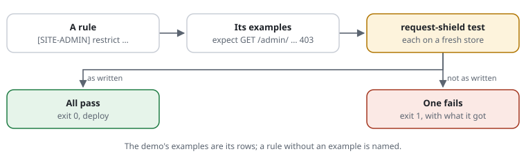
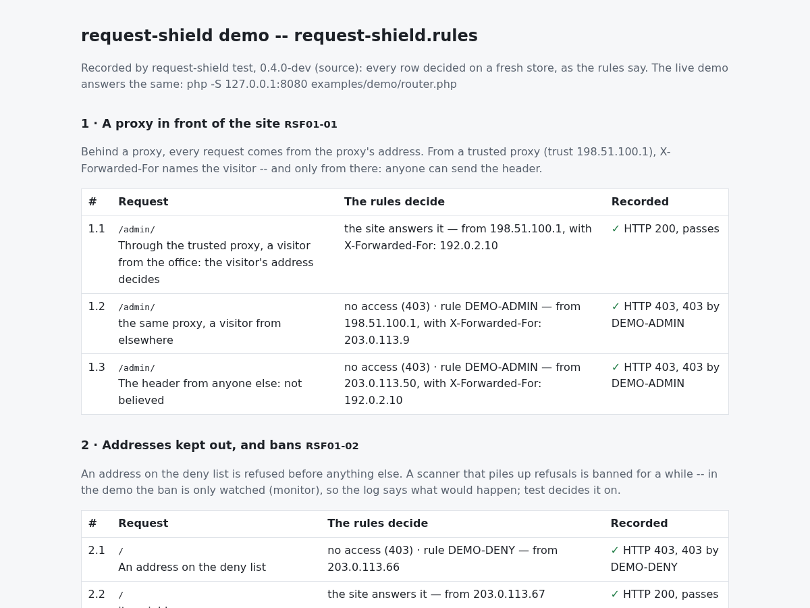

# RSF05-04 Examples next to the rules: `expect` and `request-shield test`

## What it does

Each rule can have examples next to it, in the rule file itself: an address,
and what the shield should do with it.



```text
[EXP-SYSVIEW] block regex (?i)/content/view(/|$)          # pages by node number
expect GET /content/view/full/2        404                # what it refuses
expect GET /ger/content/view/full/89   404
expect GET /news/2026/fit-and-healthy  answered           # a near miss: a page by its alias
```

`request-shield test` decides every example and says which ones do not come
out as written:

```bash
php bin/request-shield test site.rules
```

```text
EXP-SYSVIEW       ✓ GET /content/view/full/2                    404 by EXP-SYSVIEW
                  ✓ GET /ger/content/view/full/89               404 by EXP-SYSVIEW
                  ✓ GET /news/2026/fit-and-healthy              answered
EXP-MODULES       ✕ GET /shop/package                           expected answered, got 404 by EXP-MODULES
                      a near miss: an alias that names a module   (site.rules:52)

72 examples: 71 pass, 1 fails. 1 rule without an example: EXP-API
```

The examples are tests written next to what they test: a change to a rule
that breaks one is seen before the deploy, not by a visitor. Proposal
[0029](../proposals/0029-rule-examples.md).

## The line

```text
expect <METHOD> <address> <outcome> [by <ID>] [from <address>] [with pass] [times <n>] [ua "<User-Agent>"] [header <Name>:<value>]...
```

After the address, the outcome and the options may come in any order.

| Part | Meaning |
|---|---|
| `<METHOD>` | `GET`, `POST`, `HEAD` … |
| `<address>` | a path with its query (`/content/search?SearchText=yoga`), or a full URL when the host matters (`https://admin.example.org/…`). Encoded as a browser sends it (`%27`, `%3C`) |
| `passes` | answered, and a cache may keep it |
| `uncached` | answered, but not kept (a query a cache must not keep, say) |
| `answered` | either of the two: the site answers it. For near misses that must not be refused, whatever the site's cache rules say |
| `check` | the browser check |
| `403`, `404`, `405`, `429` … | refused with that status |
| `by <ID>` | the rule that must decide (`by built-in`: a fixed check without an ID, such as a path out of the site's folder). **Without it, the rule the line follows** (the last rule with an ID above it in the same file); for `uncached`, nothing is checked unless `by` is written; `passes` and `answered` take no `by` (no rule decides a request that passes) |
| `from <address>` | the visitor's address; default `198.51.100.7`, a documentation range. For `restrict`, `exempt`, `deny`, the lists |
| `ua "<User-Agent>"` | the visitor's User-Agent (`ua "Mozilla/5.0 (compatible; Googlebot/2.1)"`); default an ordinary browser's |
| `header <Name>:<value>` | a header the request carries (`header Origin:https://www.example.org`); a value with spaces in quotes (`header Accept-Language:"de, en;q=0.8"`, `\"` for a quote inside); several allowed |
| `with pass` | the visitor solved the check before (holds a valid pass) |
| `times <n>` | the request sent `n` times in a row: budgets, bans. The outcome is that of the last one |

- **The comment after it is its description**, shown when it fails.
- **Inside a `site` block**, an example without a host gets the block's first
  name and is decided with that website's rules. Inside a `match` block it
  is an example like any other (its address is written out).
- Examples for rules of other files name them: `expect GET /backup.zip 404 by SCAN-BACKUP`.
- **Mistakes are errors** with file and line, as for rules: a method in lower
  case, an outcome that is no outcome, `by` an ID no rule has.

## Demo groups: `# demo:` and `# try:`

The demo's rules (`examples/demo/request-shield.rules`) are grouped by
feature, so the demo page, the docs' tables and the tests come from one file:

```text
# demo: RSF02-02 blocked-paths Paths only attackers ask for
# Scanners ask for backups and hidden files; each is refused before the
# site runs.
[DEMO-OLD] block **/old/**
expect GET /old/x            404
expect GET /oldies           answered          # a near miss
# try: GET /old/ the page a refused visitor sees
```

- **`# demo: RSF<gg>-<nn> [<slug>] [<title>]`** opens a group: the comment
  lines right below it explain it, every `expect` line after it belongs to
  it, up to the next `# demo:` or the end of the file. The feature contract
  asks each feature for a group with an effect (a refusal, the check, or
  `uncached`) and a near miss that passes
  ([the contract](../../tests/FeatureContractTest.php)).
- **`# try: <METHOD> <address> <what to look at>`** is a row to look at, not
  decided -- for what a test cannot judge (the widget, how old a pass is).
- Outside the demo both are comments as before: any rule file may carry
  them, nothing changes for a request. A line that only looks like a marker
  (`# demo: remove before launch`) stays a comment -- a rule file never fails
  on one. An `include` inside a group does not end it; a group inside a
  `site` block belongs to that website's reading.
- In an `expect` line a `#` inside quotes is part of the value (`ua "Bot #1"`);
  the comment starts at a `#` outside them.

The demo's front page is drawn from these groups (`Waf\DemoSite`,
`Waf\ExamplesPage`): one numbered row per line, "Show the answer" decided
on the server with the live rules and store, nothing counted. An example
decided by a fixed check with no ID -- a path out of the site's folder, a size
limit -- names it `by built-in`.

`request-shield test` (and `Examples::run()`) gives each example the status
and the headers the visitor would get: 200 and the site's own headers when it
passes, else the shield's status and its header lines (`Cache-Control:
no-store`, `Retry-After`, `Allow` …).

## The recorded page: `examples --html`

`request-shield examples site.rules --html --out=examples.html` writes every
demo group as a page that needs no server: each row with what `test` decided
for it. The docs' screenshots are taken from it
(`php docs/tools/screenshots.php`, a headless Chrome), so every row on them
was decided by the rules:



## `request-shield test`

```bash
php bin/request-shield test site.rules [--source=<glob>]... [--only=<ID>] [--as-written] [--junit=<file>]
```

- **Each example on a fresh store in memory**, so examples never count
  against each other; nothing is written to the site's store, log, live view
  or statistics, and no DNS is asked.
- **The rules switched on:** rules marked `monitor` are enforced, and `set
  mode monitor` is tested as `enforce`. So the examples can be written before a
  rule is switched on. `--as-written` tests the rules as they are: a watched
  rule's examples are skipped, and in monitor mode nothing is refused.
- **Skipped**, not failed: an example about a rule that is not in effect here
  (a site took back `SCAN-BACKUP` with `unblock [SCAN-BACKUP]`: its examples
  then mean nothing).
- **Rules without an example** are listed at the end: the site's own rules
  that decide something, not the built-in ones.
- **Exit code** 0 when every example passes, 1 when one fails, 2 for a
  mistake in the files. `--junit=<file>` writes a JUnit report for CI.
- `--only=<ID>`: the examples of one rule.

In CI or before a deploy:

```bash
php vendor/cjw-network/request-shield/bin/request-shield test config/site.rules --junit=build/rules.xml
```

## The replay: your own clicks as a test

Examples say what one request should get. A **replay** asks the other way
round: here are requests known to be good -- would the rules refuse any of
them? Record someone clicking through the application, or the site's
end-to-end tests, and send the recording through the rules:

```bash
php bin/request-shield replay site.rules session.har            # a session recorded in the browser
php bin/request-shield replay site.rules access.log --ip=log    # a web server's access log, each line's own address
php bin/request-shield replay site.rules urls.txt --junit=build/replay.xml
```

```text
replay: session.har (HAR): 1284 requests, 214 different; left out: 812 static files (--all keeps them), 33 of other websites

  ✕ GET /products/?page=2&utm_source=mail          404 by APP-STRICT
  ✕ POST /cart/add                                 405 by APP-FORMS  (3×)
  ! POST /login                                    check by APP-ORIGIN

214 different requests: 211 pass, 1 get the browser check (…), 2 refused.
```

- **A recording:** a HAR file -- the browser's developer tools (Network, "Save
  all as HAR"), Playwright (`recordHar` in a browser context), a proxy; a web
  server's access log in the combined or common format (only its 2xx and 3xx
  lines: the others were no good requests); or a list, one request per line
  (`GET /path`, `/path`, a full address).
- **Each different request once,** on a fresh store, nothing counted -- one
  session is no measure of a crowd, so no limit decides. The rules are
  switched on as for `test` (`monitor` as enforced); `--as-written` takes them
  as they are.
- **Only the shape:** method, address and the headers a rule looks at
  (Origin, Referer, Content-Type, User-Agent, Accept …) -- never a cookie, a
  token or a body. Static files (style sheets, scripts, pictures, fonts) are
  left out, because a web server answers them without PHP (`--all` keeps
  them), and so are other websites' addresses (a CDN, a font).
- **Every request from one address,** `198.51.100.7` by default (`--ip=…`): a
  restricted area refuses it, as it would a visitor. `--ip=log` keeps an access
  log's own addresses.
- **Exit 1 when one is refused,** with its rule -- a step for CI next to
  `test`. A browser check is a note: a browser passes it, an end-to-end test
  needs a pass.

Before switching a rule from `monitor` to enforced, before `set mode enforce`,
after an update: the replay says in seconds whether your own clicks still get
through.

## Recording a learning run: `learn`

The replay needs a recording; the shield can make one itself. A **learning
run** records the requests of one developer -- or of the site's end-to-end
tests -- by their **shape**, as the material to build rules from
([proposal 0016](../proposals/0016-rule-advisor.md#a-learning-run-good-traffic-on-purpose);
the suggestions from it are its next part):

```bash
php bin/request-shield learn site.rules start --for=2h                     # a run of two hours (1m to 7d)
php bin/request-shield learn site.rules start --for=1h --from=203.0.113.7  # only from this address (or ranges, comma-separated)
php bin/request-shield learn site.rules status                             # until when, and what is recorded so far
php bin/request-shield learn site.rules stop                               # ended; the recording stays
```

```text
learning until 2026-10-08 12:40
recorded: the requests that carry the token -- their shape (paths, methods, the types of parameters and form fields), never a value

in a browser, two bookmarks -- recording on, and off again:
  on:  javascript:document.cookie='rs-learn=6f3c…; path=/; max-age=7200; SameSite=Lax';alert('request-shield: recording on')
  off: javascript:document.cookie='rs-learn=; path=/; max-age=0';alert('request-shield: recording off')
for tests, a header with every request:
  Request-Shield-Learn: 6f3c…
```

- **Which requests:** those that carry the run's token -- the cookie
  `rs-learn`, set and cleared with the two bookmarks (a developer turns the
  recording on and off in the browser while clicking), or the header
  `Request-Shield-Learn` (Playwright, Cypress). With `--from`, the address must
  match as well. After `--for` nothing is recorded, cookie or not.
- **The token only marks** a request: it lets none past a check (a leaked token
  is no key). Only its SHA-256 is kept (`<store-dir>/learn.json`); a new
  `start` makes a new one, and only one run is active at a time.
- **What is recorded, one JSON line per request** in
  `<store-dir>/learned.jsonl`: the time, method, host, path, each query
  parameter and form field **by type** (`int`, `number`, `id`, `word`, `list`,
  `text` -- the types of `query`), the content type, what the shield decided,
  and the status the site answered with. **Never a value, never an address,
  never a cookie.** Form fields are those PHP parsed (a form, not a JSON
  body); at most 200 parameters and fields a line. A new `start` begins a new
  recording, readable only by its owner (`--keep` adds to the old one); it
  stops growing at 10 MB. Not recorded: the check inside the form's own
  endpoint (`widget-path`), answered before the rest.
- **Every server starts and stops within its recheck:** `start` and `stop`
  write the state file and touch the main rule file, as `deny` does; the
  settings read the state when they are compiled.

```json
{"t":1791446553,"method":"GET","host":"www.example.org","path":"/products/","query":{"page":"int","q":"text"},"form":{},"type":null,"decided":"allow","status":200}
```

## The built-in rules have examples too

`rules/scanners.rules`, `rules/wordpress.rules` and `rules/tracking.rules`
carry examples with near misses (`/.env` refused, `/environment` answered).
They run with every site's examples, so a site sees that its own changes
(an `unblock … at`, a `cache-path`) left the built-in rules doing what they
should.

## Writing examples with a language model

[`docs/llm/write-rule-examples.md`](../llm/write-rule-examples.md) is an
instruction to hand a language model together with a rule file: it proposes
`expect` lines, a person reads them, and `request-shield test` decides them.
Nothing in the shield asks a model at run time.

## Cost

A learning run: nothing while none is active (the settings hold `null`, one
comparison per request); while one is, only its own requests -- a token
compared, and their line written when the request ends.

None per request: `expect` lines are read with the rules and kept apart from
the settings a request loads (the compiled settings are the same with and
without them; a test says so). Only `test` reads them.

## Example

The rules for an Exponential site ([use case](../use-cases/exponential.md))
have 72 examples (the admin as `/admin`) and 69 (the admin on its own host),
every rule at least one; `tests/ExponentialRulesTest.php` runs them.
