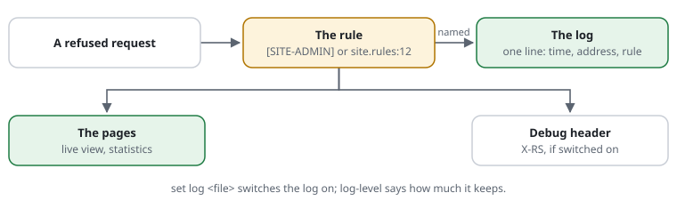

# RSF05-05 The log and rule IDs

Which rule a decision names is the rule's own answer (`Rule::explain()`, 0031 C.2): the shield asks the chain, so a rule added to it names itself in the log and on the pages.



## Rule IDs: which rule decided

Every decision that stopped or flagged a request names the rule behind it —
where it was written:

| ID | Meaning |
|---|---|
| `SITE-10` | a rule's own ID (`[SITE-10] restrict …`, see [rule files](RSF05-01-rule-files.md#ids-namespaces-and-descriptions)) |
| `site.rules:12` | a rule without an ID: line 12 of a rule file (relative to the main file's directory) |
| `ext/shop/settings/request-shield.rules:2` | an extension's rule file |
| `SCAN-BACKUP` | a built-in rule (`SCAN-HIDDEN`, `-BACKUP`, `-TEST`, `-DBTOOL`, `-CGI`; `WP-FOLDERS`, `-SCRIPTS`), from `rules/*.rules` |
| `built-in` | a check every site has: sizes, path encoding, traversal; a POST is never cached |
| `blockedPaths[3]`, `budgets.requests` | PHP array settings: the setting and index |

It appears in

- `X-RS: reject blocked path; rule=SCAN-HIDDEN` (with
  `set debug-header on`; a request let through also gets
  `Server-Timing: shield;dur=0.042;desc=request-shield` -- the shield's own
  milliseconds from its decision's start, in the browser's network tab, also
  on an answer from the HTTP cache (which never stores it); not on a refusal,
  the check page, the dashboard's pages or when the shield failed;
  [0046](../proposals/0046-response-times.md) step 3),
- `$_SERVER['REQUEST_SHIELD_RULE']` and `Shield::currentRule()`, for the
  application,
- the log.

`Shield::explain($decision, $request)` finds it by running the matching again —
**only** for a request that was stopped or flagged, so a passing request costs
nothing extra. `bin/request-shield show` lists every rule with its origin.

## The log

```text
set log        /var/log/request-shield/shield.log
set log-level  stop          # stop (default) | flag | all | off
set log-ip     masked        # masked (default) | full
set log-max-size 10M         # then one rotation to shield.log.1
```

One line per request: time, the client address (anonymised by default),
decision, status, reason, rule, for a pause how many seconds the client is
told to wait (`wait=`, its `Retry-After`), the request with its **full URL**,
the User-Agent:

```text
2026-09-29T08:41:03+02:00 198.51.100.0/24 reject 404 "blocked path" rule=SCAN-HIDDEN ref=7KQ2-M4XD "GET https://www.example.org/.env" "Mozilla/5.0 ..."
2026-09-29T08:41:07+02:00 198.51.100.0/24 challenge 429 "requests" rule=SITE-PACE "GET https://www.example.org/news?page=4711" "python-requests/2.32"
2026-09-29T08:41:09+02:00 2001:db8:1::/48 reject 403 "restricted" rule=SITE-10 "GET https://www.example.org//admin/" "curl/8.5"
2026-09-29T08:41:12+02:00 203.0.113.0/24 throttle 429 "banned" rule=SITE-SCAN wait=20 "GET https://www.example.org/.env" "curl/8.5"
```

`wait=` shows how bans grow (`ban-growth`: 5, 10, 20 … seconds) and whether a
pause is long enough; the optional fields stand in this order: `rule=`,
`claimed=`, `wait=`, `ref=`.

The URL is the one the visitor used: scheme and host as a [trusted
proxy](RSF01-01-trusted-proxies.md) reports them, the path and query as sent (not
decoded — `//admin/` and `%61dmin` stay visible).

| Level | Written |
|---|---|
| `stop` | rejected, throttled, challenged — what visitors noticed |
| `flag` | also `allow-uncached` (unknown URLs and parameters, POSTs) and solved challenges |
| `all` | every request — for a short look only: a write per request |
| `off` | nothing |

Budgets counted by the application (`Shield::active()->consume('misses')`)
are logged the same way when they refuse.

What a rule would have decided in [`set mode monitor`](RSF05-03-modes.md), or a rule
marked `monitor`, is written with `monitor-` in front — `monitor-reject 404
"blocked path" rule=SITE-OLD` — at the level of that decision: the visitor
got in.

- **Addresses are anonymised** by default to their network, and written as
  one (`198.51.100.0/24`, `2001:db8:1::/48`), so nobody mistakes an entry for
  a single client: enough to see a pattern, not a person. `set log-ip full`
  when the log feeds a ban list (fail2ban) — then it holds personal data;
  keep it short and say so in the privacy notice. (The URL can hold personal
  data too — a search term, an e-mail address in a link.) See
  [privacy and the GDPR](../privacy.md).
- **Nothing forged:** request line and User-Agent are shortened, non-printable
  characters become `?`, quotes `'` — a request cannot write a line of its own.
- One line per `write()` with `O_APPEND`: lines of parallel requests do not
  mix. The file is created 0640, its directory 0750.
- **Rotation:** past `log-max-size` (default 10 MB) the file is renamed to
  `.1` (one generation); for more, logrotate with `copytruncate` or `create`.

## Cost

A passing request writes nothing and looks nothing up (unless the level is
`all`). A logged one costs the rule lookup (a few pattern matches), one
`filesize()` and one append — a few microseconds, only for requests the shield
stopped or flagged.
