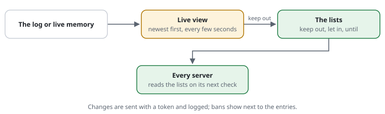

# RSF06-02 The live view and the lists in the dashboard

From [proposal 0026](../proposals/0026-live-view-and-lists.md). Two pages beside
the statistics, under `dashboard-path`: `/rs/waf/live` and `/rs/waf/lists`.

## What it does



- **Live** (`Report\LivePage`): what the shield stops right now, one row per
  request, newest first, updated every 3 seconds. Each row shows:
  - **the website** (the host, and its site block when there are some);
  - the address;
  - the request;
  - what happened (refused, banned, told to wait, checked; "watched: would be …"
    for `monitor` rules);
  - **why**, in plain words: the rule's own description, or for a list entry
    its comment ("on the deny list: scraper");
  - **where from**: a **list**, a **ban**, a **feed**, the site's **own rule**,
    a **built-in rule**, the **pace** (a budget), the **crawler policy**, or a
    **basic check**;
  - the rule ID, **a link to where the rule is written**: its line on the rules
    page (`/rs/waf/rules#rule-DEMO-PACE`, its file opened there), a list entry
    (`LIST-D3`) on the lists page, a basic check without a rule on the way of a
    request;
  - "keep out", which opens the lists page with the address filled in.

  Filters for the website, what happened and the source, plus a text search,
  are kept in the page's address. **Pause** holds new rows back and counts them.
- **Lists** (`Report\ListsPage`): both lists, newest first, with a search.
  - **Add** an address or range: kept out or let in, for 1 hour, 1 day, 7 days,
    30 days, until a date, or for good (keep out only), with **a comment of your
    own**.
  - **Change** an entry's comment, **extend** it, or **remove** it.
  - **The active bans**, each with **Lift**. After the third ban in a day, an
    address is offered "keep out for good?".

## Where the rows come from

| | `set live on` | without it |
|---|---|---|
| source | **the live memory**: with APCu a ring of the last 2,000 requests stopped, in memory; with the file store the same lines in `<store-dir>/live.log` (rotated past 500 KB), kept `live-keep` | the log's new lines (`set log`) |
| the address | **full**, so exactly that address can be kept out | as the log keeps it (masked to /24, /48 by default) |
| kept | `live-keep` (default 1 hour, at most 1 day); gone with a restart; **never on disk** | as long as the log |
| contains | refused, banned, told to wait, checked, and what watched rules would have done | what `log-level` keeps |
| cost per request | **~5 µs for a request that was stopped** (a counter and one entry); nothing for one that passes | the log line (already there) |

The live memory is the first **sink** (0031 B.9): `Log::note()` hands every record it has to the live view and to the plugins with the `Sink` capability ([plugins](RSF06-04-plugins.md#capabilities-what-a-plugin-can-do-for-the-pages)); a passing request is never noted, so it pays nothing.

The page asks for new rows with a cursor: in the memory the number of the last
entry, in the log the byte where the last read ended. A reader far behind
gets the newest rows and is told how many it skipped. The dashboard's own
requests are not shown (its feed every 3 seconds would fill the view).

## Bans that survive a restart: `set ban-keep file`

A ban lives in the store, which with APCu is gone after a restart of PHP. With
`set ban-keep file` a ban is also written as a small file in store-dir. The
first request after the restart copies the bans still running back into APCu,
once (`apcu_add()` lets one process do it). Every other request pays that one
call. Lifting a ban, on the lists page or with `request-shield unlist`, removes
the file too. Everything else (the live memory, the counters) stays in memory
only, for a short time.

## Configuration

```text
set dashboard-path /rs        # /rs/waf/live, /rs/waf/lists, /rs/waf/rules (and the statistics plugin's /rs/stats/…)
set live on                   # the live view with full addresses: APCu, or live.log in store-dir
set live-keep 1h              # how long an entry stays (1m to 1d)
set ban-keep file             # a ban also as a file: it survives a restart of APCu
[SITE-RS] restrict **/rs/** to 192.0.2.0/24   # who may open the pages: the site decides
```

All four are about the server and belong above the site blocks.

### In the site's front controller

The library renders the pages and the data; the site routes them and decides
who may open them (an address rule, its own login), as for the statistics:

```php
use CjwNetwork\RequestShield\Report\{Frame, LivePage, ListsPage};
use CjwNetwork\RequestShield\Shield;

$shield = Shield::active();
$page = Frame::pageFor($shield->settings, $path);           // 'live', 'lists', or another dashboard page
$links = Frame::links($shield->settings);                  // the tabs
$ip = $_SERVER['REMOTE_ADDR'];                             // the viewer: never offered to be kept out
if ($page === 'live' && ($_GET['format'] ?? '') === 'json') {
    header('Content-Type: application/json');
    echo json_encode(LivePage::json($shield->settings, $_GET['cursor'] ?? null, ['lang' => $_GET['lang'] ?? 'en', 'ip' => $ip]));
} elseif ($page === 'live') {
    echo LivePage::render($shield->settings, ['feed' => $links['live'] . '?format=json', 'lists' => $links['lists'], 'links' => $links, 'ip' => $ip]);
} elseif ($page === 'lists') {
    $message = $_SERVER['REQUEST_METHOD'] === 'POST'
        ? ListsPage::handle($shield->settings, $_POST, ['ip' => $ip, 'user' => $currentUser, 'ruleFile' => REQUEST_SHIELD_CONFIG])
        : null;
    echo ListsPage::render($shield->settings, ['action' => $links['lists'], 'get' => $_GET, 'message' => $message, 'links' => $links, 'ip' => $ip]);
}
```

- **Changes are POST with a token:** `ListsPage::token()` is an HMAC of the
  shield's secret, the viewer's address and the hour, never the secret itself.
  A token from this hour or the last one is accepted. A CMS that checks its own
  form token passes `'csrf' => $itsToken` to `render()` and
  `'csrfChecked' => true` to `handle()`.
- `'user'` is noted with the entry ("· dashboard editor 2026-10-01 10:12"),
  `'ruleFile'` is touched so every server reads the lists within its recheck.
- `allow POST **/rs/waf/lists` when the site limits where forms may be sent.
- **The pace:** the dashboard's own pages (`/rs/waf/live`, its feed every 3 s,
  `/rs/stats/visitors` …) do not count against the budgets when a `restrict` rule
  covers them and allows the address asking, so a live view left open never
  runs into the site's pace limit. Without such a rule they count like any
  page: an open dashboard keeps its flood guard. Matched also below a prefix
  (`/demo/rs/waf/live`); one string search for every other request.

## Guards

The same as on the command line ([IP lists](RSF01-02-ip-lists.md#the-command-line)), plus one:

- never a range that holds a trusted proxy;
- **never the address of the person clicking** (it would lock them out);
  "keep out" is not even offered for it in the live view;
- a range wider than /16 (IPv4) or /32 (IPv6) only with "a wide range: I mean it";
- an address let in needs an end; an entry for good needs a comment.

## Cost

| | |
|---|---|
| a request that passes | nothing new |
| a request stopped, `set live on` | ~5 µs (APCu: a counter, one entry); one appended line without APCu |
| a ban with `ban-keep file` | one small file written, when the ban starts |
| every request with bans and `ban-keep file` | one `apcu_add()` (~0.2 µs) |
| the live page, every 3 s | 300 new rows from memory in ~0.6 ms; from the log, at most 64 KB read |
| the lists page | the list files searched by line (`Lists::find()`): 200 entries shown, the rest counted, also with hundreds of thousands |

## Privacy

- **The live memory holds full addresses** of requests the shield stopped or
  checked, for `live-keep` (an hour by default): in APCu, or, with the file
  store, in `<store-dir>/live.log` (outside the document root, rotated past
  500 KB -- older lines are read no more, and the rotated file is replaced by
  the next rotation). The purpose is
  defence (Art. 6(1)(f)): seeing an attack and keeping its address out. Without
  `set live on` the page shows what the log holds (masked by default).
- **`ban-keep file`** keeps a banned address in a file in store-dir until its
  ban ends (at most `ban-max`), named by a hash, the address inside.
- A list entry's comment is written by people: "say why, not who".
- See [privacy and the GDPR](../privacy.md).

## Limits

- The live memory needs APCu and is per server: behind a load balancer each
  server shows its own. Without APCu the page reads the log.
- With APCu, a ban is per server too; `ban-keep file` on a shared disk lets
  every server restore it after a restart, but a new ban reaches the other
  servers only through the file at their next restart. For bans across
  servers, use the file store.
- The command line cannot reach a web server's APCu: `unlist` removes a kept
  ban's file, and the lists page (or `allow … --for=1h`) lifts it at once.
- Still to come ([0026](../proposals/0026-live-view-and-lists.md), phase 4):
  customers' views (their websites only) and lists per website.

## Examples from the demo

What the demo's rules decide for this feature -- the same lines `request-shield test` checks and the demo's front page shows (`php -S 127.0.0.1:8080 examples/demo/router.php`).

<!-- examples: docs/tools/sync-examples.php from examples/demo/request-shield.rules -- do not edit; run the tool. -->
**RSF06-02 · Live and the lists**

What the shield stops right now, and the lists: this machine only.

| Request | The rules decide | |
|---|---|---|
| `/rs/waf/live` | no access (403) · rule DEMO-STATS — from another address (198.51.100.7) | from anywhere else |
| `/rs/waf/live` | the site answers it — from 127.0.0.1 | Live, from this machine |
| `/rs/waf/lists` | look at it | Keep an address out or let it in, with a comment of your own |
<!-- /examples -->
