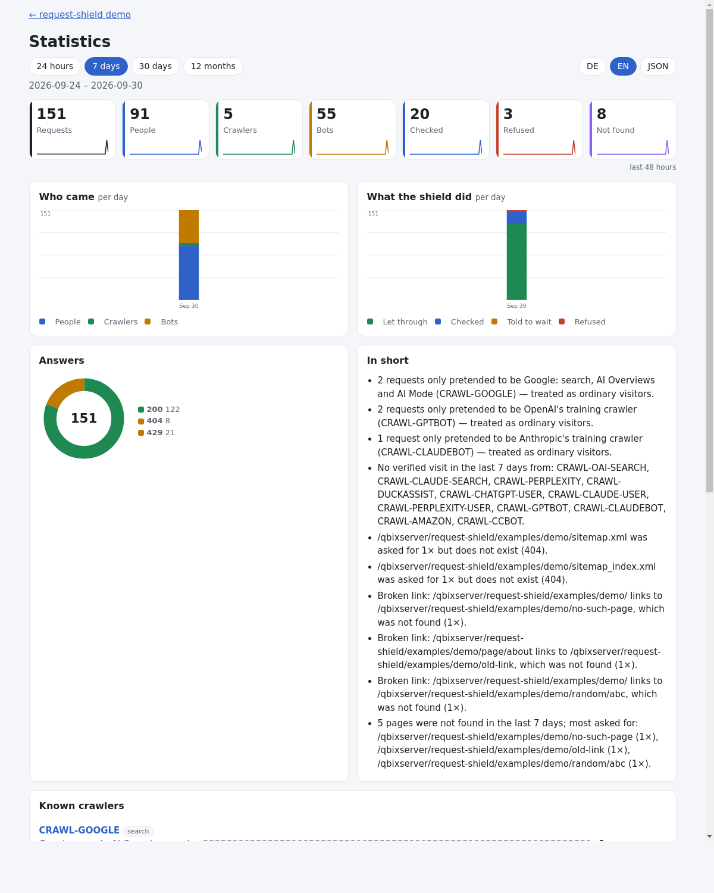

# RSF06-03 Statistics: what the shield did, and what the crawlers did

## What it does

The statistics are the shield's first [plugin](RSF06-04-plugins.md) (`plugins/stats/`,
`StatsPlugin`): `set stats on` brings them, no `plugin` line needed. They are
also the first shipped [extension](RSF06-04-plugins.md#extensions-words-and-settings-of-their-own)
(`StatsExtension`): their words and `set` keys are theirs, compiled into the
settings' slot `ext.stats`, not the core's. With them the shield counts, per
hour, while requests pass:

- **requests** — let through, checked, told to wait, refused; the rule behind
  each that was not a plain "let through"; the answer's **status code** (the
  site's own, at the end of the request, and the shield's own refusals); what
  monitor mode would have done;
- **crawlers** — for each known crawler ([0011](RSF01-04-known-crawlers.md)): how
  often it came, verified or only claiming the name, let through / checked /
  refused / told to wait, whether it read `robots.txt`, its top pages (50 a day),
  its last visit and address;
- **not-found** — pages the site answered with 404 or 410 (the top 50 a day), and
  **where the links to them are**: a page of the site itself (a broken link to
  fix) or another site's host;
- **sitemaps** — every request for a sitemap (`sitemap.xml`, `sitemap_index.xml`,
  `sitemap-news.xml`, … also `.gz`) with the site's answer (which exist: 200,
  which not: 404), and which verified crawler read which, how often and when last
  — useful after a content update: has Googlebot read the new sitemap yet?
- **pages** — the most visited pages (a view: GET, 200, HTML; the path without
  its query), by **people, crawlers and bots**, the top 100 an hour for each;
  and their first two folders (`/news/`, `/news/2026/`; `set stats-depth 1` to
  `4`), so a **subtree's** views are exact: `stats --path=/news/`, or "path
  starts with" on the page (deeper, the sum of its most visited pages) —
  like AWStats, without a log to read; and the pages the shield **stopped**
  (refused, checked, told to wait — whoever asked; the top 100 an hour for
  each): every page shows them next to its views, and sorted by them the list
  shows the pages stopped most — also those nobody ever saw (`/wp-login.php`).
  `stats --sort=blocked|refused|checked|throttled`, `'sort'` on the page (the
  Protection view starts with `blocked`); a section's numbers are the sum of its
  pages;
- **bots** — other clients that say they are tools, not browsers, by family:
  `python`, `curl`, `wget`, `go`, `java`, `node`, `php`, `perl`, `headless`,
  `scrapy`, `empty` (no User-Agent), `other`;
- **times** (only when named: `set stats requests pages times`) — how long the
  site took to answer, what the HTTP cache did, and the slow requests:
  [how fast the site answered](#how-fast-the-site-answered).

Nobody has to read the log for it. It answers questions such as *did GPTBot
crawl the site this week, or was it refused?*, *which pages are missing, and who
links to them?*, *how many requests did the shield turn away?*

```text
$ php bin/request-shield stats site.rules
Last 7 day(s), 2026-09-24 to 2026-09-30:

  48,213 requests: 46,990 let through, 312 checked, 18 told to wait, 893 refused
  answers: 200: 45,120, 301: 410, 403: 221, 404: 1,142, 429: 18

Rules that decided most:
       612  SCAN-HIDDEN
       221  SITE-ADMIN

Not found:
        88  /old-shop   linked from: /news/2025/summer (61), partner.example (27)

Known crawlers                  seen  verified claimed allowed checked refused  last
  CRAWL-GOOGLE                 3,120     3,020     100   3,020       0       0  2026-09-30 09:12
  CRAWL-GPTBOT                 1,204     1,204       0       0       0   1,204  2026-09-30 08:55

In short:
  Google: search, AI Overviews and AI Mode (CRAWL-GOOGLE) came 3,020× in the last 7 days: every time let through; it read robots.txt.
  OpenAI's training crawler (CRAWL-GPTBOT) came 1,204× in the last 7 days: every time refused (as set: block).
  100 requests only pretended to be Google … (CRAWL-GOOGLE) — treated as ordinary visitors.
  Broken link: /news/2025/summer links to /old-shop, which was not found (61×).
```

`--days=30` for a longer look, `--json` for a CMS or a dashboard. The rules page
shows each known crawler's last 7 days next to its row.

## The statistics page



**Where it lives:** `set dashboard-path /rs` (the default; `/admin/rs` if the site
wants it behind its admin area). The statistics plugin's pages live under
its own path, **`set stats-path`** (default `<dashboard-path>/stats`, so `/rs/stats/`; outside `dashboard-path` too, such as `/admin/statistics`): **`/rs/stats/overview`** (everything), **`/rs/stats/visitors`**
(visitors and pages), **`/rs/stats/protection`** (the protection), and with
`stats-hosts` **`/rs/stats/sites`** (all websites, below). `/rs/stats` itself is
the plugin's start: all websites with `stats-hosts`, else the overview. The
core's — the firewall's — pages live under `/rs/waf/`: **`/rs/waf/rules`** (rules
& setup, below), `/rs/waf/live`, `/rs/waf/lists` ([live and lists](RSF06-02-live-and-lists.md));
`/rs/waf` opens the live view. Every plugin gets its own prefix this way.
The path names the view; the filters stay GET parameters
(`?days=30&by=week&lang=de&path=/news/&crawler=CRAWL-GOOGLE`); the same as JSON is
the [API](RSF06-05-api.md)'s `GET /rs/api/v1/stats/report`, which the page's JSON button opens.
**The shield serves these pages itself** (0031 B.6): a request for one of
them is answered before the site runs -- behind a `restrict` rule that covers
it (`restrict **/rs/** to 192.0.2.0/24`: the office; `**` in front, so it holds
behind a front controller too) or the login below; every answer is `no-store`
and `noindex`. The site routes nothing, and `check` warns while nothing guards
the pages. `StatsPage::links($settings)` still returns the addresses (for a
menu), `StatsPage::viewFor($settings, $path)` which view a path is (capitals
and a trailing slash do not matter).

`Stats\Report\StatsPage::render()` prints the page, in **views** with tabs between them —
the overview (`'view' => 'all'`) and two for different people: **Visitors & pages** (`'view' => 'site'`, the
default — for editors, [proposal 0022](../proposals/0022-visitors-page.md) phase 1: six numbers, each with its
change against the period before — page views by people, requests by people,
crawler visits, bot requests, stopped, not found —; one chart, of the number
picked, with the period before dashed and a tooltip per point; "now", people's
requests in the last five minutes (with APCu: one counter a minute, never on
disk, ~0.7 µs a request); two cards with tabs — **pages** (pages, sections with
the subtree filter, stopped, not found with their referrers) and **crawlers &
AI** (search, AI assistants, AI training) —; then the sentences and the
sitemaps. Picking a number or a tab is a radio button and CSS: no script, and
the refresh keeps what was picked) and **Protection** (`'view' => 'shield'` — for admins:
requests, bots, checked, refused, what the shield did, the pages it stopped most, the answers, the rules
that decided most — each with what it does, where it is written and a link to it —,
bot families). A CMS can put each where it belongs, one view without tabs
(`'tabs' => false`): the site's in the editors' dashboard, the shield's in the
admin area. In detail:
tiles with a curve of the last 48 hours (requests, people, crawlers, bots,
checked, refused, not found), stacked bars per hour, day, week or month for
**who came** (people, crawlers, bots) and **what the shield did**, the answers
as a ring, the sentences, a bar per crawler (let through, checked, refused, only
claimed), the sitemaps, pages not found with their referrers, the rules and the
bot families. Charts are inline SVG and CSS — no script library, no external
file; a tooltip on every bar; dark mode; **English and German** (the browser's
language, or `'lang' => 'de'`); it refreshes itself every minute
(`'fragment' => true` returns only the content). The period: 24 hours, 7 or 30
days, 12 months, this month, last month, or any range (`'from'`, `'to'` as
`YYYY-MM-DD`, at most ten years; the page has a form with two date fields). The
visitors page renders in 4–6 ms (the period before included), 41–63 KB of
HTML, 7–8 KB gzipped. Print it where only the site's
people see it — behind the CMS's login, or at a path restricted to some
addresses. The demo has it at `/rs/…`.

**Rules & setup** (`/rs/waf/rules`, the core's page -- its counts come from the plugins with the `RuleCounts` capability, the statistics among them) is for whoever runs the
shield and wants every technical detail in one place:

- **the rule tester** — an address (a full URL or a path), the kind of request,
  the visitor's IP and, if wanted, a User-Agent: every step says what it makes
  of it, a diagram shows where the request ends, and the rule that decides
  links to its row below. Nothing is counted; the pace shows the visitor's real
  counters. Its fields are GET parameters (`method`, `url`, `ip`, `ua`) — a
  site with `query strict` lists them for the dashboard (the demo does); the
  page passes them as `'check' => $_GET`, and `'ip'` the address it starts
  with (the viewer's own);
- **the way of a request**, as one picture: the request, a circle for each of
  the 16 checks in the order the shield runs them (kept out, public blocklists, banned, kind of request, sizes,
  disguised addresses, website names, blocked addresses, where forms may go,
  restricted areas, known crawlers, known parameters, attack patterns, what a
  cache may keep, pace per visitor, browser check) — coloured when on, grey
  when off, each a link to its line below —, the way on to the site and the way
  down to the shield's own answer, and **after** them the log and the
  statistics: what each writes and when (what was stopped at once, what goes
  on to the site when the request ends, with the site's status; to disk after
  the answer), and that the statistics use what the crawler check found. Below
  it the same as a list: before (the visitor's address), the 16 checks with
  what each answers and how it is set, after;
- **every rule as the rule files hold them** — one part per file (the site's
  own open, the shipped ones closed), the rules in their order: the ID first,
  what it does (the comment after it), how it is written, its topic, its line,
  and how often it decided in the period shown. A link to a rule
  (`/rs/waf/rules#rule-DEMO-PACE` — the Protection view and the rule tester link
  there) opens its file;
- **every technical setting** — mode, proxies, limits, counters and store,
  browser check (the secret only as "set" or "not set" — never its value),
  known crawlers, statistics, log, the rule files and rule sets read.

It shows how the site is protected and its paths on the server: the same
login or `restrict` as the other views. `Waf\SetupPage::render($settings,
$lang, $decided)` prints only this part, for a CMS's own admin page.

## Days, weeks, months, years

```text
$ php bin/request-shield stats site.rules --from=2026-01-01 --to=2026-09-30 --by=month
                       cacheable     uncached      checked       waited      refused
  2026-01                 41,203        2,110          188            4          610
  2026-02                 38,950        1,987          201            0          702
  …
$ php bin/request-shield stats site.rules --from=2026-01-01 --to=2026-12-31 --by=month --crawler=CRAWL-GPTBOT
                          visits  let through      checked      refused      claimed
  2026-01                    812            0            0          812           14
```

- `--by=day|week|month|year` (weeks as ISO weeks, `2026-W40`), `--from`/`--to`
  for any period, `--crawler=<ID>` for one crawler; with `--json` the same as
  `periods` for a CMS.
- Hours are kept `stats-hours` days (7), days `stats-days` days (400); then a
  day is added to its month's file (`m-<yyyymm>.json`), kept `stats-months`
  months (default 0: for good). A year is twelve small files — but a period
  that reaches back past `stats-days` is only there by whole months.

## Switching it on — and parts of it

```text
set stats on                          # off (default) | on | the parts:
set stats requests crawlers           #   requests, crawlers, not-found, bots, pages, forms (what "on" counts)
set stats requests pages times        #   and times: how long the site took -- only when named
set stats-slow 2s                     # with times: the slow log from 2 s (the default; 0: none)
set stats-hours 7                     # days the hours are kept (default 7)
set stats-days 400                    # days the day totals are kept (default 400), then summed into months
set stats-months 0                    # months kept (default 0: for good)
set stats-depth 2                     # folder levels counted exactly for a section (1 to 4, default 2)
set stats-flush 60s                   # with APCu: written to disk this often (default 60 s, 0: only hourly)
```

Without `crawlers`, a crawler's request is not even looked at (no verification
cost). A per-crawler log is a separate switch (below).

In a PHP settings array (`Settings::from()`, `config/request-shield.php`) the
same settings live under `'ext' => ['stats' => [...]]`, the crawler log
nested inside:

```php
'ext' => ['stats' => [
    'enabled' => true, 'parts' => ['requests', 'crawlers', 'not-found', 'bots', 'pages', 'forms'],
    'hours' => 7, 'days' => 400, 'months' => 0, 'depth' => 2, 'flush' => 60,
    'hosts' => [], 'skip' => [],                       // stats-hosts, stats-skip (regex patterns)
    'crawlerLog' => ['dir' => null, 'kinds' => [], 'days' => 30, 'query' => true],
]],
```

What is not given keeps its default; `'path'` (where the pages live, `set
stats-path`) defaults to `<dashboardPath>/stats` when it is not given. The
extension declares its pages below it (`StatsExtension::routes()`), so the
dashboard's tabs and links follow the setting. `stats-group` is the
statistics' word too (`'ext' => ['stats' => ['groups' => …]]`); who may open the
dashboard is the core's `dashboard-access`/`dashboard-session` (`'dashboardAccess'`,
'access' => …, 'session' => …]`), until 0031 step B.7 moves them.

## Where the numbers live — and that they survive a restart

- **With APCu** (the store `auto` or `apcu`): a count is one `apcu_inc()`.
  Every `stats-flush` seconds one request writes what APCu holds into the
  hour's file and takes exactly that much out of APCu — counts added meanwhile
  stay. A restart of PHP-FPM (which empties APCu) loses at most that much.
- **Without APCu**: a request appends one short line to the hour's file
  (`O_APPEND`, lock-free).
- **Every hour**, the first request after it is over moves the finished hours
  into one small JSON file per day, `store-dir/stats/d-<yyyymmdd>.json` —
  readable by anything. Hours are kept for `stats-hours` days, then summed into
  the day's total; day files are removed after `stats-days` days.
- The hours' files are plain text (`name` or `name*count` per word), the day
  files JSON: nothing to install, easy to back up, easy to read for other tools.

## Statistics per website

For a server where many websites share one PHP pool, one rule file and one
store ([proposal 0023](../proposals/0023-plugins-hosts-customers.md), phase 2):

```text
set stats-hosts a.de www.a.de *.b.de     # these websites, each its own statistics
set stats-hosts host                     # or: every name the host rule allows
set stats-hosts sites                    # or: the site blocks' names (not "default")
```

- **The website** is the `Host` the request names, normalised: lower case,
  without the port and a trailing dot (`WWW.A.DE:443` → `www.a.de`). `a.de` and
  `www.a.de` are two websites. `*.b.de` takes every name one label deeper
  (`news.b.de`, `shop.b.de`) into one statistics, as site blocks do.
- **Only the names given get statistics of their own;** any other name is
  counted as **"other hosts"**. The `Host` header comes from the client:
  otherwise anyone could create unlimited statistics with made-up names.
- **Kept apart:** `store-dir/stats/hosts/<name>/` (the same files as before;
  `*` written `+`), `store-dir/stats/hosts/(other)/`. The APCu names carry the
  directory, so websites never count into each other.
- **Several websites read together** (all of them, a group): every page, section,
  page not found and sitemap carries its website in front (`a.de/news/x`), so the
  same path on two websites stays two entries; the filter takes `a.de/news/`.
  One website alone shows its paths as they are.
- **Read:** the pages get a switch (*All websites* · each website · *other
  hosts*), kept in every link and in the JSON (`?site=a.de`); `bin/request-shield
  stats … --site=a.de` (or `--site=other`). *All websites* adds every website up,
  and what was counted before `stats-hosts` was set (in `store-dir/stats/`).
- **A quiet website** has its finished hour rolled up and APCu written out too:
  the first request of an hour in each process tends the other websites.
- About the server: `set stats-hosts` belongs above the site blocks.
- **Cost:** finding the website, 0.15–0.35 µs per request (51 names, measured);
  once an hour per process, one look at each website's directory.

### Groups: websites per customer

```text
stats-group "Customer A" a.de www.a.de b.de      # read together, and each on its own
stats-group Reseller b.de c.de                   # a website may be in several groups
```

- A group's websites are counted apart without naming them in `stats-hosts`
  as well. The name goes in quotes when it has spaces. Its ID for addresses is
  made from it (`customer-a`).
- **A group's statistics:** its websites added up. Counters add up exactly;
  the lists in them (pages, sources) are added up per entry, which is exact for
  the most visited and approximate at the tail, where each website kept only
  its own most visited. The website switch has a section per group: *the whole
  group*, then each of its websites. `bin/request-shield stats --group="Customer A"`.
- About the server: above the site blocks.

### All websites at a glance (`/rs/stats/sites`)

With `stats-hosts` or groups, the first tab is **All websites**: one table
for the period chosen, showing where the traffic is:

- a row for all websites, then each group with its websites below it, then the
  websites in no group, then the other hosts, each sorted by page views;
- page views (with a bar), **the change against the period before**
  (`+12 %`, `−30 %`, *new*), requests by people, **search engines and AI
  crawlers apart** (AI: AI search, assistants, training), bots, what was
  stopped, pages not found (404), and a small curve of the page views. Short
  headings; each says on hover what it counts;
- a click opens that website's or group's statistics.

Reading costs about what the statistics page costs, once per website.

- Next ([0023](../proposals/0023-plugins-hosts-customers.md)): each customer's
  own access (a token per group, signed links from a hosting panel).

## Who sees what: tokens, a login, signed links

For a server with many customers ([proposal 0023](../proposals/0023-plugins-hosts-customers.md),
phase 4): the admin sees everything, a customer only its group.

```text
stats-group "Customer A" a.de www.a.de
dashboard-access *            sha256:3b4c…                    # the admin: everything
dashboard-access "Customer A" sha256:9f2c… until 2027-12-31   # the agency
dashboard-access "Customer A" sha256:71aa…                    # the customer's own
set dashboard-session 8h                                      # how long a login lasts
```

- **The principal is opaque to the shield** (0031 B.7): `dashboard-access`
  names who may open the dashboard -- `*` or an id (`"Customer A"` →
  `customer-a`); what that reader may see is the pages' business. The
  statistics map the id to a `stats-group` of the same name: its websites,
  nothing else; a principal without a group opens the dashboard and sees no
  statistics (`check` warns about it).
- **A token** is 32 random bytes: `bin/request-shield access-token site.rules "Customer A"`
  prints it once, and the line to paste. **The rule file holds only its SHA-256.**
  Someone who reads the rules cannot get in. Several tokens per group (one for
  the agency, one for the customer); each may end (`until`); withdrawn by
  deleting its line, which also ends the group's running logins.
- **What a customer sees:** its group only. Its websites side by side (the tab
  carries the group's name), visitors and pages, the protection's numbers
  without the rules that decided. **Never** another group, "Rules & setup", the
  server's overview, the live view or the lists. The statistics page enforces
  this itself, whatever address is asked for.
- **Three ways in:**
  1. **The form:** the token by POST (only from the page itself, `Origin`
     checked), then a signed session cookie (`rsd`, HttpOnly,
     SameSite=Lax, Secure on HTTPS) for `dashboard-session`. The token never
     appears in an address. `?rs-logout=1` signs out.
  2. **A signed link from the customer's own menu** (a hosting panel, the
     customer's CMS), made on that server with the shield's secret:

     ```php
     $url = 'https://stats.example.net/rs/stats/sites?' . Access::link($settings, 'Customer A', 600);
     ```

     No token in it, only that group, valid 10 minutes (at most an hour).
     Opened, it sets the cookie and redirects to the address without the
     signature. (SameSite=Lax, not Strict, so that the cookie set after a link
     from another site is sent.)
  3. **JSON for a program:** `Authorization: Bearer <token>`.
- **The door itself:** wrong tokens and links count against a budget of their
  own (10 a minute per address, then 429), each logged without the token.
  Every page: `X-Robots-Tag: noindex`, `Cache-Control: private, no-store`,
  `Referrer-Policy: same-origin`, `frame-ancestors 'self'`. A site's
  `restrict /rs/** to …` still applies first.
- **The form in the site's look:** a plugin with the `Pages` capability draws
  the login form (`access-login`), the shield keeps the headers and the cookie
  ([plugins](RSF06-04-plugins.md#capabilities-what-a-plugin-can-do-for-the-pages)).
- **Without `dashboard-access` lines nothing is asked:** the site's own rules
  decide, as before.
- **The site's administrator:** `Access::gate(…, ['admin' => true])` when the
  site knows it is the administrator (an address of the office, its own login):
  everything, no form. A customer's cookie still comes first (its own view),
  and `?rs-login=1` shows the form all the same, to try a customer's view.

Nothing to wire: the shield runs `Access::gate()` itself when it serves a
page (`Dashboard::serve()`, 0031 B.6) -- the form, the redirect of a signed
link, the 429 after too many tries, and the reader's view with the tabs it may
open (`Access::links()`). The site's own administrator is whoever passes the
`restrict` rule that covers the pages. A site that wants the pages inside its
own backend can still call `StatsPage::render()` with `'who'` from a gate of
its own, as the demo's `/customer-menu` makes a signed link with `Access::link()`.

As JSON, the [API](RSF06-05-api.md)'s `GET /stats/report` and `GET /stats/sites`
pass `StatsExtension::siteFor($settings, $who, $site)` to `StatsReport::build()` --
a customer sees its group's websites, whatever it asks for, and not the rules
that decided.

## What is counted how

| Number | What it counts |
|---|---|
| **Page views** | pages shown to people: GET, answered 200 with HTML |
| **Requests by people** | every request by a person, not only pages: forms sent, redirects, not found, JSON, and what the shield refused or checked |
| **Crawler visits** | requests from a known crawler (Googlebot, …), proved by its address or only claimed |
| **Bot requests** | tools and scripts that say so (`curl`, `python-requests`, `wget` …), not a known crawler |

So page views are a part of the requests by people, and bots are apart from
both. **The dashboard's own requests are not counted** when they pass (its
pages, the live view's feed every few seconds): looking at the numbers does
not change them. Refused or checked there, they are.

## Forms: sent, from where, how they ended

The card **Forms** on the visitors page ([proposal 0028](../proposals/0028-forms.md),
phase 2; the part `forms`, on with `set stats on`):

```text
/kontakt          142 sent
  from /kontakt 120 · /produkt/x 22 — 128 saved · 3 errors · 11 stopped (9 from another website)
/newsletter        57 sent
  from no page given 31 · another website spam.example 25 — 1 saved · 0 errors · 56 stopped
Editors (backend)
/admin/**       1,240 sent — 1,236 saved · 4 errors · 0 stopped
```

- **A form** is a POST, PUT, PATCH or DELETE outside the API (`api-path`),
  counted per address (without its query), the most sent kept as for pages.
- **Where from:** the path of the page on the website it was sent from (the
  `Referer`, without its query); **another website only by its host**; "this
  website" when only `Origin` says so; "no page given" when the browser says
  nothing. A wave of submissions with no page before, or from one foreign host,
  is spam.
- **How it ended:** saved (the site answered 2xx or 3xx: the usual redirect
  after saving), an error (4xx, 5xx), or stopped by the shield: refused,
  checked, told to wait, and how many of those came from another website
  ([`post-origin`](RSF02-04-forms-from-the-website.md)). With the live view, "stopped"
  links to it, filtered to that form.
- **The editors' area apart:** `backend <paths>` (also as `backend` inside a
  `match` block, or `backend /**` in the admin's `site` block) marks it. Its
  forms count as one entry per area, as written (`/admin/**`), not per edit
  address: saving, autosave and the editor's AJAX calls do not drown the
  visitors' forms.

```text
[SITE-BACKEND] backend /admin/**                 # the editors' area: counted apart
```

- **Never** what was typed: no field, no value, no file name.
- `bin/request-shield stats` lists them, and the JSON has `forms` and `backend`.
- Cost, measured (PHP 8.4, APCu): **nothing for GET and HEAD**; **about 18 µs
  more for a form request** (three counters, each kept within its limit), on
  top of the ~11 µs every counted request costs. A form request renders a page
  of the site anyway.

## How fast the site answered

With the part **`times`** (`set stats requests pages times`; `set stats on`
does not time) the statistics measure how long the site took for each request
the shield let through ([proposal 0046](../proposals/0046-response-times.md), step 1).

**What the time is.** The statistics already hear the end of such a request
(a shutdown function, which is how a page view gets its status). The time is
from the web server's start of the request (`REQUEST_TIME_FLOAT`) to there: the
shield's microseconds and the site's main script -- database, templates, API
calls, Symfony's `kernel.terminate`. Not in it: what the site does in its own
shutdown functions (WordPress's `shutdown` hook, destructors, the session's
write: they run after the shield's, which was registered first), the network,
the browser. So it is the right number for slow pages and for load; for how
long a visitor waited, an upper bound when the site answers early.

**What the HTTP cache did** ([RSF04-03](RSF04-03-http-cache.md)), from the
header it sets:

| kind | what it means |
|---|---|
| **hit** | answered from the cache (the site did not run) |
| **miss** | the cache asked the site, and the answer may be kept |
| **nostore** | the cache asked the site, but the answer may not be kept -- and why: `status` (not 200, 301, 308), `cookie`, `private` (also no-store, no-cache), `encoded`, `expired`, `vary`, `ttl` |
| **past** | the cache was not asked: off, a POST, a visitor who is not anonymous, a page that is not cacheable |

The share of hits is hits ÷ (hits + misses): of the pages the cache could
answer, how many it did. What the hits saved: each counted as long as the
misses' median (one slow page does not make every hit look like a big saving).

**How it is counted.** Twelve fixed bands per hour, kind of visitor and cache
kind -- 1, 5, 10, 25, 50, 100, 250, 500 ms, 1, 2.5, 10 s and more -- plus the
sum in microseconds: `rt:<who>|<cache>|<band>`, `rs:<who>|<cache>`; the
shield's own share `rq:shield`; why a miss was not kept `rn:<reason>`. The
bands are fixed, not a setting: hours add up into days and months only while
they stay the same. The median and the slow end (95 %) are read from the bands,
exact to a band's width. Who came (people, crawlers, bots) is known when
`crawlers`, `bots` or `pages` is on; with `stats requests times` alone every
request counts as a person's.

**The slowest pages** (with the part `pages` too: `set stats requests pages
times`): for every page view (GET, 200, HTML) its band, its sum and whether it
came from the cache -- `pt:<who>|<path>|<band>`, `ps:<who>|<path>`,
`pc:<who>|<path>`, kept for the same pages as the views (the 100 most viewed
an hour for each kind of visitor; a page past that limit has its times under
"(other)" too: with APCu at once, in files at the roll-up). The page and
`stats` list the 20 slowest pages viewed at least 10 times in the period, by
their median, with their slow end and their share from the cache: a page that
is slow and never comes from the cache is the first to look at (a cookie it
sets, `private`, a missing `shared`).

```text
Slowest pages (at least 10 views)     views   median      p95  from the cache
  /shop/search                             310   410 ms    2.1 s        0 %
  /news/                                    95   3.2 ms   124 ms       58 %
```

**The slow log** (`set stats-slow 2s`, the default; `0` for none): a request
slower than that is one line in `<stats dir>/slow-<yyyymmdd>.log` --

```text
2026-10-08T10:43:02Z GET /shop/search 200 2204ms 38.5MB miss people
```

time, method, path **without its query**, status, milliseconds, the request's
peak memory, cache kind, kind of visitor. **No address.** It is kept as long as
the hours (`stats-hours`, 7 days) and rotated like the log (`log-max-size`).

**Where it shows.** The statistics page (Overview, Protection): the site's
median, slow end and average by kind of visitor and cache kind, the share of
hits and what they saved, why misses were not kept, the shield's share a
request, the period's last 48 hours' median and slow end, the slow log's last lines.
`bin/request-shield stats`:

```text
  the site took: median 75 ms, slow end (p95) 2.3 s, average 763 ms -- 3 requests
  HTTP cache: 33 % hits (hit 3.0 ms, miss 100 ms), saved 96 ms; not kept: cookie 1
  the shield: 21 µs a request

Slow requests (the last):
  2026-10-08T10:43:02Z GET /index.php/slow 200 2204ms 2.8MB miss people
```

`--json` has it under `times` (in microseconds).

For one request in the browser: with `set debug-header on` the answer carries
`Server-Timing: shield;dur=0.042;desc=request-shield`, the shield's own time
(the site's is not over when the headers go out). Only then: for every visitor
it would tell that a shield is in front and cost bytes on every answer.

**Cost.** Without `times`: one look in the list of parts a request (nothing
with the statistics off). With it, measured on
this machine with APCu (StatsPlugin, a request that reaches the site): about
**+2 µs** (two clock reads, the band, three counters more), and for a page
view with `pages` about **+1.5 µs** more (its band, its sum, a hit); without APCu the
line the request writes anyway gets three fields more. The slow log costs a
comparison, and a line only for a slow request.

## Paths that are not counted: `stats-skip`

Some PHP calls are no pages of the site: a proxy for map tiles
(OpenStreetMap), an image resizer, a heartbeat. A map page can make hundreds of
them and drown the page views.

```text
stats-skip **/osm-proxy/** /tiles/**
match /api/maps/** {
  stats-skip                     # the area's own path
}
```

- **Only the statistics leave them out**, and only the requests that **pass**
  (page views, requests, status codes).
- **Refused or checked requests there are still counted:** an attack on the
  proxy stays visible in the protection numbers.
- **Protected all the same:** every rule, budget, the log and the live view
  are as before for these paths.
- Per website (inside a site block) or for all; shown with the settings on
  "Rules & setup". Cost: none without it; with it, the patterns are tried on
  passing requests only.

## One log per crawler (optional)

```text
set crawler-log /var/log/request-shield/crawlers    # <dir>/CRAWL-GPTBOT/2026-09-30.log
set crawler-log-kinds ai-search ai-user ai-training # default: all kinds
set crawler-log-days 30                             # kept (default 30)
set crawler-log-query off                           # leave the query string out
```

Every request of a known crawler, in the format of the shield's log: what it
asked for, when, and what it got. A verified crawler's address is its operator's
and is written in full; a request that only claims the name may be a person
and is masked like the log's addresses (`claimed=CRAWL-…` in the line).

## For code

```php
$shield->record($request, $decision, $rule, $now);          // after decide()/settle(), for code that runs them itself (protect() does it)
$report = CjwNetwork\\RequestShield\\Stats\\Report\\StatsReport::build($settings, null, 7);   // the numbers, and 'sentences'
echo json_encode($report);
```

`StatsReport::build($settings, null, 7, null, ['from' => '20260101', 'to' => '20260930', 'by' => 'month', 'crawler' => 'CRAWL-GPTBOT'])`
for a period, grouped and filtered (`periods`). It returns the totals, each day and the last 48 hours as
five numbers (passed, uncached, checked, throttled, refused), the rules that
decided most, the status codes, the pages not found with their referrers, each
crawler (with its pages and last visit), the other bots, and the sentences.

## Cost

Measured with OPcache, a request passing the shield (µs):

| | host, PHP 8.1 | container, PHP 8.4 |
|---|---|---|
| statistics off | 7.7 | 15.8 |
| on, APCu | — | 22.7 (+7) |
| on, files | 34.8 (+27) | 48.4 (+33) |
| a known crawler's request, APCu | — | +21 (verified, its page, its last visit) |

- With APCu a count is about 0.2 µs; most of the rest is naming the hour and
  looking at the User-Agent (crawler, bot family: one expression each).
- Without APCu the cost is one appended line — on this machine's disk 15–25 µs;
  the file store for budgets pays the same. APCu is the store to use.
- The hourly roll-up and a flush run once per interval, in one request.
- A site's 404s cost one or two counters more, at the end of the request.
- **Section levels (`stats-depth`):** each level is one counter more per page
  view — 3 instead of 2 measured at +2–3 µs with APCu (13–18 → 16–21 µs for the
  counting of a page view, 200,000 views, 3 runs), no measurable difference with
  files. At 1,000 page views a second about 0.3 % of one core. Each level has its
  own limit of 200 sections an hour for each kind of visitor, so a deep level
  with many folders never pushes out the levels above; what does not fit is
  `(other)`, and `bin/request-shield check` notes it. Worth it where the first
  level is a language or siteaccess (`/de/`, `/bold_ger/`): with 2 levels such a
  site gets only one real one.

## Large sites and intranets

Measured on this workstation (a busy desktop, 8 threads; PHP 8.4 in a
container, nginx + PHP-FPM), the shield alone, no application behind it:

| | requests a second | 99 % of requests within |
|---|---|---|
| statistics off | 5,600–6,400 | 15 ms |
| on, APCu | 5,300–5,800 (−5 to −10 %) | 18 ms |
| on, files | 5,000–5,400 (−10 to −15 %) | 17 ms |

- **Exact under load:** 62,000 requests, 32 at a time, counted 62,000 times —
  with APCu (flushing to disk every 5 seconds during the test) and with files.
- **Per request:** a few microseconds with APCu. At 1,000 requests a second that
  is well under 1 % of one CPU core — beside an application that needs
  10–200 ms a page, nothing. The number of users does not matter (an intranet
  with 100,000 people): nothing is kept per visitor, only per hour and kind.
- **Memory:** a few thousand APCu entries an hour (about 1 MB): every list
  with a limit (pages, pages not found, referrers, sitemaps) stops at it, also
  under a flood of made-up addresses.
- **Housekeeping after the answer:** the flush (every minute) and the roll-up
  (every hour) look through all of APCu — 22 ms / 38 ms with 100,000 other
  entries, 48 ms / 107 ms with 500,000. They run after the visitor has the
  page (PHP-FPM, LiteSpeed), so nobody waits for them.
- **Files at high load:** about 14 bytes a request — at 1,000 requests a second
  some 50 MB an hour, whose roll-up takes about 4 seconds of CPU once an hour
  (after the answer). It works, but **above some 50 requests a second use APCu**
  (the default store `auto` does when APCu is there).
- **Several servers:** with APCu each server counts its own; they write into
  the day files of a shared `store-dir` under a file lock — on NFS, whose locks
  are unreliable, give each server its own `store-dir` (adding them up there is
  planned).
- **Several sites on one PHP-FPM pool:** each statistics directory has its own
  APCu names, so the sites do not count into each other.
- **Reading:** the page of a week reads 7 day files (~20 ms), of a year 365
  (~120 ms).

## Privacy

See also [privacy and the GDPR](../privacy.md) for every feature.

The counters hold actions, rule IDs, status codes, paths, crawler IDs and
bot families — **no visitors' addresses**. A crawler's last address is kept
only for verified crawlers (an operator's server). A referrer is kept only for
pages not found: from the site itself as a path, from elsewhere only as the
host (a full foreign address can carry personal data). The per-crawler logs keep
addresses as described above; they are removed after `crawler-log-days`.

## Limits

- Pages answered before PHP (a CDN, Varnish, a full-page cache) are not counted.
- With APCu and several servers, each server counts its own; the day files in
  a shared `store-dir` add them up.
- Without the dashboard (proposal [0012](../proposals/0012-dashboard.md), next
  step) the numbers are read with `bin/request-shield stats`, the JSON, or the
  rules page.

## Examples from the demo

What the demo's rules decide for this feature -- the same lines `request-shield test` checks and the demo's front page shows (`php -S 127.0.0.1:8080 examples/demo/router.php`).

<!-- examples: docs/tools/sync-examples.php from examples/demo/request-shield.rules -- do not edit; run the tool. -->
**RSF06-03 · The statistics**

Who came, what the shield did, pages, crawlers, rules -- per website and per customer: this machine only, or a customer's signed link.

| Request | The rules decide | |
|---|---|---|
| `/rs/stats/overview` | no access (403) · rule DEMO-STATS — from another address (198.51.100.7) | from anywhere else |
| `/rs/stats/overview` | the site answers it — from 127.0.0.1 | The overview, from this machine |
| `/rs/stats/visitors` | look at it | Visitors & pages, for editors |
| `/rs/stats/protection` | look at it | Protection, for admins |
| `/rs/stats/sites` | look at it | All websites, by customer |
| `/rs/stats/visitors?lang=de` | look at it | Statistik auf Deutsch |
| `/customer-menu` | look at it | A customer's menu: a signed link opens Customer A's statistics only |
<!-- /examples -->
