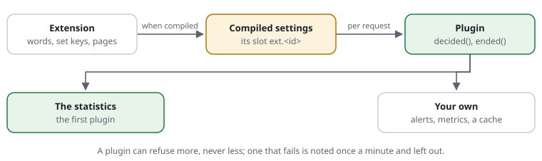

# RSF06-04 Plugins

The core of request-shield is a mini web application firewall: it checks every
request, decides, answers what it refuses itself, and logs. Everything beyond
that is a plugin's: the statistics, metrics, alerts, exports, pages in the
site's look, an HTTP cache, rules of a site's own. Two interfaces carry it,
resolved at two different times ([ADR 0008](../adr/0008-extension-points-resolved-at-compile-time.md)):



| | `Extension` | `Plugin` |
|---|---|---|
| **When** | when the rules are compiled (static methods) | per request (one object, `new X($settings)`) |
| **What** | words and `set` keys of its own, their check, its pages, its commands, the plugins it needs | hears what was decided; with a capability also counts, logs, draws a page, answers a request, adds a rule |
| **Costs a passing request** | nothing: what it compiled lies in the compiled settings | nothing without plugins; with them one call each, capabilities one array access |
| **Fails** | a wrong value refuses the compile, the last good settings stay | noted once a minute, the request goes on as if the plugin were not there |

A class may be both; the statistics are one extension (`Stats\StatsExtension`) and
one plugin (`Stats\StatsPlugin`), shipped with the shield in `plugins/stats/`
(namespace `CjwNetwork\RequestShield\Stats`). A plugin can tighten a decision,
never loosen one ([ADR 0009](../adr/0009-plugins-tighten-never-loosen.md)).
Proposal [0023](../proposals/0023-plugins-hosts-customers.md), decision
[ADR 0006](../adr/0006-core-and-plugins.md).

## Extensions: words and settings of their own

An extension speaks at compile time: it adds words and `set` keys to the rule
file, checks them when the rules are compiled, and what it checked lands in the
compiled settings in a slot of its own (`$settings->ext[<id>]`). The core never
reads that slot; a request pays nothing for an extension.

```php
use CjwNetwork\RequestShield\{Extension, Settings};
use CjwNetwork\RequestShield\Rules\{RuleFileException, Vocabulary};

final class AlertsExtension implements Extension
{
    public static function id(): string { return 'alerts'; }          // ext.alerts

    public static function vocabulary(Vocabulary $v): void
    {
        // set alerts-after 50: typed like the core's keys (bool, int, seconds, string, words, path);
        // lands in ext.alerts.after (the extension's own prefix is dropped, the rest camelCased).
        $v->set('alerts-after', 'int', 'refusals per minute before a message');
        // alert-to ops@example.org: a word of its own; the parser hands it the line's
        // words, the extension's values so far, the line's place and the rule's id.
        $v->word('alert-to', static function (array $args, array $values, string $at, string $rid): array {
            if (count($args) !== 1 || strpos($args[0], '@') === false) {
                throw new RuleFileException("$at: alert-to <address>");
            }
            $values['to'][] = $args[0];
            return $values;
        }, 'alert-to <address>: who hears about it');
    }

    /** Checks the slot with the whole base settings in hand; returns what the plugin reads. */
    public static function compile(array $raw, Settings $base): array
    {
        if (($raw['to'] ?? []) === []) {
            throw Settings::wrong('ext.alerts.to', 'at least one alert-to address');
        }
        return ['after' => $raw['after'] ?? 50, 'to' => $raw['to']];
    }

    public static function plugins(array $compiled): array { return []; }   // Plugin classes to run per request, from the compiled slot (0031 B.4)
    public static function routes(array $compiled): array { return []; }   // its pages: path => key, tab, role, order (0031 B.5)
    public static function commands(): array { return []; }     // command-line commands (0031 D.1)
    public static function check(Settings $s): array { return []; }   // warnings for `check` (0031 B.4)
}
```

```text
plugin Acme\Shield\AlertsExtension      # from here on its words are known
set alerts-after 20
alert-to ops@example.org
```

- **Offered, then known.** `plugin <class>` offers an extension for the rest
  of the reading; the shipped ones are only named (the constant
  `REQUEST_SHIELD_EXTENSIONS`: `bootstrap.php` defines it right after the
  autoloader; with Composer, `plugins/shipped.php` does, loaded through
  the package's autoload `files`) and the registry (`Rules\Vocabulary`) loads
  and offers them on its first lookup, when the rules are compiled -- a class
  that is not there is skipped, and a passing request, which never consults
  the registry, loads none of it. So `set stats on` needs no `plugin` line. An
  extension's word before its `plugin` line is an unknown rule. Every offered
  extension compiles, with an empty slot when the rules said nothing of it:
  its defaults, routes and plugins apply all the same.
- **Its own slot only.** Words and keys write into `ext.<id>`; a word or key
  the core has cannot be taken (the registry refuses it); two extensions
  cannot share an id, a word or a key. A key's `name` says where below the
  slot it lands (`set('stats-flush', 'seconds', …, name: 'flush')`; dotted
  for a nested place, `crawlerLog.dir`); `many: true` lets one key write
  several values (`set stats on|off|<parts>` writes `enabled` and `parts`).
  Key types: `bool`, `int`, `seconds`, `string`, `words`, `path` (relative to
  the rule file); a `check` callable adds the extension's own test.
- **Above the site blocks:** `set(…, serverWide: true)` marks a key the
  parser refuses inside a site block, with the core's message for its own
  server-wide keys (`stats-hosts`); `word(…, serverWide: true)` the same for
  a word (`stats-group`).
- **A word with paths:** `word(…, paths: true)` makes the parser compile the
  line's paths to patterns before the word sees them, and inside a `match`
  block the word takes no paths and gets the block's (`stats-skip`); a word
  without it keeps "does not go inside a match block".
- **Wrong at the line, or wrong at compile.** A bad value for a key is a
  `RuleFileException` naming the line (the key's type, or the extension's own
  check); a bad combination is an `InvalidArgumentException` from `compile()`
  naming the setting (`ext.alerts.to`) -- and on the request path the last
  good compiled settings stay in force, as for every mistake.
- **In a site block** an extension's `set` and words are the website's: its
  slot is compiled for that website, with the base's values and its own.
- **What runs per request:** `plugins($compiled)` names the `Plugin` classes;
  they are appended to the settings' plugins when the rules are compiled, so
  the `Shield` itself knows no plugin by name (the statistics: with `set stats
  on`, or a `crawler-log` directory).
- **Its pages:** `routes($compiled)` declares them (full path => key, tab
  labels, role `admin|reader`, order, the `RoutePage` class that draws it);
  compiled into `$settings->routes` next to the core's, and the shield serves
  them itself: `Dashboard::serve()` answers a request for a route before the
  application -- behind `Access::gate()` and the route's role (`admin` pages
  refuse a customer with 403), every answer `no-store` and `noindex`, a POST
  change with the page's token (CSRF). A route nobody guards (no `restrict`
  rule covers it, no `dashboard-access` login) answers 403 and `check` warns.
  A `RoutePage` returns a `Response` (status, header lines, body); in a build
  without the pages a route answers 404.
- **Its commands:** `commands()` names the commands it adds to
  `bin/request-shield` (name => a `Cli\Command` with `usage()` and
  `run(Cli\Context): int`): the tool (`Cli::main()`, which the script and
  the single file run) reads the rules, compiles the settings, parses the common options and runs the command from its table;
  the usage lists the extension's lines (`stats`: `plugins/stats/src/Cli/StatsCommand.php`).
- **Its warnings:** `check(Settings $s)` returns what `request-shield check`
  should say about the compiled settings (a plugin class that is not there, a
  principal no group knows).
- The smallest extension is the tests': `tests/support/RsTestExtension.php`
  (`set fail-at <stage>`, `rs-test-mark`), used to make the shield fail on
  purpose where a test wants it.

## What a plugin gets

```php
interface Plugin
{
    // After the decision, before the answer: every request the shield saw.
    public function decided(Request $request, Decision $decision, ?string $rule, Seen $seen, float $now, bool $continues, ?Decision $would = null): void;

    // When a request that went on to the site has ended ($continues was true).
    public function ended(Request $request, int $status, array $headers, Seen $seen, float $now): void;
}
```

- **`$decision`** — `allow`, `allow-uncached`, `challenge`, `throttle` or
  `reject`, with its status and reason; **`$rule`** the rule that decided
  (`SCAN-HIDDEN`, `site.rules:12`), null for a request let through.
- **`$continues`** — true: the site answers it, `ended()` follows with the
  site's status and headers. False: the shield answered itself (or code that
  calls `record()` wants it handled now).
- **`$would`** — in monitor mode, what would have been decided.
- **`Seen`** — what the core knows beyond the request, worked out on first use
  and kept, so a plugin that does not ask pays nothing:
  `host()` (the website: lower case, no port), `crawler()` (the known crawler
  the User-Agent names), `verified()` (its address proves it), `crawlerKind()`,
  `botFamily()` (curl, python, headless …), `who()` (people, crawlers, bots).

## Naming it

In a rule file:

```
[SITE-ALERTS] plugin Acme\Shield\RefusalAlert     # a message when refusals pile up
```

or in PHP settings: `'plugins' => [Acme\Shield\RefusalAlert::class]`. The class
must be loadable (Composer, or your own autoloader before the shield runs).
Without Composer, name the file that holds it: `plugin Acme\Shield\RefusalAlert
from plugins/refusal-alert.php` (relative to the rule file). The compiler loads
the file when the rules are compiled (an extension's words are known from that
line on, a capability is recorded), the shield only when it makes its plugins
-- a request without plugins loads nothing; a file that is not there is a
warning (`check` names it) and the plugin is left out. The statistics need no
line: `set stats on` (or `set crawler-log …`) brings them. `bin/request-shield
check` warns about a plugin it cannot find, or that is no `Plugin`.

## Rules for plugins

- **Tighten, never loosen.** A plugin cannot change the shield's decision or
  its answer; with `RuleProvider` it adds rules that can refuse, slow down or
  check what the core would let through -- never the other way round.
- **Made once per request**, as `new Acme\Shield\RefusalAlert($settings)`, and
  only when a plugin is named: without plugins the core does nothing more.
- **Quick.** `decided()` runs before the visitor gets the answer, `ended()` at
  the end of the request (PHP's shutdown) — the visitor has the page by then
  only if the site called `fastcgi_finish_request()`. Keep both to counters and
  appends; anything slow (a network call) belongs in a cron job that reads what
  the plugin wrote. The example below is tested with the shield's own tests.
- **Failing is safe.** Every call is wrapped: an exception is noted in PHP's
  error log (once a minute per plugin and cause) and the request goes on as if
  the plugin were not there. A class that is missing or no `Plugin` is left out
  the same way.

## An example: a message when refusals pile up

```php
<?php
namespace Acme\Shield;

use CjwNetwork\RequestShield\{Decision, Plugin, Request, Seen, Settings};

/** Writes one line to PHP's error log when more than 200 requests a minute are refused. */
final class RefusalAlert implements Plugin
{
    private const LIMIT = 200;

    public function __construct(private Settings $settings)
    {
    }

    public function decided(Request $request, Decision $decision, ?string $rule, Seen $seen, float $now, bool $continues, ?Decision $would = null): void
    {
        if ($decision->action !== Decision::REJECT || !function_exists('apcu_inc')) {
            return;
        }
        $minute = intdiv((int) $now, 60);
        $count = apcu_inc("acme:refused:$minute", 1, $ok, 120);
        if ($count === self::LIMIT + 1) {               // once, when the line is crossed
            error_log(sprintf('acme: more than %d refusals in the minute %s on %s (last rule: %s)',
                self::LIMIT, date('H:i', (int) $now), $seen->host(), $rule ?? '-'));
        }
    }

    public function ended(Request $request, int $status, array $headers, Seen $seen, float $now): void
    {
    }
}
```

## Capabilities: what a plugin can do for the pages

A plugin may implement more than `Plugin`. Each extra interface is a
**capability**: the compiler records which plugin class has which one into
the compiled settings (`$settings->hooks`, hook name => classes, by
`instanceof` when the rules are compiled), so a request -- or a page -- asks
one array and never a plugin. A new capability is a new interface (MINOR); a
plugin without it costs nothing more.

| Capability | What it answers | Who asks |
|---|---|---|
| `RuleCounts` | `ruleCounts($days, $now)`: rule id => how often it decided; `crawlerCounts($days, $now)`: what each known crawler did | the rules and setup page (`Counts`), when it is drawn -- never a request |
| `Sink` | `note($request, $decision, $rule, $now, $monitor)`: what the log hears -- every request the shield did something about (at log-level all, every one) | `Log::note()`, where the log is written -- never a passing request. The live view is the first sink; a CMS logger or a Monolog handler are others. A sink masks addresses as the log does (`Log::mask()`) |
| `Handler` | `handle($request, $decision)`: a `Response` of its own for a request the shield lets through -- an HTTP cache hit (`Request::cacheKey()` names the answer, `Decision::cacheable()` says whether it may be kept), a page -- or null: on to the application. The first answer wins and goes out as it is (its headers); a handler that throws is noted once a minute and the application runs | `Shield::protect()`, after every rule, the check and the shield's own pages, for passing requests only; one array access when no plugin has it |
| `RuleProvider` | `rules($settings, $store)`: steps of its own (`Rule\Step`: a key, a stage after the lists, a rule, words) -- the shield puts each after its stage's steps; the rule can only tighten, one that throws says nothing for that request (noted once a minute), a provider that throws adds nothing | the shield's constructor, only when a provider is recorded; the trace and the rules page show the step like any other, `Rule::explain()` names it |
| `MethodHandler` | `handleMethod($request)`: a `Response` for a request with a method the site does not take (`PURGE`, `PURGEKEYS`) -- or null: the rules refuse it as any unknown method | `Shield::protect()`, before the rules, only for such a method; a GET pays one array access |
| `ContextHandler` | `cacheContext($request, $role, $shared)`, `forgetContext($request)`: the application names the visitor's role (an HTTP cache keeps a page per role) | `Shield::active()?->cacheContext()` / `forgetContext()` from an adapter while the application runs -- never the shield itself |
| `Purger` | `purge($tags)`: the application changed content; the answers with these tags are out of date (`*`: everything) | `Shield::active()?->purge()` from an adapter (a CMS plugin on publish) -- never the shield itself |
| `Pages` | `page($kind, $ctx)`: the whole document for a page the shield answers with itself -- `error` (the refusal: status, decision, texts, lang, home, request), `challenge` (the browser check: the task, the solution field's name, texts, resend, home, logo) or `access-login` (the dashboard's form: message, action, texts) -- or null for the shield's own | `Responder`, the check's `Gate`, `Access::gate()`: only when the shield answers itself, never a passing request. The headers stay the shield's; the plugin escapes what it embeds. Proposal 0030's quiet error page is its first consumer (0031 G.1) |

The statistics plugin has `RuleCounts` (`set stats on`): the rules page shows
"decided n times" from its counters. A plugin that throws in a capability is
left out -- the page is drawn without its numbers, the record goes to the
other sinks, the application runs, the shield's own page goes out -- and
PHP's error log hears it once a minute. The tests' `tests/support/*Plugin.php`
are the smallest of each.

## Packages

Every shipped plugin is a Composer package of its own (0031 H.1), developed
here and mirrored read-only from H.2 on:

| Directory | Package | Needs |
|---|---|---|
| `plugins/api` | `cjw-network/request-shield-api` | the core |
| `plugins/waf` | `cjw-network/request-shield-waf` | the core, the API |
| `plugins/stats` | `cjw-network/request-shield-stats` | the core; suggests the API and the cache |
| `plugins/cache` | `cjw-network/request-shield-cache` | the core; suggests the API and the statistics |
| `testkit` | `cjw-network/request-shield-testkit` | -- (the test runner) |

A plugin uses another one only when it requires it, or when it suggests it
and asks `class_exists()` first -- `tests/PackagesTest.php` checks both and
installs each package next to a core without plugins. Until v1.0 the core
package carries the plugins as well (its `autoload` and `bootstrap.php`
name their directories); the core knows a plugin's words once its classes
are there (`REQUEST_SHIELD_EXTENSIONS`).

## Cost

None without plugins. With plugins, one call to each per request; a
capability one array access when no plugin has it (the bench shows the lines
with the statistics off and on). The statistics measured as before the split
(decide plus statistics, APCu: about 39 µs per request against 15 µs without —
the same as when they were part of the core).

## The statistics plugin: a plugin with pages of its own

`plugins/stats/` — `StatsExtension` (the words, the slot `ext.stats`, the
pages, the `stats` command), `StatsPlugin` (counting, the crawler logs,
`RuleCounts`), `Stats` (the counters), `Report\StatsReport`,
`Report\StatsPage`, `Report\VisitorsPage`, `Cli\StatsCommand` -- namespace
`CjwNetwork\RequestShield\Stats`. For now in this repository and loaded by the
same autoloader (`composer.json` maps the namespace, the bootstrap too); a
package of its own (`cjw-network/request-shield-stats`) when the interface has
settled (0031 phase H).

It is the model for a plugin that does more than count. What it owns, and how
it fits next to the core:

| | The statistics plugin | The core |
|---|---|---|
| **Its words** in the rule file | `set stats …`, `stats-hosts`, `stats-group` (the group a `dashboard-access` principal maps to), `stats-skip`, `set stats-path` ([statistics](RSF06-03-statistics.md)); the login itself is the core's (`dashboard-access`, `set dashboard-session`) | everything else |
| **Its address** | its own setting `ext.stats.path` (`set stats-path`, default `<dashboard-path>/stats`); `StatsExtension::routes()` declares `/sites`, `/overview`, `/visitors`, `/protection` below it into `$s->routes` | `Routes::core()`: `<dashboard-path>/waf/`: `live`, `lists`, `rules` |
| **Its pages** | `StatsPage::viewFor($settings, $path)` says which page a path is (null: not one of its own, from `$s->routes`), `StatsPage::render()` draws it, `StatsPage::links()` the tabs | `Frame::pageFor()`, `Frame::links()` (both from `$s->routes`) |
| **Who may read them** | `Access::gate()`: the admin everything, a customer its group (`who`) | the site's own rules (`restrict <dashboard-path>/** to …`) |
| **Its data** | files per website and hour under `store-dir/stats/`, APCu as a buffer | the store (counters, bans) and the log |

What a plugin with pages should do the same way:

- **One address of its own, configurable.** A site with an `/rs/` of its own,
  or two dashboards on one host, moves it with one line; the tabs and links
  follow (`links()` builds them from the compiled routes, never from a fixed
  path).
- **Declare its pages** in `routes()` and draw them in a `RoutePage`; the
  shield serves them, `Frame`, the tabs and the pace's exemption derive from
  the same table.
- **Say who asked.** A page that shows other people's data takes the `who`
  the gate returned and filters by it itself (`StatsPage` refuses another
  group's website whatever address is asked for). The links a customer gets
  come through `Access::links($settings, $who, …)`: no tab it may not open
  (the routes whose role is `reader`). The principal is opaque to the shield;
  the statistics map it to a `stats-group` of the same name.

In the demo, `/customer-menu` is a pretend hosting panel: its "Statistics"
item is a signed link (`Access::link()`) that opens Customer A's statistics,
and only those. This machine itself is the administrator (a `restrict` rule
lets it in); `?rs-login=1` shows the form all the same.
