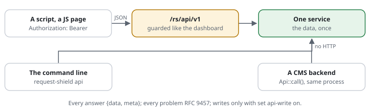

# RSF06-05 The API

## What it does



The shield's data as JSON, below `<dashboard-path>/api/v1` (`/rs/api/v1` by
default): its status, the rules, a trace or a test, the live view, the lists,
the feeds, the crawlers, the log and the statistics. It is for a CMS's
backend, a JavaScript page, a script or a language model. Every endpoint is
one service, and the dashboard's pages and the command line use the same
functions, so the API never says something else than they do.

It is a plugin (`plugins/api`, the edition `request-shield-api.php`), on by
default and guarded like the dashboard: a request reaches it only through a
`restrict` rule or with a token. Nothing of it runs for a request that is no
API call.

Every answer has the same shape:

```json
{"data": {"version": "0.4.0", "tier": "S2", "mode": "enforce", …},
 "meta": {"version": "0.4.0", "generated": "2026-10-04T08:12:00Z", "tier": "S2"}}
```

A problem is [RFC 9457](https://www.rfc-editor.org/rfc/rfc9457) JSON, never
the login form or an HTML page:

```json
{"type": "about:blank", "title": "Unauthorized", "status": 401, "detail": "Send a token: Authorization: Bearer <token> (request-shield access-token)."}
```

Every endpoint, what it takes and what it answers: [the reference](../reference/api.md)
and [openapi.yaml](../reference/openapi.yaml) (OpenAPI 3.1, also at
`/rs/api/v1/openapi.json` and `.yaml` on a site).

## Use cases

- **A CMS shows the shield in its own backend:** the statistics of a
  customer's websites, the lists with a "keep out" button, a trace for a
  support case. The CMS runs in the same PHP process and calls
  `Api::call()`; no HTTP, no token.
- **A JavaScript admin page** of a CMS (WordPress, Ibexa) fetches
  `/rs/api/v1/stats/report` with the editor's session.
- **A script or a monitoring system** asks `GET /rs/api/v1/status` and
  `GET /rs/api/v1/live` with a token; a deploy calls `POST /rs/api/v1/check`
  before `POST /rs/api/v1/reload`.
- **A language model** reads `openapi.json` and answers "what was refused
  today, and by which rule?" from `GET /rs/api/v1/log`.

## Configuration

```text
restrict **/rs/** to 192.0.2.0/24                  # the office -- or tokens:
dashboard-access * sha256:3b4c…                     # request-shield access-token site.rules '*'
api-path /rs/api/v1/**                              # a script gets the check as JSON, post-origin lets its POST through
set api-write on                                    # the endpoints that change something: off by default
set api-origins https://cms.example.org             # another website's page may call it (CORS): none by default
set api off                                         # no API at all
```

`request-shield check` says what keeps a script from the API, where one may
call it (with tokens, writes or `api-origins`): no `api-path`, an `allow POST`
that does not name it, `query strict`.

## Using it

Over HTTP, with a token:

```bash
curl -H "Authorization: Bearer $TOKEN" https://www.example.org/rs/api/v1/status
curl -H "Authorization: Bearer $TOKEN" -H "Content-Type: application/json" \
     -d '{"url": "https://www.example.org/wp-login.php", "ip": "203.0.113.9"}' \
     https://www.example.org/rs/api/v1/trace
```

In the same process, as the CMS's administrator (`'*'`) or a customer's group:

```php
use CjwNetwork\RequestShield\Api\Api;
use CjwNetwork\RequestShield\Shield;

$answer = Api::call(Shield::active()->settings, 'GET', '/stats/report', ['days' => 30], 'customer-a');
// exactly what GET /rs/api/v1/stats/report?days=30 answers that customer's token
```

On the command line, as the administrator:

```bash
php bin/request-shield api site.rules "GET /status"
php bin/request-shield api site.rules "POST /trace" --url=https://www.example.org/.env
php bin/request-shield api site.rules --openapi
```

A plugin adds endpoints of its own: its extension implements `ApiProvider`
and returns `Endpoint`s, each with an `ApiService` that makes the data. The
statistics add `/stats/report` and `/stats/sites` that way.

## Security

- **Guarded like the dashboard:** a `restrict` rule or a token, checked
  before anything runs; a token's hash only in the rule file.
- **Who may call what:** a *reader* endpoint takes a customer's token, which
  sees its group only (no rules that decided); an *admin* endpoint takes the
  administrator only.
- **Writes** (the lists, `reload`, `feeds/update`) only with `set api-write
  on`, for the administrator, with the dashboard's own checks: no trusted
  proxy, not the caller's own address, a wide range only with `confirm`.
- **A session's POST** must come from this website (its `Origin`); a script
  sends a token instead. Other websites' pages only with `api-origins`.
- **Never** the secret, a token's hash or the server's paths: a mistake in the
  rule files names the file by its name and line.
- Every answer `Cache-Control: private, no-store`, `X-Robots-Tag: noindex`; an
  `ETag` on the data, so a poll that finds nothing new gets a `304`.

## Cost

Nothing for a request that is no API call: the endpoints are compiled into
the dashboard's routes, and a request is matched against them only below
`dashboard-path`, as before. An API call costs what the page with the same
data costs, without rendering it.

## Limits

- **No DELETE:** a site accepts GET, HEAD, POST and OPTIONS by default, so a
  write is a POST (`/lists/remove`). The parameters come in the query or a
  JSON body; the paths are fixed.
- **Test, check and reload** need the rule file the shield runs from; with
  settings from a PHP array they answer 409.
- **One server's view:** the live memory, bans and counters with APCu are the
  server's own, as on the pages.

## Examples from the demo

What the demo's rules decide for this feature -- the same lines `request-shield test` checks and the demo's front page shows (`php -S 127.0.0.1:8080 examples/demo/router.php`).

<!-- examples: docs/tools/sync-examples.php from examples/demo/request-shield.rules -- do not edit; run the tool. -->
**RSF06-05 · The API**

The same data as JSON below /rs/api/v1, for a CMS, a script or a language model -- guarded like the dashboard: this machine, or a token.

| Request | The rules decide | |
|---|---|---|
| `/rs/api/v1/status` | no access (403) · rule DEMO-API — from another address (198.51.100.7) | from anywhere else (the demo's rule for **/api/** comes first) |
| `/rs/api/v1/status` | the site answers it — from 127.0.0.1 | The status, from this machine |
| `/rs/api/v1/rules` | look at it | Every rule, as JSON |
| `/rs/api/v1/openapi.yaml` | look at it | The API described (OpenAPI 3.1) |
<!-- /examples -->
