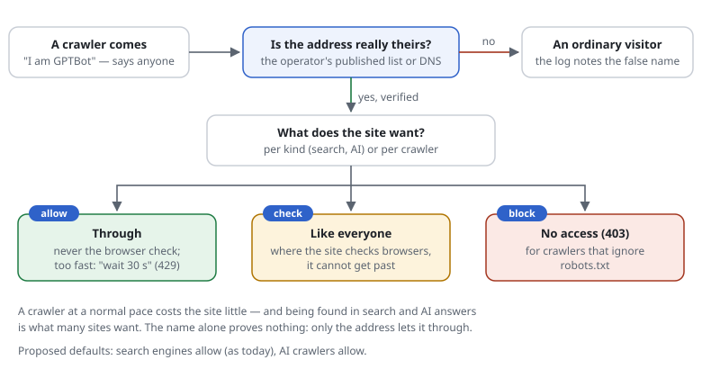

# RSF1.4 Known crawlers: search engines and AI crawlers that behave

## What it does

Search engines and AI crawlers run no JavaScript, so they can never pass the
browser check. The shield therefore recognises the ones that behave and **never
gives them the check** — but only when the request really comes from them:
the name a request sends (`GPTBot`) proves nothing, anyone can send it. A
crawler counts as verified when its address is on the operator's **published
address list**, or when its **DNS** names say so (reverse and forward).



What happens to a crawler, per kind or one by one:

```text
crawlers ai-training block          # search, ai-search, ai-user, ai-training: allow (default) | check | block
crawler  CRAWL-GPTBOT check         # one crawler differently
```

| Policy | A verified crawler |
|---|---|
| `allow` (default) | is never given the browser check; its pace is still limited — past a limit it gets the pause it understands (429 with `Retry-After`), never the check |
| `check` | is treated like any visitor |
| `block` | gets "no access" (403) — for crawlers that ignore `robots.txt` |

A request that **names** a known crawler without coming from its addresses is an
ordinary visitor; when it is checked or stopped, the log notes it:
`… challenge 429 "requests" rule=SITE-PACE claimed=CRAWL-GPTBOT …`.

## The crawlers (rules/crawlers.rules, checked 2026-09-30)

**SEO** is being found in search results; **GEO** (generative engine
optimisation) is being read, quoted and linked in AI answers. Both depend on
these crawlers reaching the site.

| ID | Crawler | Kind | Verified by |
|---|---|---|---|
| `CRAWL-GOOGLE` | Googlebot, GoogleOther, Google-InspectionTool, AdsBot, Storebot | search | address list + DNS |
| `CRAWL-BING` | bingbot (also Copilot) | search | address list + DNS |
| `CRAWL-APPLE` | Applebot | search | address list + DNS |
| `CRAWL-DUCKDUCKGO` | DuckDuckBot | search | address list |
| `CRAWL-YANDEX`, `CRAWL-BAIDU`, `CRAWL-QWANT`, `CRAWL-SEZNAM` | | search | DNS |
| `CRAWL-OAI-SEARCH` | OAI-SearchBot (ChatGPT search) | ai-search | address list |
| `CRAWL-CLAUDE-SEARCH` | Claude-SearchBot | ai-search | address list |
| `CRAWL-PERPLEXITY` | PerplexityBot | ai-search | address list |
| `CRAWL-DUCKASSIST` | DuckAssistBot | ai-search | address list |
| `CRAWL-CHATGPT-USER` | ChatGPT-User | ai-user | address list |
| `CRAWL-CLAUDE-USER` | Claude-User | ai-user | address list |
| `CRAWL-PERPLEXITY-USER` | Perplexity-User (ignores `robots.txt`, says Perplexity) | ai-user | address list |
| `CRAWL-GPTBOT` | GPTBot | ai-training | address list |
| `CRAWL-CLAUDEBOT` | ClaudeBot | ai-training | address list |
| `CRAWL-AMAZON` | Amazonbot | ai-training | DNS |
| `CRAWL-CCBOT` | CCBot (Common Crawl) | ai-training | address list + DNS |

- **search** — a search engine; **ai-search** — AI search and answers;
  **ai-user** — fetches a page when a person asks (often not bound by
  `robots.txt`: a person asked); **ai-training** — collects for training.
  Many sites want to be found and quoted (the first three) and decide about
  training separately.
- Only crawlers whose operators publish a way to verify them are on the list.
  Not listed: Meta's fetchers (the source of their addresses is still to be
  checked), Mistral (no published way found). They stay ordinary visitors; a
  site that does not want them refuses them by name (`block header User-Agent …`)
  or in `robots.txt`.
- `Google-Extended` and `Applebot-Extended` are switches in `robots.txt`, not
  crawlers: there is nothing to verify.
- A site's own crawler (its monitoring, a partner):
  `[SITE-BOT] crawler ai-search ua /PartnerBot/ dns .partner.example ranges ./partner.json`.

## The address lists — and keeping them current

The operators' lists ship with each release in `rules/crawlers/*.json`, each with
the address it comes from. They are **never fetched while a request runs**:

- **A site:** `php bin/request-shield crawlers site.rules update` fetches the
  current lists into `store-dir/crawlers/` (a cron job, or on deploy); the
  servers read them on their next check. A list that shrank to less than half
  is kept (a broken download, not a change; `--force` takes it); an update
  older than the lists of a new release is ignored. `php bin/request-shield
  crawlers site.rules` shows every crawler, its policy and how old its lists
  are; `check` notes lists fetched more than 30 days ago.
- **The library, before every release:** `php bin/update-crawler-lists` updates
  `rules/crawlers/` and regenerates `rules/crawlers.php` (the same, ready for
  settings from a PHP array). The tests fail when the two do not match, and a
  weekly GitHub workflow fails when an operator's list has changed since (see
  `CONTRIBUTING.md`, Releasing).

## Without internet: a DMZ

(Also a privacy point: a DNS lookup sends the client's address to the resolver
— with `ranges` nothing leaves the server; see [privacy and the GDPR](../privacy.md).)

```text
set crawler-verify ranges          # both (default) | ranges | dns
```

With `ranges` the shield never uses DNS: the address lists are a comparison on
the server. Recognised then: Google, Bing, Apple, DuckDuckGo, OpenAI,
Anthropic, Perplexity, Common Crawl. Crawlers only DNS can verify (Yandex,
Baidu, Qwant, Seznam, Amazon) are ordinary visitors — safe, and only relevant
where the site checks. Update the lists where there is internet (a build server,
an admin's machine) and deploy `store-dir/crawlers/` with the site. Where DNS
is used, at most `dns-lookups` new lookups a minute are made (default 30), so a
DNS server that does not answer never makes requests wait.

## In the log, on the rules page, on the command line

- `claimed=CRAWL-…` in a log line: the request named that crawler but did not
  come from it. A refused crawler: `reject 403 "crawler"` with the rule that
  refuses it.
- The rules page has a group "Known crawlers": each one, its kind, what the
  site does with it, how it is verified (list date), and how often someone only
  claimed to be it in the last 24 hours.
- `php bin/request-shield trace site.rules "GET /" --ip=… --ua="…"` shows the
  step "Known crawlers": which one, verified or not, what happens.

## Configuration (PHP array)

```php
'crawlerPolicy' => ['ai-training' => 'block', 'CRAWL-GPTBOT' => 'check'],
'crawlerVerify' => 'ranges',
'crawlers' => null,                                     // null: the shipped list (rules/crawlers.php)
'challenge' => ['searchEngines' => false],              // no crawler recognised at all
```

## Cost

Measured on PHP 8.1 with OPcache, µs per request:

| | |
|---|---|
| A normal request (no crawler named) | +0 — the name is looked at only when the check would come (≈ 1 µs, one expression for all 19) |
| Verifying by address list | 0.5 (a lookup grouped by the first two bytes of the address, built when the settings are compiled) |
| Verifying by DNS | milliseconds, once a day per address (remembered) |
| A site that refuses a kind (`block`) | +3 for every request (the name looked at), +4 for the crawler itself |
| Settings from a PHP array | +0 — `rules/crawlers.php` comes ready |

## Limits

- A crawler is counted per address like everyone else: an operator crawling
  from many addresses is limited per address, not as a whole (a budget of its
  own per crawler is a possible later step).
- The lists change: a crawler on a new address the lists do not have yet is an
  ordinary visitor until the next update (or verified by DNS, where it has DNS).
- `robots.txt` remains the polite way to ask crawlers to stay away; `block`
  is for those that do not ask.
