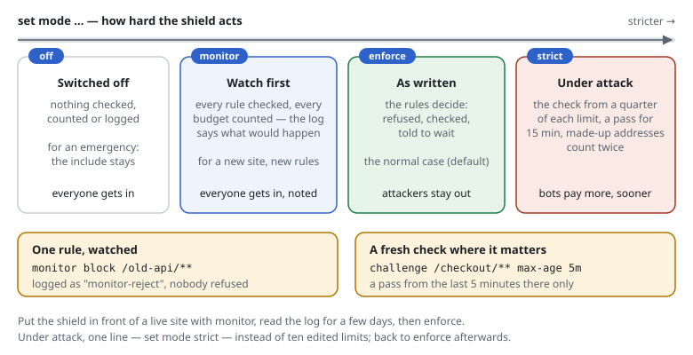

# RSF5.3 Modes: monitor first, strict under attack

## What it does

One line says how hard the shield acts:

```text
set mode monitor        # off | monitor | enforce (default) | strict
```



| Mode | What happens |
|---|---|
| `off` | Nothing: no checks, no counting, no log. The include stays; `Shield::active()->consume()` and `requirePass()` do nothing, the check inside the form is not shown. |
| `monitor` | Every rule is checked and every budget counted, **as `enforce` would** — and the log shows what would have been decided (`monitor-reject`, `monitor-throttle`, `monitor-challenge`), but **nobody is refused**. A request that would have been stopped is answered as `allow-uncached`: a cache must not keep it. |
| `enforce` | The rules as written. The default. |
| `strict` | `enforce`, tightened for a site under attack (below). |

**Single rules** can be watched with `monitor` in front — logged, not enforced,
while everything else runs as always:

```text
[SITE-OLD]  monitor block     /old-api/**                  # before it is switched on
            monitor restrict  /admin/** to 192.0.2.0/24
            monitor limit     requests 100/min             # a stricter limit, tried out
            monitor limit     searches 10/min on-demand
            monitor challenge /login
            monitor query     strict
```

When the log shows no false hits, remove the word. `monitor` goes before
`block`, `restrict`, `allow`, `limit`, `challenge` and `query strict` — the
rules that refuse or check someone — and inside `match` blocks too. The other
rules refuse nobody; to watch everything, `set mode monitor`.

**A fresh check** on sensitive paths:

```text
set        pass-ttl 1h
challenge  /login  /checkout/**  max-age 5m
```

There a visitor needs a pass issued in the last five minutes; the rest of the
site keeps the long pass. The pass cookie carries its time, signed: nothing is
stored.

## Use cases

- **Putting the shield in front of a live site:** `set mode monitor` for a few
  days, read the log (or the [rules page](active-rules-page.md)), then
  `enforce`.
- **A new rule on a running site:** `monitor block /old-api/**` — does anyone
  still use it?
- **A stricter limit, tried out:** `monitor limit requests 100/min` next to the
  enforced `limit requests 600/min`: the log shows who would have been stopped.
- **Under attack:** `set mode strict` — one line instead of ten edited limits.
  Back to `enforce` when it is over.
- **An emergency:** `set mode off` switches the shield off without touching the
  site's `auto_prepend_file` or front controller.
- **A checkout, an account's settings:** `challenge … max-age 5m`.

## `strict`

| | `enforce` | `strict` |
|---|---|---|
| The browser check | where a budget says (`challenge-at`) | from **a quarter** of each limit, for every budget without its own `challenge-at` (`requests 600/min` → from 150) |
| The pass | `pass-ttl` (1 hour) | at most **15 minutes** (a shorter `pass-ttl` stays) |
| The difficulty | from `difficulty-min` | from **twice** `difficulty-min` (at most `difficulty-max`) |
| An address a cache must not keep | counts once | counts **twice** against the budgets — the pattern of floods that bust the cache with made-up addresses |
| Search engines | welcome | welcome (verified as always) |

The site's own values win where it sets them: a budget with its own
`challenge-at` keeps it. `strict` is a switch for the time of an attack; it
does not turn itself on.

## In the log and on the rules page

```text
2026-09-30T10:12:03+00:00 198.51.100.0/24 monitor-reject 404 "blocked path" rule=SITE-OLD "GET https://www.example.org/old-api/v1" "curl/8.5"
```

- The line of a watched decision starts with `monitor-`, at the log level of
  the decision it would have been (`set log-level stop` shows what would have
  been refused).
- `X-RS: monitor reject blocked path; rule=…` (mode `monitor`) and
  `X-RS-Monitor: …` (a rule marked `monitor`), with `set
  debug-header on`.
- The rules page names the mode at the top, lists the watched rules in a group
  of their own ("Watched, not enforced") with how often each would have
  decided, and its check says what a watched rule would do.
- `bin/request-shield show` prints `set mode …` and the `monitor …` lines;
  `trace` adds "Watched: …".

## Configuration

Rule files: as above. PHP array:

```php
'mode' => 'monitor',                                     // off | monitor | enforce | strict
'challenge' => [
    'alwaysPaths' => ['#^/login$#'],
    'alwaysMaxAge' => ['#^/login$#' => 300],             // an alwaysPaths entry => seconds
],
```

Rules marked `monitor` are a feature of rule files: the file is read twice when
it is compiled, once without them (what is enforced) and once with them (what
is watched); the second reading is the setting `monitorRules`.

## Cost

Measured on PHP 8.1 with OPcache, a passing request, µs:

| | |
|---|---|
| `enforce` (as before) | 7.7 |
| `monitor` | 7.7 — the same checks; a write to the log only for what would have been stopped |
| `strict` | 8.3 — the values are set when the settings are read; a request a cache must not keep costs one more count |
| `off` | 2.2 — reading the request, nothing else |
| `enforce` + rules marked `monitor` | 13.6 — the checks once more, with the watched rules (their own budgets counted, the others only looked at) |

Watching single rules costs a second pass of the checks for every request the
enforced rules let through: meant for the days a rule is tried out.

## Limits

- `monitor` in front of a budget counts it on its own only when the enforced
  rules do not have it; a budget of the same name (`monitor limit requests
  100/min` next to `limit requests 600/min`) uses the enforced count — each
  request is counted once.
- `trace` and the rules page's check show a watched budget of its own at 0 (the
  watched counters are kept apart).
- A pass issued before `strict` was switched on keeps its lifetime.
