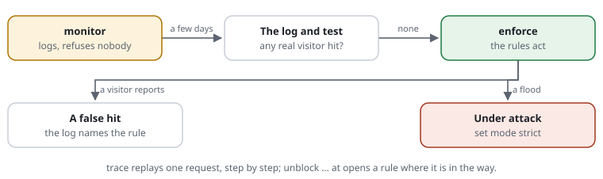

# For admins: you run the shield on a server

You installed request-shield, or you look after a site that has it. This page
says what you see, what the numbers mean, and what to do when something
happens. Words in links are explained in the [glossary](../glossary.md).



## What you see

- **The [log](../glossary.md#log)**: one line per refused or checked
  [request](../glossary.md#request), with the [rule ID](../glossary.md#rule-id)
  that decided. Switch it on with `set log /var/log/request-shield.log`.
- **The [dashboard](../glossary.md#dashboard)** at `/rs/`: the live view of
  what is stopped right now, the lists of kept-out
  [addresses](../glossary.md#address), and the [rules](../glossary.md#rule) page with a tester.
- **The command line**: `check` before every deploy, `trace` for one request,
  `stats` for the last days ([all commands](../reference/cli.md)).

## What the numbers mean

`request-shield stats site.rules` starts like this:

```text
48,213 requests: 46,990 let through, 312 checked, 18 told to wait, 893 refused
```

- **Let through**: the site answered. Usually far above 90 %.
- **Checked**: a visitor got the [browser check](../glossary.md#browser-check).
  A real browser passes it in less than a second.
- **Told to wait**: a visitor used up its [budget](../glossary.md#budget) and
  got [status code](../glossary.md#status-code) 429.
- **Refused**: mostly [scanners](../glossary.md#scanner). The rules that
  refused most are listed below the line, each with its rule ID.

A sudden rise in "checked" or "told to wait" means a flood. A rise in
"refused" from one rule after a change means that rule may hit real visitors.

## What you do when

- **You add a rule.** Write it with `monitor` in front. That is
  [monitor](../glossary.md#monitor) [mode](../glossary.md#mode) for one rule: it is logged, nobody is
  refused. After a few days without real visitors in the log, remove the word.
- **A visitor says they are refused.** That is a
  [false positive](../glossary.md#false-positive). Ask for the time and the
  address, find the line in the log, and replay it:

  ```bash
  php bin/request-shield trace site.rules "GET https://www.example.org/shop/search?q=union+select" --ip=198.51.100.7
  ```

  `trace` says check by check what happens, and which rule decides. Open that
  rule where it is in the way: `unblock [ATK-SQL-UNION@1] at /shop/search`.
- **One address keeps attacking.** Keep it out for a week:
  `request-shield deny site.rules 203.0.113.9 --for=7d --reason="login attempts"`.
  A [ban](../glossary.md#ban) ends by itself.
- **The site is under attack.** Write `set mode strict`. In
  [strict](../glossary.md#strict) mode the browser check comes much earlier.
  [Search engines](../glossary.md#crawler) stay welcome. Go back to `set mode enforce` when it is over.
- **An update is out.** `request-shield self-update --check` says whether there
  is one. When an update changes a shipped rule you took back or rewrote, `check`
  says so. If a [rule file](../glossary.md#rule-file)
  does not compile after a deploy, the last good rules stay in force.

## A typical day

- **08:10** — `stats` shows 893 refusals since yesterday. 612 came from
  `SCAN-HIDDEN`: scanners asking for `/.env`. Nothing to do.
- **10:30** — A colleague wants to try a new limit for the search. You add
  `monitor limit searches 10/min at /search/**` and run `check`. Nobody is refused
  yet.
- **14:00** — A customer reports "403" on the shop's search. The log names
  `ATK-SQL-UNION`: the search was for a book titled "Union Select". You run
  `trace`, then add `unblock [ATK-SQL-UNION@1] at /shop/search` and run `test`.
- **17:45** — The live view shows 4,000 requests a minute from many addresses.
  You set `set mode strict`. The flood gets the browser check; real visitors
  barely notice.
- **Two days later** — The search limit's log shows no real visitors. You remove
  `monitor` from the line.

More: [modes](../features/RSF05-03-modes.md) ·
[log and rule IDs](../features/RSF05-05-log-and-rule-ids.md) ·
[live and lists](../features/RSF06-02-live-and-lists.md) ·
[IP lists and bans](../features/RSF01-02-ip-lists.md).
