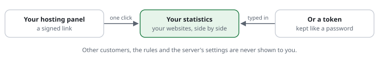

# For customers: your statistics

Your hoster or your agency protects your websites with request-shield. It
also counts visitors, and you may see those numbers for your own websites.
Words in links are explained in the [glossary](../glossary.md).

## How you get in

- **A link in your hosting panel.** One click opens your [statistics](../glossary.md#statistics). The link
  works for a few minutes only, so it cannot be passed on.
- **Or a [token](../glossary.md#token).** Your hoster gives you a long secret
  word. Type it into the form on the statistics page. Keep it like a password.
  After a few hours you are asked again.

## What you see

- **Your websites side by side**: [requests](../glossary.md#request), people,
  [crawlers](../glossary.md#crawler), [bots](../glossary.md#bot), what was
  stopped, pages not found.
- **Each website on its own**: its most read pages, search engines and AI
  crawlers, its forms.

You never see other customers' websites, the [rules](../glossary.md#rule), or the server's settings.
Nobody else sees yours, except your hoster.

## What the numbers mean

- **People** are visitors with a real browser. **Crawlers** are programs that
  say who they are, such as Googlebot. **Bots** are other programs.
- **Stopped** are requests turned away before your website ran: mostly
  attacks. They cost your website nothing.
- **Not found** are [addresses](../glossary.md#address) that do not exist on your website, with the page
  that links to them.

## What you do when

- **The numbers look wrong**, or a website is missing: ask your hoster. Only
  they can change which websites belong to you.
- **Someone left your company who had the token.** Ask your hoster for a new
  token. The old one stops working when its line is deleted.
- **A visitor says your website refused them.** Tell your hoster the time and
  the page. Their [log](../glossary.md#log) names the rule that decided.

## A typical day

- **Morning** — You click "Statistics" in your hosting panel. Your two shops
  are side by side: 3,100 people yesterday, 410 requests stopped.
- **A minute later** — You open the larger shop. Most visitors read the new
  offers page. Google came 280 times.
- **Afternoon** — "Not found" shows an old product page, linked from a partner
  website. You ask the partner to update the link.

More: [the statistics](../features/RSF06-03-statistics.md) ·
[privacy and the GDPR](../privacy.md).
