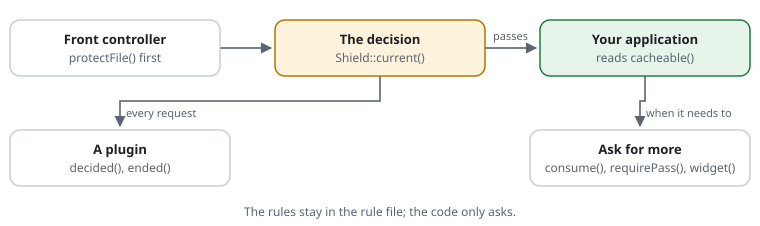

# For developers: the shield in your code

You build or maintain the application behind the shield. This page says where
the shield sits, what your code can ask it, and how to extend it. Words in
links are explained in the [glossary](../glossary.md).



## Where it sits

The shield runs before your application: first thing in the
[front controller](../glossary.md#front-controller), or by `auto_prepend_file`.

```php
CjwNetwork\RequestShield\Shield::protectFile(__DIR__ . '/../config/request-shield.rules');
```

`protectFile()` reads the [rule file](../glossary.md#rule-file) once and keeps
it compiled for OPcache. A refused [request](../glossary.md#request) never
reaches the next line. A passing one costs about 12
[µs](../glossary.md#microsecond) with [APCu](../glossary.md#apcu).

## What your code can ask

- **May this answer be kept by a [cache](../glossary.md#cache)?**

  ```php
  if (!CjwNetwork\RequestShield\Shield::current()?->cacheable()) {
      // answer normally, but do not store the page
  }
  ```

- **Count an expensive thing against the visitor's
  [budget](../glossary.md#budget)**, such as a cache miss or a failed sign-in:

  ```php
  $shield = CjwNetwork\RequestShield\Shield::active();
  if ($shield !== null && !$shield->consume('misses')->passes()) {
      // too many: answer 429, or a stale copy
  }
  ```

- **Ask for the [browser check](../glossary.md#browser-check) before saving
  what a visitor sent**: `Shield::active()?->requirePass();`. The form is sent
  again by itself afterwards; nothing typed is lost.
- **Run the check inside a form** while the visitor types:
  `<?= Shield::active()?->widget() ?>`.

Each call costs nothing until it is made.

## What you do when

- **You add a [rule](../glossary.md#rule).** Write an [example](../glossary.md#rule-example) next to it, and
  run `request-shield test` in CI:

  ```text
  [SITE-ADMIN] restrict /admin/** to 192.0.2.0/24
  expect GET /admin/ from 198.51.100.7  403 by SITE-ADMIN
  expect GET /admin/ from 192.0.2.10    answered
  ```

- **You need more than the rules give.** Write a [plugin](../glossary.md#plugin).
  It hears every decision (`decided()`) and the end of every request
  (`ended()`). It may refuse more, never less. Words of its own in the rule file
  make it an [extension](../glossary.md#extension).
- **A test should not depend on the shield.** `set mode off` keeps the include
  but does nothing; `consume()` and `requirePass()` return at once.
- **You change the shield itself.** Read [CONTRIBUTING](../../CONTRIBUTING.md):
  tests, a benchmark before and after, docs in the same change.

## A typical day

- **09:00** — The shop's search gets slow under scrapers. You add
  `limit searches 20/min on-demand` to the rules, and `consume('searches')`
  before the search runs.
- **10:00** — You add two `expect` lines for the new limit. `request-shield
  test` passes in CI.
- **14:00** — The comment form gets spam. You call `requirePass()` before the
  comment is saved. Real readers see nothing; the spam [bot](../glossary.md#bot) fails the check.
- **16:00** — Marketing wants a message when refusals pile up. You write a
  plugin that counts refusals in `decided()` and sends a message above a
  threshold.

More: [plugins](../features/RSF06-04-plugins.md) ·
[the site asks for the check](../features/RSF03-04-app-challenges.md) ·
[examples next to the rules](../features/RSF05-04-rule-examples.md) ·
[what a cache may keep](../features/RSF04-01-cacheable-definition.md) ·
[the rule file reference](../reference/rule-files.md).
