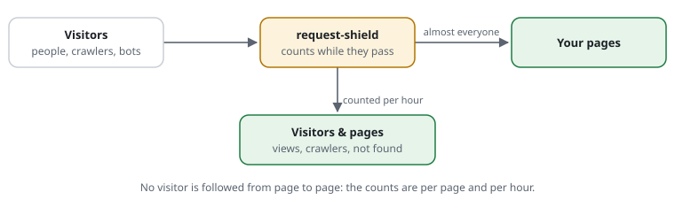

# For editors: visitors, pages and crawlers

You write and look after the content of a website. The shield counts who
reads it, so you see which pages people read, which search engines and AI
companies come by, and which links are broken. You need no technical
knowledge for this page. Words in links are explained in the
[glossary](../glossary.md).

## What you see

The page **Visitors & pages** in the [dashboard](../glossary.md#dashboard),
usually at `/rs/stats/visitors`. It shows the shield's
[statistics](../glossary.md#statistics). Your admin tells you the
[address](../glossary.md#address) and how to open it.

- **Six numbers at the top**: page views by people, visits by
  [crawlers](../glossary.md#crawler), [bots](../glossary.md#bot), stopped,
  not found. Each shows its change against the period before.
- **A chart** of the number you click, with the period before as a dashed line.
- **Pages**: the most read pages, and whole sections such as `/news/`.
- **Crawlers & AI**: search engines, AI assistants and AI training crawlers,
  each with how often it came.
- **Forms**: how often each form was sent, from which page, and how it ended.

## What the numbers mean

- **People** are visitors with a real browser. **Crawlers** are programs that
  read the site and say who they are, such as Googlebot. **Bots** are other
  programs, such as scripts that copy pages.
- **Page views** count pages, not pictures or files. One visitor reading three
  pages counts three.
- **Stopped** are [requests](../glossary.md#request) the shield turned away, mostly attacks. A real
  reader is almost never among them.
- **Not found** are pages that do not exist, with the page that links to them.
  A link from your own site is a broken link you can fix.

## What you do when

- **A page is missing in the search results.** Look at "Crawlers & AI": did
  Google come this week? The sitemaps section says whether it read the new
  sitemap.
- **You do not want AI companies to train on your texts.** Ask your admin for
  `crawlers ai-training block`. AI assistants that answer a person's question,
  and search engines, can stay welcome.
- **"Not found" shows a page of yours as the source.** Open that page and fix
  the link. The number goes down from the next day.
- **A reader asks: "Why do I see a check page?"** That was the
  [browser check](../glossary.md#browser-check). It runs by itself in less than a
  second, and the reader is left alone for about an hour. It comes when many
  requests arrive at once. See [the browser check, in plain words](../explained/browser-check.md).
- **A form gets much spam.** Look at "Forms": spam often comes from no page or
  from another website. Your admin can allow the form only from your own pages.

## A typical day

- **Monday, 09:00** — You open Visitors & pages for the last 7 days. 2,400 page
  views by people, 15 % more than the week before. The new article leads.
- **09:10** — "Not found" lists `/old-shop` 61 times, linked from your own page
  `/news/2025/summer`. You fix the link there.
- **11:30** — Crawlers & AI: Googlebot read the new sitemap yesterday. GPTBot
  came 1,204 times and was refused each time, as your team decided.
- **15:00** — A reader writes that a page "checked my browser". You look at the
  time: there was a rush of requests then. You reply that the check is
  harmless and runs only once an hour.

More: [the statistics](../features/RSF06-03-statistics.md) ·
[known crawlers](../features/RSF01-04-known-crawlers.md) ·
[the check inside the form](../features/RSF03-03-browser-check-in-the-form.md).
