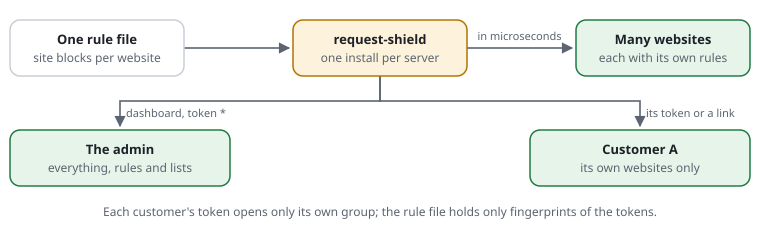

# For hosters: many websites, one shield

You run a server with many websites, often for many customers. This page says
how one shield protects them all, how each customer sees only its own
numbers, and what to do when. Words in links are explained in the
[glossary](../glossary.md).



## What you see

- **One [rule file](../glossary.md#rule-file) for the server.** [Rules](../glossary.md#rule) outside
  any block hold for every website. A [site block](../glossary.md#site-block)
  adds rules for one website, or sets its own [mode](../glossary.md#mode).
- **The [dashboard](../glossary.md#dashboard)** with the tab "All websites":
  one row per website and per customer group, each with its
  [requests](../glossary.md#request), refusals and pages not found.
- **`request-shield check`** names the [tier](../glossary.md#tier) of the
  hosting: with [APCu](../glossary.md#apcu), with files, or with neither.

## What the numbers mean

- **Requests per website** show which site draws the traffic. A site far above
  its usual numbers is the first place to look during a flood.
- **Refused per website** is mostly [scanners](../glossary.md#scanner). Scanners
  often try every website on a server, one after the other.
- **The cost**: a passing request costs the shield about 12
  [µs](../glossary.md#microsecond) with APCu and about 42 µs with files. A page
  from a CMS costs 100 to 200 ms, thousands of times as much.

## What you do when

- **You set up a server.** Point PHP's `auto_prepend_file` at the shield's
  `bootstrap.php` for every pool. Keep the shield and its
  [store directory](../glossary.md#store-directory) outside every website's public folder.
- **A customer gets a website of its own rules.** Add a site block:

  ```text
  site shop.a.example a.example {
    restrict /admin/** to 192.0.2.0/24
  }
  ```

- **A customer wants its [statistics](../glossary.md#statistics).** Put its websites in a group, and make a
  [token](../glossary.md#token):

  ```text
  stats-group "Customer A" a.example www.a.example
  ```

  ```bash
  php bin/request-shield access-token server.rules "Customer A"
  ```

  The command prints the token once, and the `dashboard-access` line to paste.
  The rule file keeps only a fingerprint. Your hosting panel can instead make a
  signed link. It is valid for ten minutes and opens the group's view.
- **One [address](../glossary.md#address) attacks many websites.** A [ban](../glossary.md#ban) on one
  website holds on all of them. `request-shield feeds server.rules export
  --format=nftables` hands the kept-out addresses to the [firewall](../glossary.md#waf), where they
  cost nothing.
- **A whole server is under attack.** `set mode strict` in the base tightens
  every website that does not set its own mode.

## A typical day

- **07:00** — Cron runs `request-shield feeds server.rules update` every hour.
  The [blocklists](../glossary.md#blocklist) are fresh; no website noticed.
- **09:20** — A new customer moves in. You add a site block for its two names,
  a group, and a token. The customer gets the token by your usual secure way.
- **11:00** — "All websites" shows one shop with ten times its usual requests,
  all to made-up addresses. You give that site block `set mode strict`. The
  shop's real customers barely notice.
- **15:30** — An agency asks for the same statistics as the customer. You make
  a second token for the group, `until` the end of the contract.
- **Evening** — The flood is over. You remove `set mode strict` from the block.

More: [site blocks](../features/RSF05-01-rule-files.md#site-blocks-rules-per-website) ·
[statistics per website and groups](../features/RSF06-03-statistics.md#groups-websites-per-customer) ·
[who sees what](../features/RSF06-03-statistics.md#who-sees-what-tokens-a-login-signed-links) ·
[the tiers](../features/RSF05-02-settings.md#what-this-installation-can-do-the-tiers) ·
[public blocklists](../features/RSF01-03-blocklist-feeds.md).
