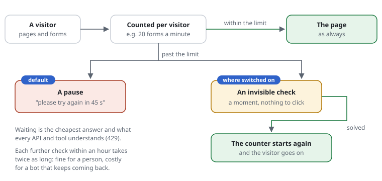

# 0001 — Earn back a spent budget: a challenge instead of 429, for forms and APIs too

| | |
|---|---|
| Status | **Accepted** 2026-09-30 (decisions below), not yet implemented |
| Proposed | 2026-09-28 |
| Affects | budgets, the challenge, the responder |

## Summary

A client past a budget's `limit` gets `429 Too Many Requests` today. With this
proposal a budget can ask for a proof of work instead, and a solved challenge
resets the client's counter for that budget: the client "pays" for the next
`limit` requests with a little CPU. That works for GET pages (as the browser
check does now), for **form posts** (the challenge page re-submits the form)
and for **API calls** (a machine-readable challenge in a header).

## In one picture



## Decisions (with Felix, 2026-09-30) — and why

| Question | Decision | What it brings |
|---|---|---|
| Past the limit, by default? | **A pause (429)**, as today. The check only where a site switches it on, per budget: `limit posts 20/min on-exceeded challenge` | An update changes nothing on its own; APIs, apps and monitoring keep getting the answer every tool understands (429 with `Retry-After`); a pause is the cheapest answer under attack. Where people are behind the requests (pages, forms), the site chooses the check. |
| After a solved check? | **The counter starts again** (a whole new `limit`) | Simple and fair for a person: one check, and they go on. What keeps a bot from living off it is the next line. |
| Harder each time? | **×2 per solve within an hour**, from `difficulty-min` up to at most `difficulty-max`; after an hour without a solve, back to the start | A person solves once or twice and hardly notices (≈ 0.1 s, then 0.2 s); a bot that keeps coming back pays more each time (≈ 1–2 s on a phone at the default maximum). Stricter sites raise `difficulty-max`. |
| What is an "API"? | **JSON** (`Accept` or `Content-Type` `application/json`, `*+json`), plus the paths a site names: `api-path /api/**` | JSON clients get the task as a header they can solve; the path is the surest sign a site knows. Browsers and simple tools (`*/*`) are not mistaken for APIs. |

In plain words, for whom what changes when a site switches the check on:

| Who | Before (a pause) | With the check |
|---|---|---|
| A person who clicked a lot | waits until the minute is over | a moment of "One moment, please", then on |
| A simple bot (no JavaScript) | waits, then carries on | stays out: it cannot solve the check |
| A bot with a browser engine | waits, then carries on | pays computing time, twice as much each time |
| An API client (JSON) | 429, `Retry-After` | the task in a header; solved, it goes on |

## Motivation

- A real user who submits a form too often — a shop's checkout retried, a
  search refined twenty times — should not be locked out for the rest of the
  window. A bot should.
- An attacker rotating through addresses pays per address and per burst,
  instead of simply waiting for the window to pass.
- APIs cannot run a browser script, but can solve a proof of work; the ALTCHA
  format has client libraries for several languages.

## Design

### Budget setting

```text
limit posts 20/min on-exceeded challenge          # rule file; without "on-exceeded": a pause (429)
```

```php
'budgets' => [
    'posts' => ['limit' => 20, 'window' => 60, 'onExceeded' => 'challenge'],   // default: 'throttle'
],
```

- Past `limit` (and not before: `challengeAt` stays the separate, earlier
  browser check) the decision is `CHALLENGE` with the budget's name.
- A solution for that budget resets the client's counter for it
  (`Store::reset(key)`, one write) and is bound to client, budget and
  challenge, and single-use as today.
- **Escalation:** a second counter per client and budget counts solves per
  hour; the difficulty starts at `difficulty-min` and doubles with each
  (`difficulty-min × 2^solves`, at most `difficulty-max`: with the defaults
  50,000 → 100,000 → 200,000 → 400,000 → 500,000); an hour without a solve
  starts it again. One legitimate
  user solves once or twice; sustained abuse becomes exponentially more
  expensive.

### Browsers: GET

As the browser check today: the page solves, sets the solution cookie and
reloads.

### Browsers: form posts

Built since this was proposed, and reused here:

- the check page carries the posted fields and sends them again once solved
  ([0006](0006-the-site-asks-for-the-check.md): escaped fields, the request's
  own URL, the form token unchanged, no files, up to 256 KB);
- the check inside the form ([0010](0010-browser-check-in-the-form.md)): a
  form with the box sends its answer along, so even a form with files goes
  straight through.

### APIs

For a request that asks for or sends JSON (`application/json`, `*+json`), or
matches a path named with `api-path`:

```http
HTTP/1.1 429 Too Many Requests
Request-Shield-Challenge: eyJhbGdvcml0aG0iOiJTSEEtMjU2Ii...   (base64url of the ALTCHA JSON)
Content-Type: application/json

{"error":"rate_limited","challenge":{"algorithm":"SHA-256","challenge":"…","maxnumber":50000,"salt":"…","signature":"…"}}
```

The client solves it and repeats the request with
`Request-Shield-Solution: <base64url payload>`. Clients with an API token are
exempt as today and never see this.

### Optional: a visible CAPTCHA

A `ChallengeProvider` interface, with the proof of work as the default and
adapters for Cloudflare Turnstile, hCaptcha or Friendly Captcha later. These
send the visitor's data to a third party; the default stays self-hosted.

## Security

- Solutions bound to client bucket, budget and challenge; single-use; expire.
- Escalating difficulty per client and budget.
- Re-submitted forms: escaped fields, own URL only, size limit, no files.
- The API challenge reveals nothing but what the browser page reveals.

## Cost

Nothing on the passing path. A reset is one store write; a challenge as today
(~12 µs page, ~9 µs check).

## Open questions

None left: decided on 2026-09-30 (above). As proposed they were: the default
`onExceeded`; a full reset or a credit; the escalation's factor and cap; what
counts as an API.
