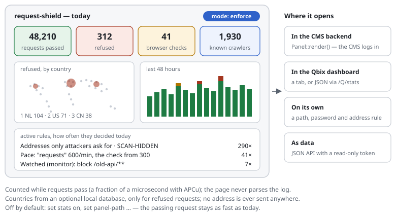

# 0012 — A dashboard: what the shield does, at a glance

| | |
|---|---|
| Status | **Draft** |
| Proposed | 2026-09-30 |
| Affects | a new optional part (`Report\Panel`), the store (counters), the rules page, the log |

## Summary

An optional admin page that shows a site owner, in plain words and on one
screen, what the shield does: the mode, the rules in force, how many requests
passed, were checked or refused — per hour and day, per rule, per country —
and which crawlers came. It can be opened on its own (a path the shield
answers, locked by password and address) or **embedded**: one PHP call returns
the page or its data as JSON, for the Exponential backend, the Qbix server's
dashboard or any CMS. It reads **counters kept while requests pass**, not the
log, so opening it costs nothing even on a busy site.

This proposal is the frame; the IP lists ([0013](0013-ip-lists.md)), crawler
statistics ([0014](0014-crawler-statistics.md)), page statistics
([0015](0015-page-statistics.md)) and the rule advisor
([0016](0016-rule-advisor.md)) are tabs in it.

## In one picture

## Roadmap for 0012–0016

Recommended order — each step is useful on its own, and each builds on the one
before:

1. **Counters** (below) and **crawler statistics** ([0014](0014-crawler-statistics.md)):
   small, and they answer the most asked question first — *did GPTBot crawl
   the site, or was it refused?*
2. **The dashboard, read-only**: tiles, mode, rules, countries, crawlers.
   Nothing on it can change anything yet, so the security surface is small.
3. **IP lists** ([0013](0013-ip-lists.md)): the first thing it can change —
   with a login, CSRF protection and files only the lists may write.
4. **The rule advisor** ([0016](0016-rule-advisor.md)), deterministic, from the
   counters and monitor mode.
5. **Page statistics** ([0015](0015-page-statistics.md)): optional, with the
   most privacy questions.
6. The optional LLM help of 0016, last.

## Motivation

- Today the rules page ([active rules](../features/active-rules-page.md))
  explains the rules and shows the last 24 hours from the log. A site owner
  also wants the *trend* — "more refusals since Tuesday?" — and the big
  picture without reading log lines.
- The log is not the right source for a dashboard: parsing a large log on
  every view is slow, and at `log-level stop` it holds only refusals.
- The people who run a site are often not the people who wrote its rules:
  they need the page to speak plainly, and to live where they already work —
  in the CMS backend.

## What it shows

| Area | Content | Source |
|---|---|---|
| **Tiles** | requests, refused, checked, passed the check, known crawlers — today, with yesterday beside it | counters |
| **Over time** | a bar per hour (last 48 h) and per day (last 30 days): passed, uncached, checked, throttled, refused | counters |
| **Mode** | the mode in words (as on the rules page), rules marked `monitor`, `strict` highlighted | settings |
| **Rules** | the rules page's groups, each rule with how often it decided (today, 7 days) | counters per rule ID |
| **Countries** | where refused requests came from: a small world map and a ranked list | counters per country |
| **Crawlers** | see [0014](0014-crawler-statistics.md) | counters per crawler |
| **Lately** | the last refusals and checks, as now | the log's tail |
| **Try an address** | the Inspector, as now | — |

Designed for people who are not technicians: every number has a sentence
("312 requests were refused today — 290 of them looked for files only
attackers ask for"), colours follow the rules page (green passed, amber
checked, red refused), no jargon on the first screen.

## Design

### Counters

A new, small `Stats` part in the core, used only when switched on
(`set stats on`):

- **Keys** per hour: `stat:<yyyymmddhh>:<what>` — `what` is an action
  (`reject`, `challenge`, …), a rule ID, a country code or a crawler ID. A
  request adds one to *two or three* keys: its action and, when not a plain
  `allow`, its rule; country and crawler only where they apply.
- **APCu**: `apcu_inc()` (~0.2 µs each). Once an hour the first request after
  the full hour moves the finished hour into a file
  (`<store-dir>/stats/<yyyy-mm-dd>.json`, one small object per hour), guarded
  by `apcu_add()` so only one request does it. A restart loses at most the
  running hour.
- **Without APCu**: one append of a short line to the hour's file
  (`<store-dir>/stats/<yyyymmddhh>.log`, `O_APPEND`, lock-free like the file
  store), summed when the dashboard or the hourly roll-up reads it.
- **Kept**: hours for 7 days, days for 400 days (configurable); older files
  are removed by the roll-up.

### Countries

Country from the address, **offline**: an optional country database the site
downloads — recommended: **DB-IP "IP to Country Lite"** (CC BY 4.0, monthly,
no account; attribution on the page), converted by
`bin/request-shield geo update` into a compact sorted range file for a binary
search (~20 comparisons, ~2 µs). No request ever goes to an external service.
Looked up **only for refused and checked requests** (rare), never for passing
ones. Without the database the country tiles are simply not shown.

The map: an equirectangular **dot grid** of the world (a few hundred dots,
from Natural Earth's public-domain outlines, ~15 KB, embedded), each dot
belonging to a country; bubbles sized by refusals. Always next to it the same
data as a ranked list — readable without the map, and for screen readers.

### Opening it

- **On its own:** `set panel-path /request-shield/panel`. Answered by the shield
  before the application (like the widget endpoint). Locked by **both** an
  address rule (`restrict /request-shield/panel/** to 192.0.2.0/24`, or
  localhost by default) and a password (`set panel-password-hash $2y$…`, a
  `password_hash()`; a signed session cookie for 30 minutes). Never indexed
  (`X-Robots-Tag: noindex`), never cached.
- **Embedded:** `Report\Panel::render($settings, ['action' => …, 'csrf' => …])`
  returns the page's HTML (inline CSS, no external files) to print inside the
  CMS's own backend — the CMS does the login, the panel takes its form token
  for changes. `Report\Panel::json($settings, 'overview'|'hours'|'rules'|'countries'|'crawlers')`
  returns the data, for a CMS that draws its own widgets.
- **Exponential:** an admin module `request-shield/dashboard` (a view that calls
  `Panel::render()`, the CMS's policies decide who sees it), and a dashboard
  block with the tiles.
- **Qbix server:** a tab in `/Q/dashboard` that includes `Panel::render()` of
  the site it serves, or its JSON through `/Q/stats`.
- **JSON API** on its own: `<panel-path>/api/<what>`, with a read-only API
  token (`set panel-api-token-hash …`) sent as `Authorization: Bearer`.

### In the single file (0002)

The core stays small: the counters are a few lines in the shield. The panel
(page, map, charts) is a **second, optional file** (`request-shield-panel.php`)
loaded only on the panel path or by `Panel::render()` — a passing request
never parses it.

## Cost

| | Per request |
|---|---|
| `set stats off` (default) | nothing |
| `set stats on`, a passing request | one counter (~0.2 µs APCu, ~5 µs file append) |
| a refused or checked request | two or three counters, plus the country lookup (~2 µs) with a database |
| opening the dashboard | reads counters and a few day files; no log parsing (only its tail for "Lately") |

## Privacy

- Counters hold **no addresses and no personal data**: an hour, an action, a
  rule ID, a country code, a crawler ID.
- The country is looked up from the address and only the country is kept.
- "Lately" shows the log's lines as the log keeps them (masked addresses by
  default, see [the log](../features/log-and-rule-ids.md)).
- The panel sets one cookie, only for someone who logs in (a session, not
  tracking).

## Open questions

1. Standalone login: password hash in the rule file (proposed) — or only
   embedded, leaving login to the CMS? *Recommendation: both; standalone
   needs address rule + password together.*
2. The country database: DB-IP Lite (CC BY 4.0, proposed), or also MaxMind
   GeoLite2 (needs an account and a licence key)? *Recommendation: DB-IP Lite
   as the documented default; GeoLite2 as an option for sites that have it.*
3. The map: a dot grid (proposed), real country outlines (~100 KB+), or only
   the list? *Recommendation: dot grid + list.*
4. How long are hours and days kept? *Recommendation: 7 days of hours, 400 days
   of days.*
5. Should `set stats on` be the default once the counters are measured?
   *Recommendation: no — off until someone asks for the dashboard; one line
   switches it on.*
