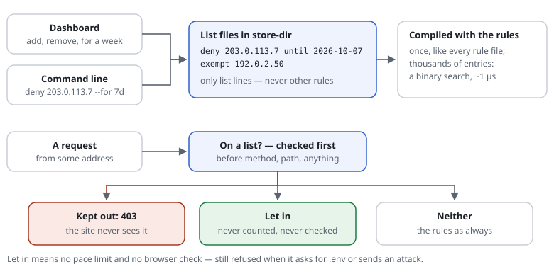

# 0013 — IP lists: let an address in, keep one out

| | |
|---|---|
| Status | **Implemented** (2026-10-01): `deny`, `exempt … until`, list files, the command line, automatic bans; the dashboard tab comes with [0012](0012-dashboard.md) |
| Proposed | 2026-09-30 |
| Affects | rule files (new rules `deny` and `ban`, list files), the store, the dashboard ([0012](0012-dashboard.md)), the command line |

## Summary

Two lists a site owner keeps without editing rule files: **addresses let in**
(never counted, never checked — the office, the monitoring) and **addresses
kept out** (403, before anything else — a scraper, an attacker). Kept from the
dashboard or the command line, each entry with a reason and, if wanted, an
end date. Stored as small **list files** the shield reads like its other
rules: compiled once, checked in the same pass as today, so a passing request
pays nothing for them.

And, as the last rung when checks and pauses have not helped: **automatic,
temporary bans** — a client that keeps going past its limits, or keeps asking
for what only attackers ask for, gets nothing but a short "wait" for a while,
longer each time it comes back.

## In one picture



## Motivation

- An attacker's address, noticed in the log or on the dashboard, should be
  shut out in seconds — by someone who has never opened a rule file.
- The office or a monitoring service should never meet the browser check.
- "For a week" is common: a temporary block that lifts itself.
- What exists: `exempt <addresses>` (never counted) and `restrict <paths> to
  <addresses>` (areas for some). What is missing: refusing an address site-wide,
  and keeping either list without editing files by hand.

## Design

### The rules

```text
exempt  192.0.2.50                 # exists: never counted (budgets, so never checked by them)
deny    203.0.113.7  198.51.100.0/24  until 2026-10-07    # new: 403 before everything else
```

- `deny <addresses or ranges> [until <date>]`: refused with 403 (reason
  `denied`), checked **first** — before the method, before the path. The
  cheapest refusal there is, and a denied client costs the site nothing.
- The allow list uses `exempt`, which exists; entries from the list are also
  exempt from always-checked paths (`challenge`) — a let-in address is *never*
  checked. It is **not** exempt from blocked paths or attack patterns: a
  compromised office machine asking for `/.env` is still refused.

### The list files

```text
set lists-dir ${REQUEST_SHIELD_LISTS:-<store-dir>/lists}
```

- Two files there, `allow.rules` and `deny.rules`, written **only** by the
  dashboard and the command line, atomically (a temporary file, then
  `rename()`), one entry per line with its reason, who added it and when, as the
  rule's description:

  ```text
  [LIST-D17] deny 203.0.113.7 until 2026-10-07   # scraper, 900 requests/min · dashboard 2026-09-30
  ```
- Read after the site's rule files, like an include; recompiled when they
  change (the settings already notice changed files).
- **Only list lines are accepted there** — `deny` and `exempt` with addresses,
  nothing else. A list file that holds anything else is an error. So the
  dashboard, which needs a writable directory, can never be used to write
  rules: the rule files themselves stay read-only for the web server.
- Expired entries are left out when compiling; the compiled settings remember
  the next end date and are rebuilt once it has passed (one integer compared
  per request).

### Many addresses

Up to a few dozen entries: checked like `exempt` today (a loop over parsed
ranges). Above that the compiler builds a sorted range table (IPv4 and IPv6
apart) and the check is a binary search — about 1 µs for 10,000 entries — so a
list fed by a fail2ban-style script stays fast.

### Keeping them

- **Dashboard:** a tab with both lists, a search, "add" (address or range,
  reason, for 1 hour / 1 day / 1 week / always) and "remove". From the log and
  the country view: "keep this address out" next to an entry.
- **Command line:** `bin/request-shield deny 203.0.113.7 --for 7d --reason
  "scraper"`, `allow …`, `unlist …`, `lists` — for scripts, including a
  fail2ban action.
- **Guards:** the dashboard refuses to deny the address it is opened from, the
  addresses in `trust`, and ranges wider than /16 (IPv4) or /32 (IPv6) unless
  confirmed.

## Automatic, temporary bans: the last rung

The shield already answers a client that is too fast with a ladder: the browser
check past `challenge-at`, a pause (or, with `on-exceeded challenge`, a check
that frees the counter and doubles in difficulty, [0001](0001-earn-back-a-spent-budget.md))
past the limit. A bot that neither solves nor waits keeps coming anyway. The
last rung: **for a while, nothing but a short answer.**


```text
[SITE-BAN]   ban after 5 limits in 10m     for 15m     # repeatedly past a limit: a pause, a spent check
[SITE-SCAN]  ban after 20 refusals in 5m   for 1h      # a scanner: blocked paths, attack patterns
[SITE-POW]   ban after 10 checks in 10m    for 15m     # the check shown again and again, never solved
[SITE-LOGIN] ban after 10 logins in 15m    for 30m     # a budget the site counts (consume('logins'))
set ban-growth 2                                       # a repeat offender: twice as long each time
set ban-max 1d                                         # at most
```

- **What counts** — clear signals only: a request past a limit (throttled or a
  spent check); a refusal for a blocked path or an attack pattern; a check page
  shown without being solved; an on-demand budget past its limit (failed
  sign-ins, via `Shield::active()->consume()`). Each is one counter per client
  in the store, counted only when it happens — a passing request counts nothing.
- **Where it is kept** — in the store (APCu, or the files in store-dir), with
  its end time: it ends by itself, nothing to clean up. With `ban-growth` the
  next ban within a day lasts twice as long, up to `ban-max`.
- **The answer** — **429 Too Many Requests with `Retry-After`**, checked at the
  very start (right after `deny`): honest ("wait 15 minutes"), understood by a
  person behind the same address, and well-behaved tools stop by themselves. A
  banned client costs one lookup and a few bytes; no rule, no page of the site.
- **Never banned** — the allow list (`exempt`), trusted proxies (`trust`) and
  verified crawlers ([0011](0011-known-crawlers.md); they keep getting the
  pause they understand). Clients are counted as for the budgets: IPv4 by
  address, IPv6 by its /64.
- **Watch first** — `monitor ban …` ([0004](0004-modes-monitor-and-strict.md))
  logs whom a ban would have hit (`monitor-ban`) and bans nobody; in `set mode
  monitor` no ban is enforced either.
- **Seen and lifted** — the log writes `ban 429 "…" rule=SITE-SCAN until 10:45`;
  the dashboard lists the active bans with their rule and end, and one click
  (or `bin/request-shield unlist 203.0.113.7`) lifts one — as for the deny list.
- **A ban and the deny list** give the same kind of refusal; a ban comes from
  the store and ends by itself, a deny entry from a person and a file. The
  dashboard offers "keep out for good" next to a ban that keeps coming back.
- **Several servers** — with APCu a ban holds per server; with the file store
  on a shared disk, for all of them. For the firewall level, the log line can
  feed fail2ban, which bans before a request reaches the web server — cheaper
  still, and a good second line.

**Risks, and what limits them.** Many people can share one address — an office,
a school, a mobile carrier's network. One bot there would ban everyone behind
it. Hence: off by default, only clear signals, short durations that grow only
for repeat offenders, `monitor ban` first, 429 with the time to wait (never a
silent 403), and the dashboard's list of active bans. Behind a load balancer the
client address must be right ([trusted proxies](../features/trusted-proxies.md)),
or the balancer would be the one counted — which the shield refuses for
trusted proxies anyway.

## Cost

| | Per request |
|---|---|
| no list entries | nothing |
| a few dozen entries | ~0.1 µs per entry (as `exempt` today) |
| thousands of entries | a binary search, ~1 µs |
| expiry | one integer comparison |
| a denied client | refused before any other check: less than any other refusal |
| bans switched on | one store lookup per request (APCu ~0.2 µs, the file store ~1–2 µs); counting only when a limit, refusal or unsolved check happens |
| a banned client | that lookup and a short answer — nothing else runs |

Measured once built (PHP 8.4, OPcache; [details](../features/ip-lists.md#cost)):
5,000 deny ranges +0.3–2 µs with APCu; bans on +0.5–1 µs with APCu and +3–6 µs
with the file store (one stat per request for the address's ban).

## Privacy

The lists hold addresses — personal data under the GDPR when they belong to
people. The reason and the end date make the purpose and the retention
explicit; entries without an end date are listed on the dashboard as
"permanent" so they are reviewed. The list files stay outside the document
root (in store-dir by default) and are created 0640. A ban holds an address
only for its duration (at most `ban-max`) and for a stated purpose (defence
against an attack); the counters behind it expire with their windows.

## Open questions

1. `deny` checked first (before even the method), or after the path checks?
   *Recommendation: first — the cheapest place, and a denied address has no
   business anywhere.*
2. The allow list: `exempt` plus never checked (proposed), or also past
   blocked paths and attack patterns? *Recommendation: never past those.*
3. Answer to a denied client: 403 (proposed), or drop the connection
   (not possible from PHP), or 404? *Recommendation: 403 with the usual short
   page; the reason stays out of it.*
4. Automatic bans: as proposed — off by default, only the four signals above,
   15 minutes to an hour, growing ×2 for repeat offenders up to a day?
   *Recommendation: yes; a site switches them on per signal, `monitor ban`
   first.*
5. A ban's answer: 429 with `Retry-After` (proposed) or 403? *Recommendation:
   429 — it says how long, and people behind a shared address understand it.*
6. Should a ban that keeps returning be offered for the deny list?
   *Recommendation: offered on the dashboard and by the rule advisor
   ([0016](0016-rule-advisor.md)); a person decides.*

## Decisions (2026-10-01)

1. **`deny` first** — before the method and the path; **403** with the usual
   short page, the reason stays out of it (the log names the entry).
2. **The allow list is never counted and never checked** (not at
   always-checked pages either), and **never let past** blocked paths or
   attack patterns.
3. **Bans: off by default, the four signals** (`limits`, `refusals`, `checks`,
   a budget's name), 429 with `Retry-After`, ×2 for a repeat within a day
   (`ban-growth`), at most a day (`ban-max`), `monitor ban` to watch first.
4. **A ban that keeps returning is offered for the deny list** — on the
   dashboard and by the rule advisor ([0016](0016-rule-advisor.md)); a person
   decides. Both wait for [0012](0012-dashboard.md).

As built, beyond the design above:

- `ban` and the list settings (`lists-dir`, `ban-growth`, `ban-max`) are about
  the server: above the site blocks ([0024](0024-rules-per-website.md)), so a
  client banned on one website is banned on all. `deny` may stand in a site
  block and then keeps an address off that website only.
- The command line writes the list files; `allow` always takes an end (an
  address let in for good belongs in the rule file); a range holding a trusted
  proxy is refused even with `--force`. With the file store `unlist` lifts a
  running ban at once.
- The store learned `mark()`/`marked()`: a key held until a time, ending by
  itself (APCu TTL; a small file, removed when read after its end).
