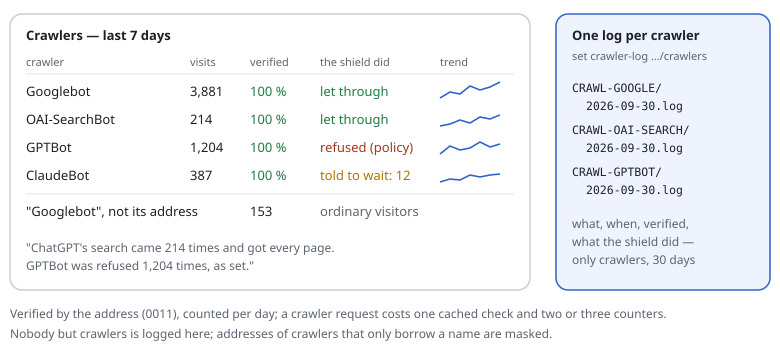

# 0014 — Crawler statistics: did GPTBot come, and what did it get?

| | |
|---|---|
| Status | **Implemented** 2026-09-30, except the dashboard tab (see [statistics](../features/statistics.md)) |
| Proposed | 2026-09-30 |
| Affects | known crawlers ([0011](0011-known-crawlers.md)), the counters of [0012](0012-dashboard.md), the log |

## Summary

For every known crawler ([0011](0011-known-crawlers.md)): how often it came,
how often it was really the crawler (verified by its address) and how often
only someone using its name, what the shield did with it (let through,
checked, refused, told to wait), when it was last seen and which pages it
fetched most. Shown on the dashboard, available as JSON, and — optionally —
one log file per crawler, so "did ChatGPT's search read our new page?" has a
plain answer.

## In one picture



## Motivation

- For SEO and GEO the questions are simple and asked often: *Did Google,
  Bing, ChatGPT, Claude, Perplexity read the site this week? Which pages? Were
  any of them refused by mistake?*
- The shield is the one place that knows the answer reliably: it verifies a
  crawler by its address (0011), where a web server's access log only has the
  name — which anyone can send.
- And the opposite question, for sites that refuse training crawlers: *is the
  refusal working, and who pretends to be a crawler?*

## Design

### What is counted

Per crawler ID and day (and hour, for the last 7 days), with `set stats on`:

| Counter | Meaning |
|---|---|
| `seen` | requests whose User-Agent named it |
| `verified` | … coming from its addresses |
| `claimed` | … not from its addresses (ordinary visitors borrowing the name) |
| `allowed`, `checked`, `refused`, `throttled` | what the shield decided (verified ones) |
| `robots` | fetches of `/robots.txt` — did it read the site's wishes? |

Plus, per crawler, the **last seen** time and address, and the **top pages**
of the day (paths without query, at most 50 per crawler per day; the rest
counted as "other").

Today (0011) a crawler is verified only when it matters (it would be checked,
or the site refuses it). With statistics on, every request that names a
crawler is verified — **cached per address and crawler for a day**, so after
the first request of an address it is one cache read.

### Per-crawler logs (optional)

```text
set crawler-log /var/log/request-shield/crawlers     # one file per crawler and day
set crawler-log-kinds ai-search ai-user ai-training  # default: all kinds
```

- `<dir>/CRAWL-GPTBOT/2026-09-30.log`, one line per request: time, address,
  verified or claimed, decision, method and URL, User-Agent — the format of the
  shield's log.
- Verified crawlers' addresses are an operator's, not a person's: written in
  full. Claimed ones may be people: masked as in the log (`log-ip`).
- Kept 30 days by default (`set crawler-log-days`), removed by the hourly
  roll-up of 0012.
- Written with `O_APPEND`, one write per request of a crawler — only for
  crawlers, never for other visitors.

### On the dashboard

A "Crawlers" tab: one row per crawler with the counters of today and the last
7 and 30 days, a sparkline, the last visit, the policy in words; opened, its
top pages and its last log lines. Answers in sentences at the top:

> *ChatGPT's search (OAI-SearchBot) came 214 times this week and got every
> page. GPTBot (training) was refused 1,204 times, as set. 153 requests
> pretended to be Googlebot — they were treated as ordinary visitors.*

JSON: `Panel::json($settings, 'crawlers')`, `<panel-path>/api/crawlers?days=7`.

## Cost

| | Per request |
|---|---|
| `set stats off` | nothing |
| a request that names no crawler | nothing beyond 0011's one expression over the User-Agent |
| a request that names one | verification from the cache (~0.5 µs), two or three counters (~0.2 µs each with APCu) |
| per-crawler log on | one appended line per crawler request (~5 µs) |

## Privacy

- Counters hold crawler IDs, dates and paths — no personal data.
- Per-crawler logs: verified crawlers' addresses are companies' servers;
  claimed ones are masked. URLs can carry personal data (a search term in a
  query) — the log keeps what the shield's log keeps; `set crawler-log-query
  off` leaves the query out.

## As built — where it differs

- The four open questions as recommended: every crawler request is verified
  when statistics are on; 50 pages per crawler and day; per-crawler logs off by
  default, all kinds when on; other bots counted by family.
- Also counted, at the site owner's request: the answers' **status codes** and
  the **pages not found** with where the links to them are (the site's own
  path, or another site's host) — part `not-found`.
- The parts can be switched on one by one (`set stats requests crawlers
  not-found bots`); with APCu the counts are written to disk every
  `stats-flush` seconds (default 60), so a restart of PHP-FPM loses at most that.
- Read with `bin/request-shield stats` (words or `--json`),
  `Report\StatsReport::build()`, and on the rules page; the dashboard tab
  comes with 0012.

## Open questions

1. Verify every crawler request when statistics are on (proposed), or count
   only "seen" and verify lazily as today? *Recommendation: verify — the
   verified/claimed split is the point, and the cache makes it cheap.*
2. Top pages per crawler: 50 per day (proposed)? *Recommendation: 50; enough to
   answer "did it read the new page", small enough to keep.*
3. Per-crawler logs by default for AI crawlers only, or for all? *Recommendation:
   off by default; when switched on, all kinds.*
4. Count crawlers that are not on the list but look like bots (`python-requests`,
   `curl`, headless browsers) as a group "other bots"? *Recommendation: yes, as
   one counter by User-Agent family — useful for 0015 and 0016, no verification.*
