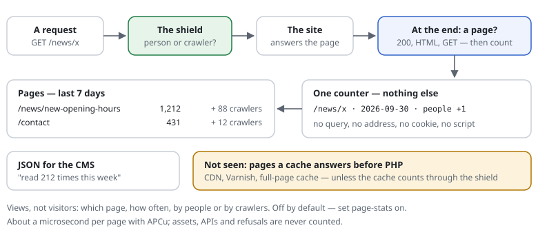

# 0015 — Page statistics: which page, how often — without tracking anyone

| | |
|---|---|
| Status | **Draft** |
| Proposed | 2026-09-30 |
| Affects | the counters of [0012](0012-dashboard.md), `Shield::protect()` (the end of a request), the dashboard, a JSON API |

## Summary

An optional, minimal page counter: how often each page was viewed, per day,
**by people** — kept apart from known crawlers and other bots, because the
shield already knows who is who. No cookies, no scripts in the page, no
addresses kept, no profile of anyone: only "this path, this day, this many".
A dashboard tab and a JSON API answer simple questions: *which pages are read
most, did the new page get visitors, how many views yesterday?* It does not
pretend to be an analytics suite. *Where visitors come from and on which
devices* — from the headers of the same page views — is
[0018](0018-audience-statistics.md).

## In one picture

## Motivation

- Many small sites want exactly this and nothing more — and install a
  third-party tracker for it, with a cookie banner and data leaving the site.
- The shield runs on every request anyway and can tell a person from a known
  crawler (0011, 0014) better than a script in the page, which bots skip or
  fake.
- A CMS can show the numbers next to each page ("read 212 times this week")
  through the API.

## Design

### What is counted

With `set page-stats on` (needs `set stats on`):

- **When:** at the end of the request, from a shutdown function the shield
  registers — then the status and the content type are known. Counted only
  when the answer was **200** and **HTML** (`Content-Type: text/html`), for
  **GET**, not for the shield's own pages.
- **What:** the path, lower-cased, without the query (query parameters are
  often personal: search terms, tokens). A page with a known parameter that
  changes its content (`page` on a list, declared with `cache-query`) keeps it.
- **Who:** three groups — *people* (no crawler named, passed without a
  refusal), *crawlers* (verified known crawlers, per kind), *other bots*
  (claimed crawlers and bot-like User-Agents, see 0014's open question 4).
- **Limits:** at most `page-stats-paths` distinct paths a day (default 5,000);
  beyond that "other" — made-up URLs cannot fill the store. With a cacheable
  definition (`cache-path`), paths outside it are counted as "other" too.

### Storage

The counters of 0012: `apcu_inc()` per request, rolled up hourly into
`<store-dir>/stats/pages-<yyyy-mm-dd>.tsv` (path, people, crawlers, bots).
Without APCu, one appended line per page view, summed at the roll-up. Kept
400 days by default.

### Dashboard and API

- **Tab "Pages":** top pages today / 7 / 30 days, a chart of daily views,
  people and crawlers side by side, a search box for one path.
- **JSON:** `Panel::json($settings, 'pages', ['from' => …, 'to' => …, 'top' => 20])`,
  `<panel-path>/api/pages?path=/news/x&days=30` with the read-only token of
  0012 — for a CMS widget next to each page.

### Honest limits

- **Pages the shield does not see are not counted:** answers from a CDN,
  Varnish or LiteSpeed's cache, and full-page cache hits served before PHP
  (Exponential's HTTP cache early exit, the Qbix server's response cache).
  Where such a cache sits in front, the numbers are a lower bound — unless the
  cache runs the shield (the Qbix server, a PHP early exit) and counts its
  hits too (a hook: `Stats::page($path, $who)`).
- **No visitors, no sessions:** counting *people* would need an identifier;
  this proposal counts *views*. Sources (search engines, AI assistants, other
  sites), devices and browsers, from the headers alone, are
  [0018](0018-audience-statistics.md). A daily, salted, in-memory
  count of distinct visitors is possible (like privacy-friendly analytics
  tools), but it is an open question below, off by default.

## Cost

| | Per request |
|---|---|
| `set page-stats off` (default) | nothing |
| a page view | the shutdown function, one header scan, one counter (~1 µs with APCu; ~5 µs appending without) |
| anything else (assets, APIs, refusals) | the shutdown function returns at once |

## Privacy

- **No cookie, no local storage, no script, no fingerprint, no address**: a
  path, a day, a group, a number. In most readings of the ePrivacy rules
  counting like this needs no consent — to be confirmed by each site's data
  protection officer; the docs will say so and not promise more.
- Queries are dropped (search terms, e-mail addresses in links).
- The "other" bucket and the path limit keep attacker-made URLs out.

## Open questions

1. Count at the end (status and type known, proposed) or at the start
   (simpler, but counts 404s and redirects)? *Recommendation: at the end.*
2. Distinct visitors per day with a daily rotating salt, never stored?
   *Recommendation: not in the first step; views answer the simple questions,
   and it keeps the privacy statement one sentence long.* (Weighed in detail
   in [0018](0018-audience-statistics.md#unique-visitors-without-cookies--later-maybe-opt-in).)
3. Paths outside the cacheable definition: "other" (proposed) or counted?
   *Recommendation: "other" when a definition exists — it is the site's own
   list of real pages.*
4. Should the Exponential adapter count its HTTP cache hits through the hook?
   *Recommendation: yes — otherwise the busiest pages are the ones missing.*
