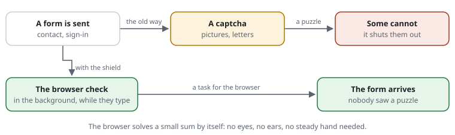
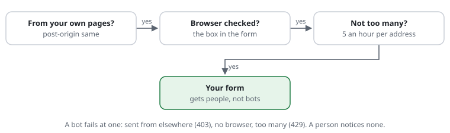

# An accessible website, hardened: no puzzle for anyone

**Situation:** your website must be usable by everyone -- people who are
blind, deaf, older, or who cannot hold a mouse still. In Germany this is the
law for many websites: the Barrierefreiheitsstärkungsgesetz for shops and
services since June 2025, the BITV 2.0 for public bodies. At the same time,
bots fill your contact form with spam and try passwords on your sign-in.
The usual answer is a captcha. But a captcha is a puzzle -- and every puzzle
shuts someone out.



**With the shield:** the puzzle goes to the browser, not to the person. The
[browser check](../glossary.md#browser-check) is a small sum the browser
solves by itself, in the background. Nobody has to see a picture, hear a
sound, read distorted letters or drag a slider. A bot without a real browser
cannot solve it. A bot with one pays for every try with computing time.

## Why a captcha is a barrier

| The captcha | Who it shuts out |
|---|---|
| **Distorted letters** | blind people (a screen reader cannot read a picture), people with poor sight, people with dyslexia |
| **"Click all the traffic lights"** | blind people; people with poor sight; people who cannot aim a mouse |
| **An audio captcha** (the usual second way) | deaf people, deafblind people; anyone in a noisy place; it is often hard to understand even for people who hear well |
| **A sum or a riddle** ("what is 3 + 4?") | people with cognitive disabilities; people who do not speak the language well |
| **A slider or a puzzle piece** | people who use a keyboard, a switch or voice control instead of a mouse |
| **A time limit** | everyone who is slower: older people, people with tremor, people using assistive technology |
| **Google's "invisible" captcha** (reCAPTCHA) | people who block trackers, use a VPN or an unusual browser -- they often get the hardest puzzles; and every visitor's data goes to Google |

The rules for accessible websites (WCAG) say so too:

- **WCAG 1.1.1:** a captcha needs a second way in another sense -- a picture
  captcha also needs an audio one. That still leaves out people who can
  neither see nor hear well.
- **WCAG 2.2, 3.3.8:** at a sign-in, nobody may be asked to remember,
  transcribe or calculate something, unless there is another way.
- The W3C's own note "Inaccessibility of CAPTCHA" comes to the same
  conclusion: every captcha excludes someone.

*This is a summary, not legal advice.*

And captchas no longer keep bots out well: image and language models read
letters and find traffic lights as well as people do, and solving services
sell a thousand answers for a few cents
([proposal 0038](../proposals/0038-checks-without-friction.md#why-not-a-captcha)).

## The comparison

| | Captcha | Browser check |
|---|---|---|
| What the **person** does | solves a puzzle, often more than once | nothing |
| **Blind** visitors (screen reader) | need the audio version, if there is one | nothing to see: the page has a heading and one sentence |
| **Deaf** visitors | fine with pictures, stuck with audio | nothing to hear |
| Visitors with **cognitive** disabilities | a riddle, letters, a time limit | nothing to solve |
| Visitors **without a mouse** | sliders and pictures are hard | nothing to click |
| **Moving pictures** | some captchas animate | the ring stands still for people who ask for less motion |
| **Time** | 10--30 seconds, often more | 0.1--0.5 seconds, once an hour; a few seconds on an old phone |
| **Data** to others | often Google or another service | none: everything stays on your server |
| **Bots** | solved by models and solving services | a bot without a browser cannot; with one, every try costs it |
| **Without JavaScript** | depends on the captcha | not yet: the page says JavaScript is needed (see Limits) |

## Step by step

Three layers protect a form. A bot fails at one of them. A person notices
none.



1. **The rules:** a form only from your own pages, and not too many from one
   [address](../glossary.md#address).

   ```text
   set widget-path /request-shield                      # the box in the form (step 2)
   set pass-ttl 3h                                      # long enough to fill in a long form slowly
   [FORM-ORIGIN] post-origin same                       # a form sent from another website: refused
   [FORM-LIMIT]  limit contact 5/hour at /contact/send  # more than five an hour from one address: a pause
   ```

   `pass-ttl 3h`: a person who needs a long time for the form does not lose
   it. There is no time limit for the person -- only the browser's answer
   expires.
2. **The box in the form** checks the browser while the visitor types
   ([the check inside the form](../features/RSF03-03-browser-check-in-the-form.md)):

   ```php
   <form method="post" action="/contact/send">
     …
     <?= CjwNetwork\RequestShield\Shield::active()?->widget() ?>
     <button>Send</button>
   </form>
   ```

   The box says *"Checking your browser … ✓ Browser checked"*. A screen
   reader announces it once, politely, without interrupting. Nothing to
   click.
3. **Where the form arrives,** one line:

   ```php
   CjwNetwork\RequestShield\Shield::active()?->requirePass();   // the box's answer counts
   ```

   A bot that sends the form without a browser gets the check page instead;
   a person's form goes straight through.
4. **Test it with a screen reader** (NVDA, VoiceOver, TalkBack) and with the
   keyboard only: open the form, fill it in, send it. You should hear the
   box's short message once, and nothing else should change.

## What the person sees, if anything

Most people see nothing but the small box in the form. If the shield asks
for the check on a page (too many requests, a sign-in), the check page comes
for a moment:

- **one heading and one sentence** -- *"One moment, please. Your browser is
  being checked."* -- in the visitor's language (German and English built
  in);
- a ring that fills; it does not spin for people whose system asks for
  less motion;
- then the page they asked for, by itself. Nothing to click.

## Limits

- **Without JavaScript** the check cannot be solved. The page says so
  clearly, but the visitor is stuck. Almost every screen reader and voice
  control works with JavaScript, so this rarely hits people with
  disabilities -- but it does hit people with very strict browser settings. A
  way without JavaScript (a signed form and a short wait) is
  [proposal 0038](../proposals/0038-checks-without-friction.md).
- **Cookies** are needed for the [pass](../glossary.md#pass-cookie). It is a
  security cookie, not a tracking cookie; in the common reading it needs no
  consent ([privacy](../privacy.md)).
- **The check page's message** is read when the page opens. When it changes
  (*"failed, trying again"*), a screen reader does not announce the change
  yet -- the box in the form does.
- **The check does not replace accessible forms:** labels, error messages,
  enough contrast and keyboard use are still the form's job.
- **A determined attacker** with many real browsers gets through, slowly and
  at their own cost. For the sign-in, add a pause after wrong passwords
  ([the sign-in, hardened](login-backoff.md)).

Features: [the browser check](../features/RSF03-02-browser-challenge.md) ·
[the check inside the form](../features/RSF03-03-browser-check-in-the-form.md) ·
[the site asks for the check](../features/RSF03-04-app-challenges.md) ·
[budgets](../features/RSF03-01-budgets.md) ·
[forms from the website](../features/RSF02-04-forms-from-the-website.md) ·
[explained for everyone](../explained/browser-check.md).
