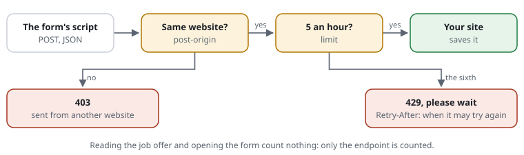

# A pentest asks for rate limits on the forms

**Situation:** you are technically responsible for a website. A penetration
test asks for rate limits on the important forms: job applications above
all, but also contact and newsletter. Today a bot can send them thousands of
times. The forms are built in the browser by a script from a form
definition; the script sends every form as JSON to one endpoint, CV and
certificates inside the JSON. Changing the application would take a release.
You want to add the limits afterwards, and show the pentester that they work.



**With the shield:** four lines in the [rule file](../glossary.md#rule-file),
no change to the application. The endpoint gets a
[budget](../glossary.md#budget), counted per [address](../glossary.md#address).
Past it, the sender gets [status code](../glossary.md#status-code) 429 with
`Retry-After`, before the endpoint runs.

## Step by step

1. **Find the endpoint.** Open the browser's developer tools, tab "Network",
   and send a form once. The request with the method `POST` and the type
   `fetch` names it. Here it is `/forms/submit` (a made-up name). Note every
   other address a form on the site posts to, such as the site search.
2. **Write the rules, watched first.** With `monitor` in front, nobody is
   refused yet; the [log](../glossary.md#log) shows who would have been:

   ```text
   [FORM-POST]   monitor allow POST /forms/submit /search
   [FORM-ORIGIN] post-origin same
   [FORM-LIMIT]  monitor limit forms 5/hour at /forms/submit
   ```

   - `allow POST` lets forms be sent only to these addresses; anywhere else,
     405. Forget one, and that form stops working: hence `monitor` first.
   - `post-origin same` refuses a form sent from another website (403). The
     form's script runs on your pages, so the browser sends your website as
     `Origin`.
   - The `limit` counts only requests to the endpoint. Reading the job offers
     and opening the form count nothing.
3. **Write what you expect, next to the rules.** These
   [rule examples](../glossary.md#rule-example) are your proof for the
   pentester:

   ```text
   expect POST /forms/submit times 5 answered header Origin:https://www.example.org header Content-Type:application/json
   expect POST /forms/submit times 6 429 by FORM-LIMIT header Origin:https://www.example.org header Content-Type:application/json
   expect POST /forms/submit 403 by FORM-ORIGIN header Origin:https://evil.example header Content-Type:application/json
   expect POST /jobs/some-offer 405 by FORM-POST header Origin:https://www.example.org
   expect GET  /jobs/some-offer times 30 answered
   ```

   `request-shield test site.rules` checks every line; `--junit=report.xml`
   writes the result for CI or for the report. `test` treats `monitor` as
   switched on, so the examples hold before you enforce them.
4. **Watch a few days.** The log's `monitor-` lines show who would have been
   refused or told to wait. Real applicants rarely send more than one or two
   forms an hour.
5. **Switch them on.** Remove the word `monitor`. From now on the sixth form
   within an hour from one address gets 429.

## What the pentester sees

- The sixth request within an hour: `429 Too Many Requests` with
  `Retry-After` and `Cache-Control: no-store`. The endpoint never runs for
  it.
- A form sent from another website: `403`. A `POST` to any other address:
  `405`. A `POST` without `Origin` and `Referer` gets the browser check first.
- The log line of each refusal names the rule: `FORM-LIMIT`, `FORM-ORIGIN`.
- `request-shield trace site.rules "POST https://www.example.org/forms/submit"`
  shows check by check what happens to one request.

## One limit per kind of form

All forms go to one endpoint, and the shield does not read the request's
body. So it cannot tell an application from a newsletter sign-up. If they
need different limits, the endpoint counts, with one line once it knows the
form:

```text
[FORM-JOBS] limit applications 3/hour on-demand at /forms/submit
[FORM-NEWS] limit newsletter 10/hour on-demand at /forms/submit
```

```php
// in the endpoint, after reading the form's name from the JSON
CjwNetwork\RequestShield\Shield::active()?->consume('applications', answer: true);
```

`consume()` counts one. Past the limit the shield answers 429 itself and the
request ends there.

## The browser check before sending

A limit per address caps a bot; it does not ask whether a browser is there.
The [browser check](../glossary.md#browser-check) does: a bot that sends to
the endpoint directly has to solve a task first. A
[pass cookie](../glossary.md#pass-cookie) is per visitor, not per job offer;
`max-age` says how fresh it must be.

**A. The check when a job offer is opened.** Rules only, no code:

```text
set        pass-ttl 3h                   # a pass holds long enough to write an application
[JOB-PAGE] challenge /jobs/** max-age 30m   # opening an offer: a check, unless one was solved in the last 30 minutes
[JOB-SEND] challenge /forms/submit          # sending: only with a pass
```

The script's `fetch` is sent to the same website, so the browser sends the
pass with it. It works, and it has costs:

- **Every reader** of a job offer sees "one moment, please" for up to half a
  second, not only applicants.
- **Job portals and other crawlers** that are not
  [known crawlers](../features/RSF01-04-known-crawlers.md) get the check page
  instead of the offer and cannot list it. Verified search engines, Google
  for Jobs among them, are let through. Watch first: `monitor challenge
  /jobs/** max-age 30m`, then read the log.
- **An applicant who needs longer than `pass-ttl`** gets a task the script
  cannot solve, and the form shows its general error.

**B. The check when the form is sent** (recommended). Only the endpoint
asks; the form's script solves the task and sends again. Readers and
crawlers notice nothing, and no input is lost:

```text
set        widget-path /request-shield
[JOB-SEND] challenge /forms/submit max-age 60m
```

The page loads the shield's script, `<script src="/request-shield/widget.js"
defer></script>`, and the form's script sends through this function:

```js
// Sends; when the shield answers with a task (429, JSON), solves it and sends again.
async function sendChecked(url, init) {
  const r = await fetch(url, init);
  if (r.status !== 429 || !r.headers.get('Request-Shield-Challenge') || !window.RS) return r;
  const c = (await r.clone().json()).challenge;
  const [n, took] = await new Promise((ok) => RS.solve(c, (n, took) => ok([n, took])));
  if (n < 0) return r;
  return fetch(url, { ...init, headers: { ...init.headers, 'Request-Shield-Solution': RS.payload(c, n, took) } });
}
```

Tried against a real server: the first request gets 429 with the task, the
browser solves it in well under a second, the second request reaches the
endpoint with its body unchanged and sets the pass cookie; the same answer
twice is refused. The task is sent only to a sender without a fresh pass;
everyone else sends once. Both tries count against `limit forms`. `RS.solve`
and `RS.payload` are not yet a promised interface:
[0035 the check for forms that send JSON](../proposals/0035-checked-json-forms.md)
makes them one.

## Limits

- **The answer is a short HTML page, not JSON.** The form's script expects
  JSON, cannot read it, and shows its general error; what the applicant typed
  stays in the form. [Error pages (0030)](../proposals/0030-error-pages.md)
  will answer in JSON a request that sends JSON. Do not mark the endpoint as
  `api-path` for this: an API path is not checked by `post-origin`.
- **Keep the pause, not the check,** past the limit: `on-exceeded challenge`
  would answer with a task. Only a script as in B above can solve it.
- **Per address.** Applicants behind one office network share one budget.
  Five an hour is still enough for a whole office; raise it where needed.
- **Many addresses.** A botnet that sends one form per address is not
  stopped by a limit per address. A limit for all senders together is a
  proposal: [0034 budgets for everyone together](../proposals/0034-shared-budgets.md).
- **Behind a proxy** or a CDN, the shield sees the visitor's address only with
  a `trust` line for it ([trusted proxies](../features/RSF01-01-trusted-proxies.md)).
- **Several servers** count apart unless they share the
  [store directory](../glossary.md#store-directory).

Features: [budgets](../features/RSF03-01-budgets.md#a-budget-for-one-area) ·
[forms only from the website itself](../features/RSF02-04-forms-from-the-website.md) ·
[access rules](../features/RSF02-03-access-rules.md) ·
[modes](../features/RSF05-03-modes.md) ·
[examples next to the rules](../features/RSF05-04-rule-examples.md).
