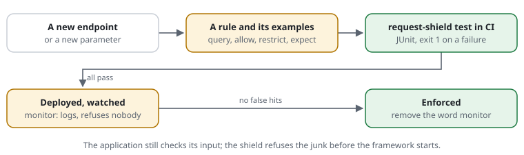

# A developer hardens the application, and tests it

**Situation:** you develop a PHP application -- a Symfony shop, a CMS
project, an API. It checks its own input, but every request still starts the
framework, the database and the session first: scanners asking for `/.env`,
bots posting to every address, made-up parameters, password guessing. You
want the application to accept only what it is built for, and you want to
know after every change that it still does -- in CI, not by trying it.



**With the shield:** a [rule file](../glossary.md#rule-file) next to the
code, in the same repository. Each [rule](../glossary.md#rule) says what the
application accepts; a [rule example](../glossary.md#rule-example) next to it
says what must be refused and what must get through. `request-shield test`
checks every example in CI, like a unit test. The rules run before the
framework, so whatever they refuse costs a few microseconds, not a page.

## Step by step

1. **Start from a template for your framework**, in monitor mode:

   ```bash
   php vendor/bin/request-shield init --app=symfony --docroot=public --out=config/request-shield.rules
   ```

   It already refuses the paths only scanners ask for, WordPress's on a site
   that has none, and attack patterns in the query; it paces each visitor.
   `init` knows `exponential`, `plain`, `symfony` and `wordpress`.
2. **Say what the application accepts**, rule by rule, each with its
   examples right below it:

   ```text
   host www.example.org
   api-path /api/**

   [APP-PARAMS]  query page int   q text   sort word   id int      # the parameters the application reads, each of its type
   expect GET /products/?page=2&sort=price          answered
   [APP-STRICT]  query strict                                       # any other parameter, or a wrong type: 404
   expect GET /products/?debug=1                    404 by APP-STRICT
   expect GET /products/?page=two                   404 by APP-STRICT

   [APP-FORMS]   allow POST /login /contact /api/**                 # a POST only where a form or the API is
   expect POST /admin/users/delete                  405 by APP-FORMS
   [APP-ORIGIN]  post-origin same                                   # forms only from the website's own pages
   expect POST /contact                             403 by APP-ORIGIN header Origin:https://evil.example
   expect POST /contact                             answered header Origin:https://www.example.org

   [APP-ADMIN]   restrict /admin/** to 10.0.0.0/8                   # the admin area: the internal network only
   expect GET /admin/                               403 by APP-ADMIN
   expect GET /admin/                               from 10.1.2.3 answered

   [APP-LOGIN]   limit logins 10/min at /login                      # password guessing: 10 a minute per address
   expect POST /login times 11                      429 by APP-LOGIN header Origin:https://www.example.org

   expect GET /search?q=1%27%20union%20select%20password%20from%20users   403 by ATK-SQL-UNION
   expect GET /search?q=union%20of%20states         answered       # a search that only looks alike
   ```

   Each refusal names its rule, so a failing example says which rule moved.
3. **Test it like code:** locally, and in CI on every push.

   ```bash
   php vendor/bin/request-shield check config/request-shield.rules
   php vendor/bin/request-shield test  config/request-shield.rules --junit=build/request-shield.xml
   ```

   `check` stops at the first mistake with its file and line (exit 1), and
   warns with exit 3. `test` exits 1 when one example fails and writes a
   JUnit report that CI shows next to the unit tests. Nothing is counted:
   every example runs on a fresh store.

   ```yaml
   # .github/workflows/tests.yml, next to the unit tests
   - run: php vendor/bin/request-shield check config/request-shield.rules
   - run: php vendor/bin/request-shield test config/request-shield.rules --junit=build/request-shield.xml
   ```
4. **Your own clicks as a test:** record someone clicking through the
   application -- the browser's developer tools save it as a HAR file, and
   Playwright's `recordHar` does it for the end-to-end tests -- and replay it:

   ```bash
   php vendor/bin/request-shield replay config/request-shield.rules build/session.har --junit=build/replay.xml
   ```

   It says which of your own requests the rules would refuse, and by which
   rule: a parameter without its `query` line, a form without its `allow
   POST`. Exit 1 when one is refused, so it goes into CI too.
5. **One request, step by step,** when something surprises you:

   ```bash
   php vendor/bin/request-shield trace config/request-shield.rules "POST https://www.example.org/admin/users/delete" --ip=203.0.113.9
   ```
6. **Deploy watched, then enforce.** `set mode monitor` logs what would be
   refused, and nobody is refused. When the log shows no real request among
   them, write `set mode enforce`.

## What it brings

- **The application gets only what it is built for.** Unknown parameters,
  methods where no form is, other websites' forms and the scanners' paths
  are refused before the framework starts: about 12 µs instead of a page.
- **The rules are tested like code.** A new endpoint without its
  `allow POST` fails in CI, not in production; a refactoring that renames a
  parameter shows up as a failing example.
- **The examples are the documentation.** They say in one line each what
  the application accepts; `test` lists each with its result, and its JUnit
  report can go with a review or a security audit.
- **The application can ask the shield too:** the browser check before it
  saves a form (`Shield::active()?->requirePass()`), a budget for an
  expensive search (`consume()`), whether an answer may be cached
  ([for developers](../for/developers.md)).
- **Its tests can call it:** the [API](../features/RSF06-05-api.md)'s
  `Api::call($settings, 'POST', '/trace', ['url' => '/admin/'])` answers in the
  same process what `trace` prints.

## Limits

- **It does not replace the application's own checks.** The shield sees the
  address, the headers and the method; it never reads a form's body. The
  application still validates what it saves.
- **The rules must follow the application.** A new parameter needs its
  `query` line, a new form its `allow POST` -- the examples make sure nobody
  forgets.

Features: [known query parameters](../features/RSF02-05-known-parameters.md) ·
[access rules](../features/RSF02-03-access-rules.md) ·
[forms only from the website itself](../features/RSF02-04-forms-from-the-website.md) ·
[attack patterns](../features/RSF02-06-attack-patterns.md) ·
[examples next to the rules](../features/RSF05-04-rule-examples.md) ·
[modes](../features/RSF05-03-modes.md).
