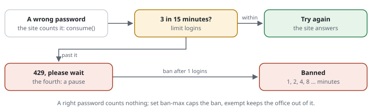

# The sign-in, hardened: three tries, then longer and longer

**Situation:** your application has a sign-in. Bots try passwords from leaked
lists, thousands an hour, from many addresses or from one. A person who
mistypes needs a few tries; a bot needs thousands. You want three tries to go
through, and then every further one to wait longer -- without touching the
application's own user database.



**With the shield:** the application tells the shield about each wrong
password; the shield counts them per [address](../glossary.md#address), and
after the third it answers itself -- with a pause, then a
[ban](../glossary.md#ban) that doubles each time it comes back. The
application runs no more for that address until the ban ends.

## Step by step

1. **The rules:** a [budget](../glossary.md#budget) the application counts,
   and a ban when it is spent.

   ```text
   [LOGIN-TRIES] limit logins 3/15m on-demand at /login     # three wrong passwords in 15 minutes
   [LOGIN-BAN]   ban after 1 logins in 15m for 1m           # past them: banned for a minute ...
   set ban-growth 2                                         # ... twice as long each time within a day
   set ban-max 1h                                           # at most an hour
   exempt 192.0.2.0/24                                      # the office: never counted, never banned
   ```

2. **One line in the application,** where a password was wrong:

   ```php
   use CjwNetwork\RequestShield\Shield;

   if (!$auth->check($username, $password)) {
       // A wrong password: counted. Past the limit the shield answers itself (429) and the request ends here.
       Shield::active()?->consume('logins', answer: true);
       // ... "wrong user name or password", as before
   }
   ```

   A right password counts nothing. `at /login` keeps the count to the
   sign-in: no other page's requests touch it.
3. **What happens,** for one address that keeps trying:

   | Try | What it gets |
   |---|---|
   | 1--3 | the application's answer: "wrong password" |
   | 4 | a pause (429): the shield answers, not the application; the ban begins |
   | during the ban | 429 for every request, before the application runs |
   | after it, the next wrong one | a ban of 2 minutes, then 4, 8, 16 … up to `ban-max` |

   A bot that waits out each ban gets one guess every few minutes, then one
   an hour. A person who mistyped three times and then gets it right waits
   not at all; only a fourth wrong password brings the pause.
4. **Watch first:** `[LOGIN-BAN] monitor ban after …` bans nobody and logs the
   ban it would have set. The [live view](../features/RSF06-02-live-and-lists.md)
   shows every ban with its rule, and lifts one with a click.

## The other way: the browser check instead of a pause

```text
[LOGIN-TRIES] limit logins 3/15m on-demand at /login on-exceeded challenge
```

Past the third wrong password the visitor gets the
[browser check](../glossary.md#browser-check); solved, the count starts
again. Each solution within an hour is twice as hard as the one before: a
person solves it once or twice in a moment, a bot pays more computing time
for every round. No ban, nobody locked out -- the better choice where many
people share an address. Both can be combined: the check first, a ban for
whoever keeps failing it (`ban after 10 checks in 10m for 15m`).

## Limits

- **Per address:** a botnet that tries one password per address is not
  slowed by this. A limit for all addresses together is
  [proposal 0034](../proposals/0034-shared-budgets.md); against it the
  application's own measures help (a locked account, a second factor).
- **A ban is for the whole website,** not only the sign-in: whoever is
  banned gets 429 everywhere until it ends. Keep `ban-max` short and the
  office `exempt`.
- **The fourth password is checked** by the application, but the shield
  answers instead of it: the bot does not learn whether it was right.
- **Several servers** count apart unless they share the store, and with APCu
  each server keeps its own bans (`set ban-keep file` keeps them over a
  restart; [bans](../features/RSF01-02-ip-lists.md#bans)).

Features: [IP lists and bans](../features/RSF01-02-ip-lists.md#bans) ·
[budgets](../features/RSF03-01-budgets.md#past-the-limit-a-pause-or-earn-it-back) ·
[the site asks for the check](../features/RSF03-04-app-challenges.md) ·
[modes](../features/RSF05-03-modes.md).
